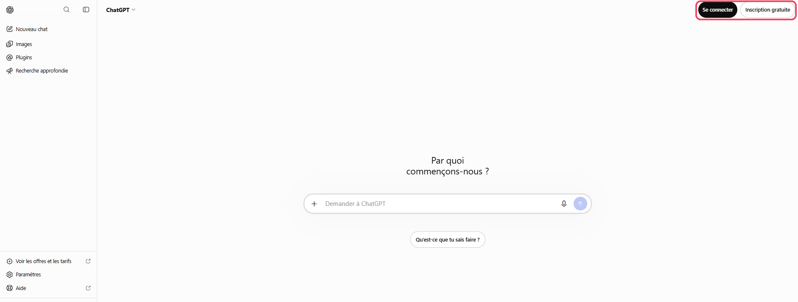
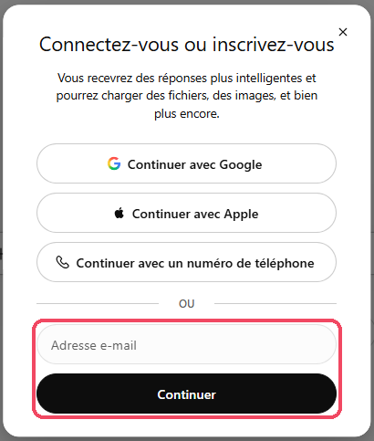
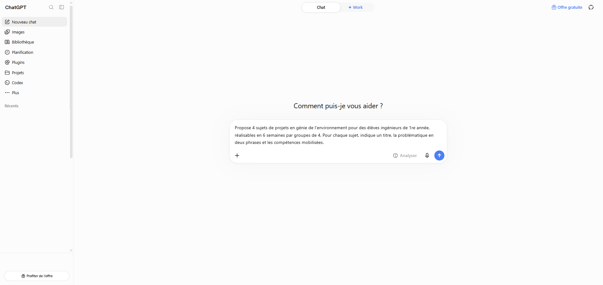
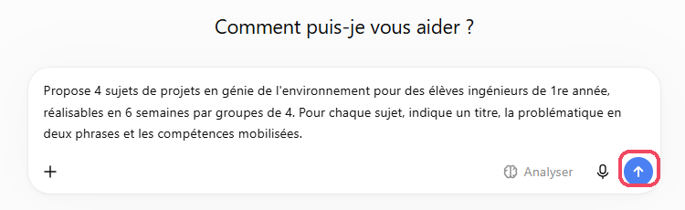
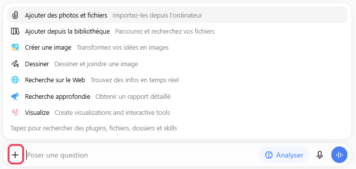
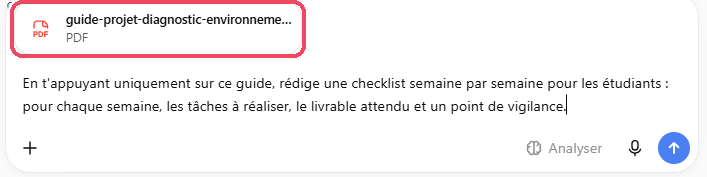

# ChatGPT

<span class="badge badge-hors-ue">Hors UE</span> <span class="badge badge-gratuit">Gratuit, compte conseillé</span>

<p class="maj">Dernière vérification : à compléter</p>

**ChatGPT** est l'assistant conversationnel de l'entreprise américaine OpenAI, le plus utilisé au monde. Polyvalent, il rédige, explique, analyse des fichiers et des données, génère des images et peut converser à voix haute. Vos étudiants l'utilisent très probablement : le connaître vous aide aussi à concevoir des activités et des évaluations adaptées.

[Ouvrir ChatGPT](https://chatgpt.com){ .md-button .md-button--primary }

!!! info "Fiche en cours de rédaction"
    Le tutoriel complet sera bientôt disponible.

## À quoi ça sert dans le supérieur

- **Analyser des données** : tracer et commenter des mesures de TP à partir d'un tableur.
- **Concevoir des études de cas** et des mises en situation professionnelles.
- **Expliquer une notion autrement** : analogies, niveaux de difficulté, exemples concrets.
- **S'entraîner à l'oral**, en français ou en anglais, grâce au mode vocal.
- **Illustrer un support** : images, pictogrammes, visuels d'introduction.

## Version gratuite

Le compte gratuit permet de discuter avec ChatGPT sur le web, sur ordinateur et sur mobile, sans limite pour les échanges courants. Il donne accès à la recherche web, à l'ajout de fichiers, à l'analyse de données, à la génération d'images, au mode vocal, au **canevas** (rédaction dans un panneau à part) et aux **projets**, mais chacun de ces outils a ses propres limites d'usage : ChatGPT vous prévient lorsque vous les atteignez. Les modèles les plus puissants, la **recherche approfondie** et le **mode agent** sont réservés aux abonnements payants (Go, Plus, Pro). Selon les pays, des publicités peuvent s'afficher dans la version gratuite.

## Cas d'usage

=== "Analyser des données de TP"

    **Exemple** : des mesures de température relevées lors d'un TP de transferts thermiques.

    Joignez le fichier Excel ou CSV, puis demandez :

    ```
    Ce fichier contient des mesures de température en fonction
    du temps, relevées pendant le refroidissement d'une pièce
    métallique. Trace la courbe, ajuste un modèle exponentiel,
    donne la constante de temps obtenue et commente l'écart
    entre les mesures et le modèle. Explique chaque étape pour
    que je puisse la refaire avec mes élèves.
    ```

    ChatGPT exécute des calculs pour produire le graphique : vérifiez toujours les valeurs obtenues avant de les réutiliser.

=== "Concevoir une étude de cas"

    **Exemple** : une mise en situation pour un cours de sécurité industrielle.

    ```
    Rédige une étude de cas réaliste pour des élèves ingénieurs
    de 2e année en sécurité industrielle : un incident dans une
    usine agroalimentaire (fuite d'ammoniac). Donne le contexte,
    la chronologie, les documents dont disposent les élèves,
    3 questions d'analyse et les éléments de réponse attendus
    dans un corrigé séparé.
    ```

=== "Expliquer autrement"

    **Exemple** : une notion souvent mal comprise en thermodynamique.

    ```
    Explique la notion d'entropie de trois façons différentes :
    1) avec une analogie de la vie quotidienne,
    2) pour un élève de classe préparatoire,
    3) pour un élève ingénieur de 2e année, avec une équation.
    Termine par les 3 erreurs de compréhension les plus
    fréquentes et une question pour vérifier chacune.
    ```

=== "S'entraîner à l'oral"

    **Exemple** : préparer vos élèves à un entretien de stage en anglais.

    Proposez à vos élèves d'activer le **mode vocal** et de commencer par :

    ```
    Tu es recruteur dans une entreprise de génie civil au
    Royaume-Uni. Fais-moi passer un entretien de stage de
    10 minutes en anglais : pose une question à la fois,
    attends ma réponse, puis à la fin donne-moi un retour sur
    mon vocabulaire, ma prononciation et mes arguments.
    ```

=== "Illustrer un support"

    **Exemple** : une image d'introduction pour une séance sur la ville durable.

    ```
    Crée une illustration au style épuré, format paysage, qui
    montre un quartier urbain durable : panneaux solaires,
    toitures végétalisées, pistes cyclables, tramway. Pas de
    texte dans l'image.
    ```

    !!! warning "Pas de schéma technique"
        Les images générées conviennent pour illustrer, pas pour expliquer : un schéma de montage, une coupe ou un circuit électrique généré par l'IA contient presque toujours des erreurs.

## Pas à pas

:material-magnify-plus-outline: Cliquez sur une capture pour l'agrandir.
{ .astuce-zoom }


<div class="etape" markdown>

### <span class="etape-num">1</span> Créer un compte

ChatGPT peut s'utiliser sans compte, mais de façon très limitée : sans compte, vous ne pouvez ni joindre de fichiers, ni retrouver vos conversations. Créez donc un compte gratuit.

1. Rendez-vous sur [chatgpt.com](https://chatgpt.com). Si un bandeau **Nous utilisons des cookies** s'affiche en bas de l'écran, cliquez sur **Refuser les cookies non essentiels**.
2. En haut à droite, cliquez sur **Inscription gratuite** (ou sur **Se connecter** si vous avez déjà un compte).

    

3. Dans la fenêtre **Connectez-vous ou inscrivez-vous**, saisissez votre **adresse e-mail de l'école** (@mines-ales.fr) dans le champ **Adresse e-mail**, puis cliquez sur **Continuer**. N'utilisez pas les boutons **Continuer avec Google**, **Continuer avec Apple** ou **Continuer avec un numéro de téléphone**, qui relient ChatGPT à un compte personnel.
4. Suivez les indications à l'écran pour terminer l'inscription.



</div>

<div class="etape" markdown>

### <span class="etape-num">2</span> Découvrir l'interface

L'écran se compose de deux parties.

- **À gauche, la barre latérale** : **Nouveau chat** pour démarrer une conversation, **Images** pour créer et retrouver des images, **Bibliothèque** pour retrouver les fichiers que vous avez joints, **Projets** pour organiser votre travail par cours, puis **Planification**, **Plugins**, **Codex** et **Plus**. Sous **Récents** s'affiche la liste de vos conversations. La **loupe** en haut permet d'y chercher, et l'icône de **panneau** masque ou affiche la barre. Votre nom apparaît tout en bas, avec la mention **Free** (version gratuite).
- **Au centre, la zone de saisie** (« Comment puis-je vous aider ? ») : le bouton **+** à gauche donne accès aux fichiers et aux outils, le bouton **Analyser** demande à ChatGPT une réponse plus réfléchie, et le **micro** permet de dicter votre demande. Le bouton rond à droite lance le **mode vocal** lorsque la zone est vide, et devient une **flèche** d'envoi dès que vous écrivez.

Les boutons **Offre gratuite** (en haut à droite) et **Profiter de l'offre** (en bas à gauche) concernent les abonnements payants : vous n'en avez pas besoin.



</div>

<div class="etape" markdown>

### <span class="etape-num">3</span> Formuler une demande

Cliquez dans la zone de saisie et décrivez ce que vous voulez obtenir en précisant le **résultat attendu**, le **public** visé et les **contraintes** (durée, format, niveau). Par exemple : « Propose 4 sujets de projets en génie de l'environnement pour des élèves ingénieurs de 1re année, réalisables en 6 semaines par groupes de 4. Pour chaque sujet, indique un titre, la problématique en deux phrases et les compétences mobilisées. »

Appuyez sur **Entrée** ou cliquez sur la **flèche bleue**, à droite de la zone de saisie, pour envoyer. Poursuivez ensuite la conversation pour affiner le résultat : « plus court », « ajoute un sujet sur l'eau », « propose un calendrier semaine par semaine ».



</div>

<div class="etape" markdown>

### <span class="etape-num">4</span> Découvrir le menu +

Cliquez sur le bouton **+** à gauche de la zone de saisie, au début d'une conversation ou en cours de route (la zone affiche alors « Poser une question »). Il regroupe ce que ChatGPT peut utiliser pour votre demande :

| Option | À quoi elle sert |
|---|---|
| **Ajouter des photos et fichiers** | Joindre un document ou une image depuis votre ordinateur |
| **Ajouter depuis la bibliothèque** | Réutiliser un fichier déjà joint dans une conversation précédente |
| **Créer une image** | Générer une image à partir de votre description |
| **Dessiner** | Dessiner à main levée et joindre le dessin à votre demande |
| **Recherche sur le Web** | Permettre à ChatGPT de chercher des informations récentes sur le web |
| **Recherche approfondie** | Obtenir un rapport détaillé, construit à partir de nombreuses sources |
| **Visualize** | Créer des graphiques et des outils interactifs (intitulé affiché en anglais) |

Tout en bas du menu, vous pouvez taper un mot pour retrouver un plugin ou un fichier.



</div>

<div class="etape" markdown>

### <span class="etape-num">5</span> Joindre un document

1. Cliquez sur le bouton **+**, puis sur **Ajouter des photos et fichiers**.
2. Choisissez le fichier sur votre ordinateur. Il s'affiche au-dessus de la zone de saisie, avec son nom et son format (par exemple **PDF**).
3. Écrivez votre demande en vous référant au document, par exemple : « En t'appuyant uniquement sur ce guide, rédige une checklist semaine par semaine pour les étudiants : pour chaque semaine, les tâches à réaliser, le livrable attendu et un point de vigilance. »
4. Envoyez votre demande.

Les fichiers que vous joignez sont **automatiquement enregistrés dans votre Bibliothèque** : vous les retrouverez à gauche, sous **Bibliothèque**. Retirez donc toute donnée personnelle d'un document avant de le joindre.



</div>

<!--
Étapes restant à rédiger à partir des captures (plan provisoire) :
 6. Rédiger dans le canevas
 7. Utiliser le mode vocal
 8. Créer un projet
 9. Personnaliser ChatGPT (instructions personnalisées)
10. Empêcher l'utilisation de vos conversations pour entraîner les modèles
11. Utiliser une conversation temporaire
-->

## Ressources officielles

- [Centre d'aide d'OpenAI](https://help.openai.com) : prise en main, fonctionnalités, confidentialité (en anglais, une partie des articles est traduite).
- [Questions fréquentes sur la version gratuite](https://help.openai.com/en/articles/9275245-chatgpt-free-tier-faq) : ce qui est inclus et les limites (en anglais).
- [Comparatif des formules](https://chatgpt.com/pricing) : version gratuite et abonnements.
- [Contrôle de vos données](https://help.openai.com/en/articles/7730893-data-controls-faq) : entraînement des modèles, historique, suppression (en anglais).

## Points de vigilance

!!! warning "Données"
    OpenAI est une entreprise américaine : vos conversations sont traitées hors de l'Union européenne. N'y déposez ni données personnelles d'étudiants (noms, notes, copies nominatives), ni documents confidentiels. Désactivez l'utilisation de vos conversations pour l'entraînement des modèles (voir le pas à pas).

!!! tip "Fiabilité"
    ChatGPT peut inventer des faits, des chiffres ou des références bibliographiques avec beaucoup d'assurance. Vérifiez tout contenu avant de le transmettre à vos étudiants, en particulier les calculs et les sources.

!!! info "Vos étudiants l'utilisent aussi"
    Testez vos sujets de devoir dans ChatGPT : vous verrez ce qu'un étudiant peut obtenir en quelques secondes, et vous pourrez adapter la consigne (appui sur une expérience vécue en TP, oral de soutenance, étapes intermédiaires à rendre).

!!! note "Une interface qui évolue vite"
    OpenAI modifie régulièrement l'interface et les limites de la version gratuite. Si un intitulé a changé, le principe reste généralement le même.
