# Claude

<span class="badge badge-hors-ue">Hors UE</span> <span class="badge badge-gratuit">Gratuit, compte obligatoire</span>

<p class="maj">Dernière vérification : septembre 2026</p>

**Claude** est l'assistant conversationnel de l'entreprise américaine Anthropic. Il se distingue par sa capacité à travailler sur des **documents longs** et par ses **artéfacts** : des contenus créés dans un panneau à part (document, tableau, schéma, quiz interactif, petite application) que vous pouvez modifier, copier ou partager.

[Ouvrir Claude](https://claude.ai){ .md-button .md-button--primary }

## À quoi ça sert dans le supérieur

- **Analyser un document long** : rapport, article, référentiel, cahier des charges.
- **Créer des activités interactives** sous forme d'artéfacts : quiz, simulation, schéma.
- **Donner un retour argumenté** sur une production à partir de vos critères.
- **Organiser ses cours en projets**, avec leurs documents et leurs consignes.
- **Rédiger et structurer** des documents longs : syllabus, guide de projet, sujet d'examen.

## Version gratuite

Le compte gratuit permet de discuter avec Claude sur le web, sur ordinateur et sur mobile, de joindre des fichiers, de faire des recherches sur le web, de créer des artéfacts et de créer **jusqu'à 5 projets**. Le nombre de messages est limité et se renouvelle toutes les quelques heures. Les modèles les plus puissants et certaines fonctions (Claude Code, extension pour navigateur, outils pour Microsoft 365) sont réservés aux abonnements payants.

## Cas d'usage

=== "Analyser un document long"

    **Exemple** : un rapport de 80 pages sur la gestion de l'eau que vous voulez exploiter dans un cours de génie de l'environnement.

    Joignez le rapport (bouton **+**), puis demandez :

    ```
    Voici un rapport sur la gestion de l'eau en zone
    méditerranéenne. Résume-le en une page pour des élèves
    ingénieurs de 2e année, puis propose 5 questions de
    discussion pour un TD, en indiquant pour chacune la page
    du rapport où se trouve la réponse.
    ```

=== "Activité interactive"

    **Exemple** : un quiz d'auto-évaluation sur les bases de la résistance des matériaux.

    ```
    Crée un quiz interactif de 10 questions sur la résistance
    des matériaux (contraintes, déformations, loi de Hooke)
    pour des élèves ingénieurs de 1re année. Après chaque
    réponse, affiche une explication courte. À la fin, affiche
    le score et les notions à revoir.
    ```

    Claude crée le quiz dans un **artéfact** que vous pouvez tester immédiatement, puis partager avec vos étudiants par un lien.

=== "Donner un retour"

    **Exemple** : commenter un rapport de stage à partir de votre grille d'évaluation.

    Joignez la grille et le rapport **anonymisé**, puis demandez :

    ```
    En t'appuyant uniquement sur la grille jointe, propose un
    retour sur ce rapport : 3 points forts, 3 axes
    d'amélioration concrets, et une appréciation par critère.
    Reste factuel et bienveillant.
    ```

    !!! warning "Vous restez l'évaluateur"
        Retirez le nom de l'étudiant avant de joindre le document, et considérez la proposition comme une aide à la rédaction de votre propre appréciation, jamais comme une note.

=== "Projet de cours"

    **Exemple** : un projet regroupant tout votre cours de mécanique des fluides.

    Créez un projet, ajoutez-y votre polycopié et votre plan de cours, et donnez-lui une consigne permanente, par exemple : « Tu m'aides à préparer mon cours de mécanique des fluides pour des élèves de 2e année. Appuie-toi sur le polycopié du projet. » Chaque nouvelle conversation du projet en tiendra compte.

=== "Rédiger un syllabus"

    **Exemple** : le syllabus d'un nouveau module.

    ```
    Rédige le syllabus d'un module de 30 heures sur l'économie
    circulaire pour des élèves ingénieurs de 3e année :
    objectifs d'apprentissage formulés avec des verbes d'action,
    prérequis, plan séance par séance, modalités d'évaluation
    et bibliographie de départ à vérifier.
    ```

## Pas à pas

:material-magnify-plus-outline: Cliquez sur une capture pour l'agrandir.
{ .astuce-zoom }


<div class="etape" markdown>

### <span class="etape-num">1</span> Créer un compte

Rendez-vous sur [claude.ai](https://claude.ai). Saisissez votre **adresse e-mail de l'école** (@mines-ales.fr) et cliquez sur **Continuer avec l'e-mail**. Vous recevez un code de connexion par courriel : saisissez-le pour accéder à votre compte. Le compte est gratuit.

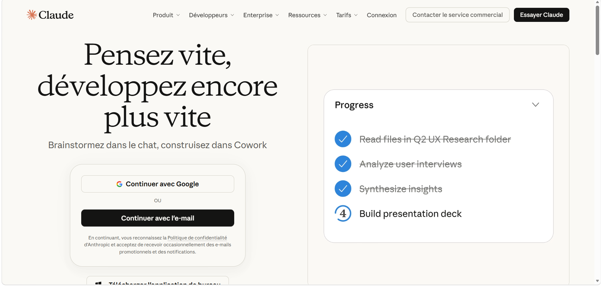

</div>

<div class="etape" markdown>

### <span class="etape-num">2</span> Découvrir l'interface

L'écran se compose de deux parties.

- **À gauche, la barre latérale** : **Nouveau** pour démarrer une conversation, **Projets** pour organiser votre travail par cours, **Artéfacts** pour retrouver vos créations, puis la liste de vos conversations. L'icône de **panneau** en haut à gauche masque ou affiche la barre. Votre nom et votre formule d'abonnement apparaissent tout en bas.
- **Au centre, la zone de saisie** (« Comment puis-je vous aider aujourd'hui ? ») : le bouton **+** à gauche donne accès aux fichiers et aux outils, et le **micro** à droite permet de dicter votre demande. Laissez le sélecteur sur **Chat** : l'option **Cowork**, à côté, est réservée aux abonnements payants.

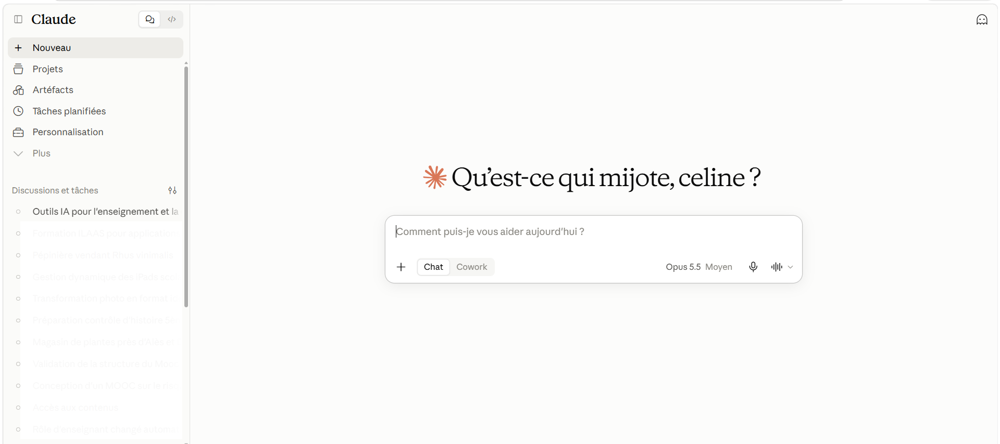

</div>

<div class="etape" markdown>

### <span class="etape-num">3</span> Formuler une demande

Cliquez dans la zone de saisie et décrivez ce que vous voulez obtenir en précisant le **résultat attendu**, le **public** visé et les **contraintes** (longueur, ton, format). Appuyez sur **Entrée** ou cliquez sur la **flèche orange**, à droite de la zone de saisie, pour envoyer. Poursuivez ensuite la conversation pour affiner le résultat : « plus court », « ajoute un exemple », « adapte pour des étudiants de 1re année ».

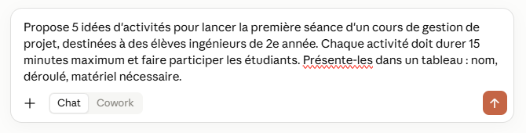

</div>

<div class="etape" markdown>

### <span class="etape-num">4</span> Découvrir le menu +

Cliquez sur le bouton **+** à gauche de la zone de saisie, au début d'une conversation ou en cours de route (la zone affiche alors « Écrivez un message… »). Il regroupe tout ce que Claude peut utiliser pour votre demande :

| Option | À quoi elle sert |
|---|---|
| **Ajouter des fichiers ou des photos** | Joindre un document ou une image (raccourci **Ctrl + U**) |
| **Prendre une capture d'écran** | Joindre une image de ce qui est affiché à l'écran |
| **Ajouter au projet** | Rattacher la conversation à l'un de vos projets |
| **Compétences** | Utiliser des savoir-faire prêts à l'emploi (par exemple créer un document Word ou une présentation) |
| **Connecteurs** | Relier Claude à d'autres services (stockage, agenda…), avec votre autorisation |
| **Recherche web** | Permettre à Claude de chercher des informations récentes sur le web ; une coche indique que l'option est active |
| **Mémoire** | Permettre à Claude de se souvenir d'éléments de vos conversations précédentes ; cette option s'affiche au début d'une nouvelle conversation |

D'autres options peuvent apparaître selon votre abonnement, comme **Recherche** (recherche approfondie), **Système de design** ou **Ajouter des plugins** : elles ne sont pas disponibles ou sont limitées en version gratuite.

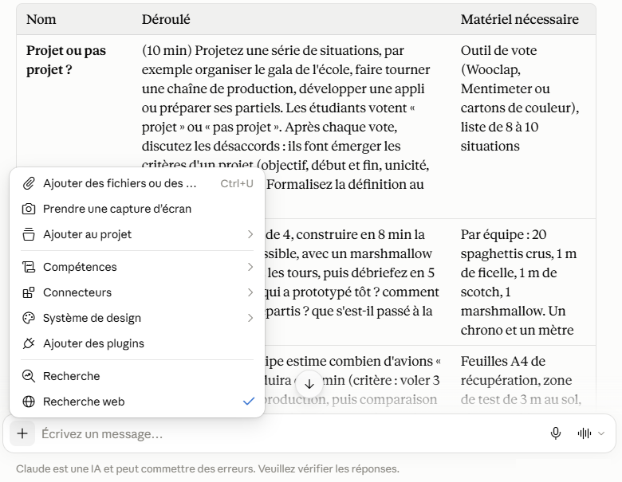

</div>

<div class="etape" markdown>

### <span class="etape-num">5</span> Joindre un document

Cliquez sur le bouton **+** de la zone de saisie, puis sur **Ajouter des fichiers ou des photos** (ou appuyez sur **Ctrl + U**), et sélectionnez votre document : PDF, Word, tableur, présentation ou image. Vous pouvez aussi glisser le fichier directement dans la zone de saisie. Posez ensuite votre question à son sujet. Le fichier reste disponible pendant toute la conversation.

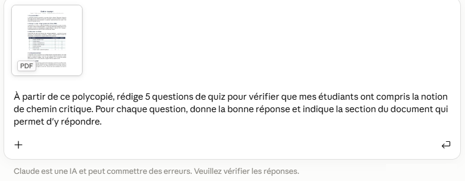

</div>

<div class="etape" markdown>

### <span class="etape-num">6</span> Demander un artéfact

Un **artéfact** est un contenu que Claude crée à part, dans un panneau qui s'ouvre à droite de la conversation : un quiz interactif, un document, un tableau, un schéma. Il n'y a aucun menu à ouvrir : tout se passe dans la conversation.

Dans la zone de saisie, décrivez le contenu voulu et ajoutez **« dans un artéfact »**. Par exemple, après avoir obtenu des questions de quiz : « Transforme ces 5 questions en quiz interactif dans un artéfact : une question à la fois, un message après chaque réponse et le score à la fin. » Envoyez la demande.

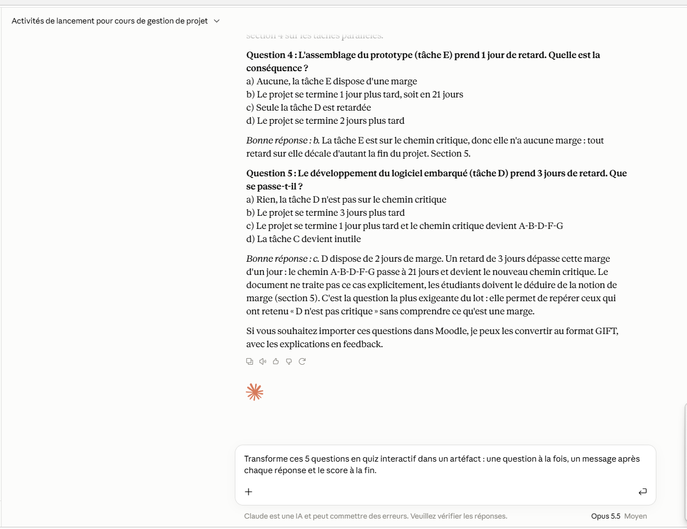

</div>

<div class="etape" markdown>

### <span class="etape-num">7</span> Découvrir l'artéfact

Après quelques secondes, un **panneau s'ouvre à droite** de l'écran et affiche le résultat. Pour un quiz, vous pouvez le tester directement : répondez aux questions comme le ferait un étudiant et vérifiez les messages et le score.

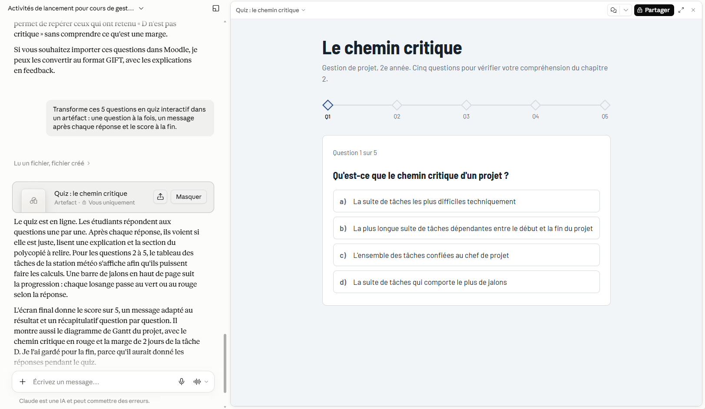

</div>

<div class="etape" markdown>

### <span class="etape-num">8</span> Utiliser les boutons du panneau

Deux zones permettent de gérer l'artéfact.

- **En haut du panneau** : le **titre** de l'artéfact, le bouton noir **Partager** pour le rendre accessible à d'autres personnes (voir l'étape 10), l'icône à **double flèche** pour l'afficher en plein écran, et la **croix** pour fermer le panneau.
- **Dans la conversation**, un **encadré gris** portant le titre de l'artéfact apparaît sous votre demande. Il indique aussi sa visibilité : **Vous uniquement** signifie que personne d'autre ne peut le voir. Le bouton **Masquer** ferme le panneau ; cliquez à nouveau sur cet encadré pour le rouvrir.

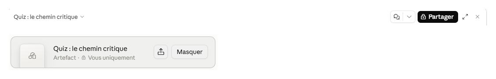

</div>

<div class="etape" markdown>

### <span class="etape-num">9</span> Modifier l'artéfact

Pour faire évoluer l'artéfact, écrivez simplement vos demandes dans la conversation : « ajoute une question », « affiche la correction à la fin », « utilise des couleurs plus sobres ». Claude met à jour le panneau à chaque demande.

</div>


<div class="etape" markdown>

### <span class="etape-num">10</span> Retrouver et partager vos artéfacts

Cliquez sur **Artéfacts** dans la barre latérale : la page liste toutes vos créations, des plus récentes aux plus anciennes.

- Les onglets **Tous**, **Les vôtres** et **Partagé avec vous** filtrent la liste ; la **loupe** permet de rechercher un artéfact par son titre.
- Chaque ligne affiche le titre de l'artéfact et un **cadenas**, qui indique qu'il est privé. Cliquez sur la ligne pour l'ouvrir, ou sur les **trois points** à droite pour les autres options.
- Pour transmettre un artéfact, ouvrez-le puis cliquez sur **Partager** en haut du panneau : vous obtenez un lien à diffuser, par exemple sur Moodle. Tant que vous ne l'avez pas partagé, il reste visible par vous seul.

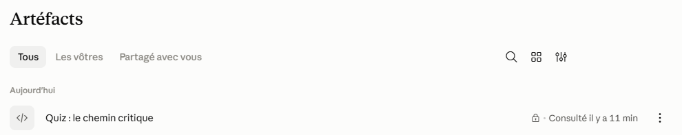

</div>

<div class="etape" markdown>

### <span class="etape-num">11</span> Créer un projet

Un **projet** regroupe les conversations, les documents et les consignes d'un même sujet, par exemple un cours. La version gratuite permet d'en créer jusqu'à 5.

1. Cliquez sur **Projets** dans la barre latérale. La page affiche vos projets, ainsi qu'un projet d'exemple, **How to use Claude**, qui sert de guide d'utilisation (en anglais).
2. Cliquez sur le bouton noir **Nouveau projet**, en haut à droite.
3. Donnez un nom au projet (par exemple celui de votre cours) et une courte description, puis validez.
4. Dans le projet, ajoutez vos **documents** (polycopié, plan de cours) et des **instructions** permanentes, par exemple : « Tu m'aides à préparer mon cours de gestion de projet pour des élèves de 2e année. Appuie-toi sur le polycopié du projet. »
5. Lancez vos conversations depuis le projet : elles s'appuieront sur ces documents et ces instructions. Pour rattacher une conversation existante, cliquez sur **+**, puis sur **Ajouter au projet**.

La **loupe** et la double flèche, à côté du bouton **Nouveau projet**, permettent de rechercher et de trier vos projets.

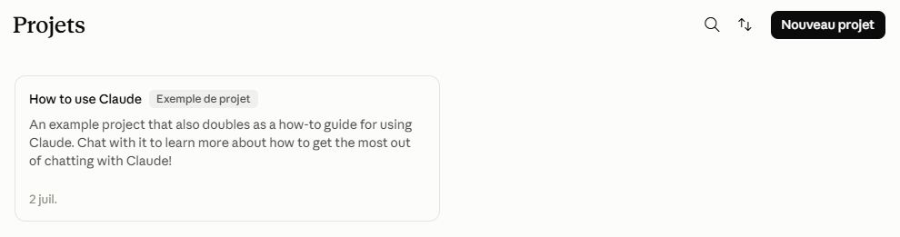

</div>

<div class="etape" markdown>

### <span class="etape-num">12</span> Découvrir la page Personnalisation

Cliquez sur **Personnalisation** dans la barre latérale. Cette page permet d'ajouter des fonctions à Claude, réparties en onglets :

- **Compétences** : des savoir-faire prêts à l'emploi, par exemple pour créer des documents ou analyser des données. L'onglet **Découvrir** propose les compétences disponibles ; cliquez sur **+** pour en ajouter une, et retrouvez celles que vous avez ajoutées dans **Les vôtres** ;
- **Connecteurs** : relier Claude à d'autres services (stockage, agenda…), avec votre autorisation ;
- **Plugins** : des ensembles d'outils, surtout utiles avec les abonnements payants.

La plupart des compétences sont décrites en anglais. Pour débuter, vous pouvez ignorer cette page : Claude fonctionne très bien sans rien ajouter.

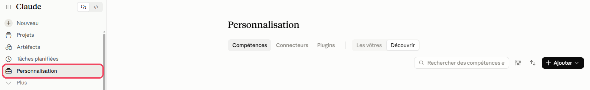

</div>

<div class="etape" markdown>

### <span class="etape-num">13</span> Donner des instructions permanentes à Claude

Vous pouvez indiquer une fois pour toutes qui vous êtes et comment vous souhaitez que Claude vous réponde. Il en tiendra compte dans toutes vos conversations.

1. Cliquez sur votre nom en bas à gauche, puis sur **Paramètres**. Une fenêtre s'ouvre, avec un menu à gauche.
2. Dans ce menu, cliquez sur **Compte**. La page commence par la section **Profil**.
3. Si vous le souhaitez, choisissez votre métier dans la liste **Quel type de travail exercez-vous ?**
4. Dans la zone **Instructions pour Claude**, écrivez vos consignes, par exemple : « Je suis enseignant en école d'ingénieurs. Réponds en français, de façon structurée, et signale toujours les points à vérifier. »

Les modifications sont prises en compte dès les conversations suivantes.

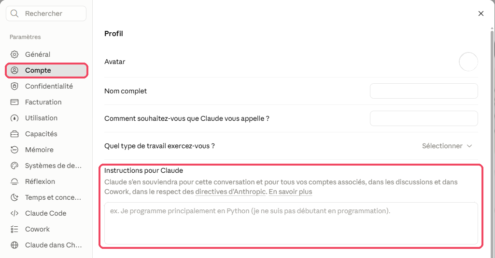

</div>

<div class="etape" markdown>

### <span class="etape-num">14</span> Protéger vos données

1. Ouvrez les **Paramètres** comme à l'étape précédente (votre nom en bas à gauche, puis **Paramètres**).
2. Dans le menu de gauche, cliquez sur **Confidentialité**.
3. Repérez l'option **Contribuez à améliorer nos modèles d'IA**. Si l'interrupteur à droite est bleu, vos conversations peuvent servir à entraîner les modèles d'Anthropic : cliquez dessus pour le désactiver (il devient gris).
4. Plus bas, dans **Vos données**, la ligne **Artefacts partagés** et son bouton **Gérer** vous permettent de vérifier les artéfacts que vous avez partagés et de retirer un partage.

Pour une demande que vous ne souhaitez pas conserver, utilisez une **conversation privée** (icône en haut à droite d'une nouvelle conversation) : elle n'est pas enregistrée dans votre historique.

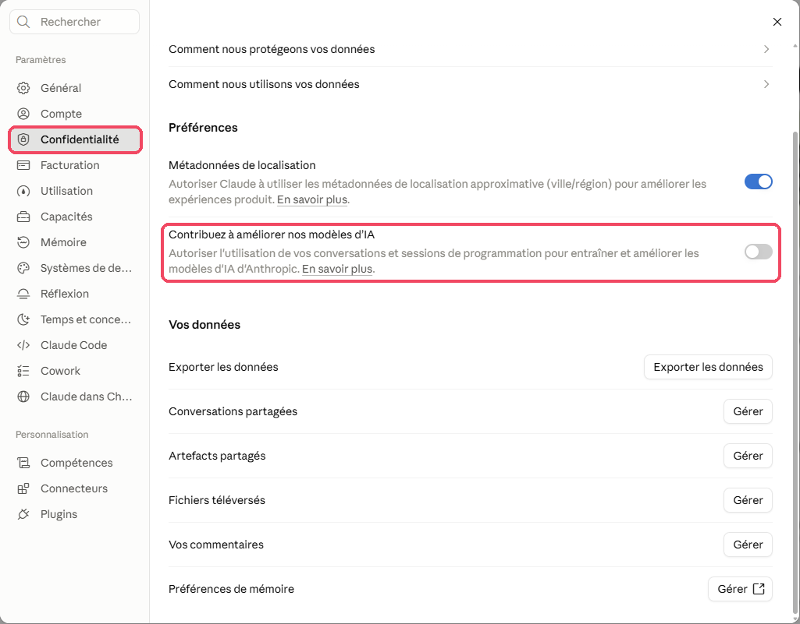

</div>

## Ressources officielles

- [Centre d'aide de Claude](https://support.claude.com) : prise en main, projets, artéfacts, confidentialité.
- [Comparatif des formules](https://claude.com/pricing) : ce qui est inclus dans la version gratuite et dans les abonnements.
- [Notes de version](https://support.claude.com/en/articles/12138966-release-notes) : les nouveautés, mois par mois (en anglais).

## Points de vigilance

!!! warning "Données"
    Anthropic est une entreprise américaine : vos conversations sont traitées hors de l'Union européenne. N'y déposez ni données personnelles d'étudiants (noms, notes, copies nominatives), ni documents confidentiels. Pensez à anonymiser tout document avant de le joindre.

!!! tip "Fiabilité"
    Claude peut se tromper, notamment sur des calculs, des dates ou des références bibliographiques. Relisez tout contenu avant de le transmettre à vos étudiants.

!!! info "Artéfacts partagés"
    Un artéfact publié est accessible à toute personne qui dispose du lien. Vérifiez son contenu avant de le partager, et ne publiez jamais d'informations personnelles.

!!! note "Évaluation"
    Claude peut vous aider à formuler un retour sur une production, mais l'évaluation reste la vôtre : ne lui déléguez jamais une note.
