# Gemini

<span class="badge badge-hors-ue">Hors UE</span> <span class="badge badge-gratuit">Gratuit, compte Google</span>

<p class="maj">Dernière vérification : à compléter</p>

**Gemini** est l'assistant conversationnel de Google. Il se distingue par ses liens avec l'univers Google : il peut regarder une vidéo YouTube, créer des diapositives dans son **Canvas**, exporter ses réponses vers Google Docs, travailler avec vos **notebooks NotebookLM** et créer des **Gems**, des assistants personnalisés que vous pouvez partager avec vos étudiants.

[Ouvrir Gemini](https://gemini.google.com){ .md-button .md-button--primary }

!!! info "Fiche en cours de rédaction"
    Le tutoriel complet sera bientôt disponible.

## À quoi ça sert dans le supérieur

- **Créer un assistant de cours** (Gem) qui guide les étudiants sans leur donner les réponses.
- **Exploiter une vidéo** : résumer une conférence ou un tutoriel YouTube, en tirer des questions.
- **Créer des diapositives** à partir d'un polycopié, dans le Canvas.
- **Prolonger le travail fait dans NotebookLM** : interroger les sources d'un notebook depuis Gemini, ou verser une conversation Gemini dans un notebook (voir la fiche [NotebookLM](../recherche/notebooklm.md)).
- **Analyser une image** : photo de tableau, schéma de montage, graphique.
- **Préparer des exercices à indices progressifs**, pour accompagner les étudiants pas à pas.

## Version gratuite

Avec un compte Google gratuit, vous accédez à Gemini sur le web et sur mobile, avec un modèle rapide et un accès limité au modèle le plus puissant. La version gratuite comprend la génération et la modification d'images, la **recherche approfondie** (Deep Research), le **Canvas**, les **Gems** et la conversation à voix haute (**Gemini Live**). L'utilisation est limitée : le quota se renouvelle toutes les 5 heures, dans la limite d'un plafond hebdomadaire. Les documents trop longs peuvent aussi dépasser la capacité de lecture de la version gratuite. Les abonnements payants (Google AI Plus, Pro et Ultra) relèvent ces limites et ajoutent notamment la génération de vidéos.

## Cas d'usage

=== "Créer un Gem tuteur"

    Un **Gem** est une version de Gemini que vous configurez une fois pour toutes, avec un nom, des instructions et, si besoin, des documents de référence (voir l'étape 10 du pas à pas).

    **Exemple** : un assistant qui accompagne vos étudiants en méthodes numériques, sans faire le travail à leur place.

    Lors de la création du Gem, donnez-lui ces instructions :

    ```
    Tu es tuteur en méthodes numériques pour des élèves
    ingénieurs de 2e année. Quand un étudiant te pose une
    question sur un exercice, ne donne jamais la solution
    complète : pose-lui une question pour l'aider à avancer,
    puis donne un indice si besoin. Vérifie qu'il a compris
    en lui demandant de reformuler. Réponds en français.
    ```

    Vous pouvez ensuite partager le Gem avec vos étudiants par un lien.

=== "Exploiter une vidéo"

    **Exemple** : une conférence en ligne sur la production d'hydrogène, pour un cours d'énergétique.

    Collez le lien de la vidéo YouTube, puis demandez :

    ```
    Résume cette conférence en 10 points clés pour des élèves
    ingénieurs de 3e année en énergétique. Indique pour chaque
    point le moment de la vidéo où il est abordé, puis propose
    5 questions de compréhension à poser en début de TD.
    ```

=== "Diapositives avec Canvas"

    **Exemple** : un chapitre de polycopié de mécanique des sols, à transformer en support de cours.

    Cliquez sur **+**, puis sur **Canvas**, joignez le chapitre et demandez :

    ```
    À partir de ce chapitre, crée un diaporama de 10
    diapositives pour un cours de mécanique des sols en
    2e année d'école d'ingénieurs : une idée par diapositive,
    des phrases courtes, et une diapositive de synthèse avec
    3 questions de vérification. Insiste sur les notions de
    contrainte effective et de consolidation.
    ```

    Relisez chaque diapositive : Gemini peut simplifier à l'excès ou se tromper.

=== "Analyser une image"

    **Exemple** : la photo du tableau en fin de cours d'automatique, à transformer en fiche propre.

    Joignez la photo, puis demandez :

    ```
    Voici la photo de mon tableau à la fin d'un cours sur la
    stabilité des systèmes asservis. Retranscris-le sous forme
    de fiche de synthèse structurée, avec les équations en
    clair. Signale les passages que tu n'arrives pas à lire
    plutôt que de les deviner.
    ```

=== "Exercice à indices progressifs"

    **Exemple** : un exercice de chimie des solutions pour un travail en autonomie.

    ```
    Rédige un exercice de chimie des solutions sur le calcul
    du pH d'un tampon, pour des élèves ingénieurs de 1re année.
    Ajoute 3 indices de plus en plus précis, à consulter dans
    l'ordre en cas de blocage, puis le corrigé détaillé.
    ```

## Pas à pas

:material-magnify-plus-outline: Cliquez sur une capture pour l'agrandir.
{ .astuce-zoom }

<div class="etape" markdown>

### <span class="etape-num">1</span> Se connecter avec votre compte Gmail

1. Rendez-vous sur [gemini.google.com](https://gemini.google.com). La page de présentation de Gemini s'affiche : cliquez sur **Discuter avec Gemini**.

    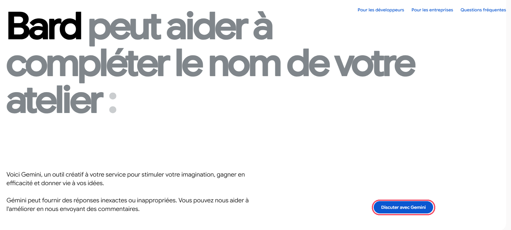

2. La fenêtre **Conditions d'utilisation et règles de confidentialité** s'ouvre. Sa partie **Vos données et les applications Gemini** explique ce que Google collecte : vos discussions, les fichiers et images que vous partagez, et des informations sur votre position. Lisez-la, puis cliquez sur **Utiliser Gemini**.

    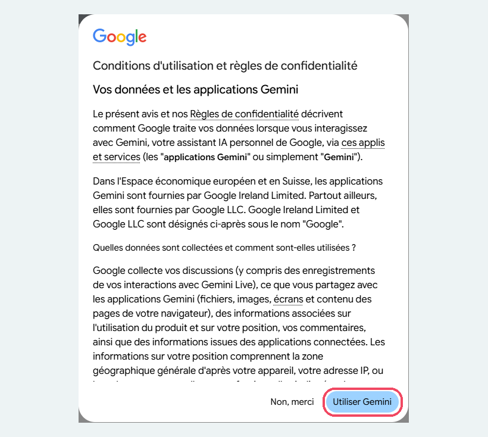

3. Dans la fenêtre **Sélectionnez un compte**, choisissez votre compte **Gmail personnel** s'il apparaît dans la liste. Sinon, cliquez sur **Utiliser un autre compte**, puis saisissez votre adresse Gmail et votre mot de passe.

Gemini s'utilise avec un compte Google : connectez-vous avec votre compte Gmail personnel, et réglez-le pour protéger vos données (voir les étapes 13 et 14).

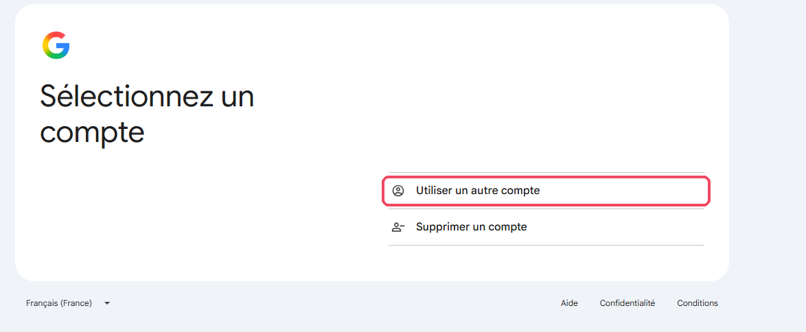

</div>

<div class="etape" markdown>

### <span class="etape-num">2</span> Découvrir l'interface

L'écran se compose de deux parties.

- **À gauche, la barre latérale** : **Nouvelle discussion** pour démarrer une conversation, **Rechercher dans les discussions**, **Images** pour créer et retrouver des images, **Bibliothèque** pour retrouver vos fichiers. La rubrique **Notebooks** regroupe vos notebooks, partagés avec NotebookLM (**Nouveau notebook** pour en créer un), et la rubrique **Récentes** liste vos conversations. Tout en bas se trouvent **Activité** (l'historique de vos conversations, voir l'étape 13), votre nom et une **roue dentée** qui ouvre les réglages. Gemini y affiche aussi la ville d'où vous vous connectez, déduite de votre adresse IP. L'icône de **panneau**, en haut, réduit la barre à une colonne d'icônes.
- **Au centre, la zone de saisie** (« Demander à Gemini ») : le bouton **+** à gauche donne accès aux fichiers et aux outils, le sélecteur **Flash** permet de choisir le mode de réponse (voir l'étape 7) et le **micro** sert à dicter votre demande.

En haut à droite, l'icône de **discussion temporaire** permet d'ouvrir une conversation qui ne sera pas conservée (voir l'étape 14).

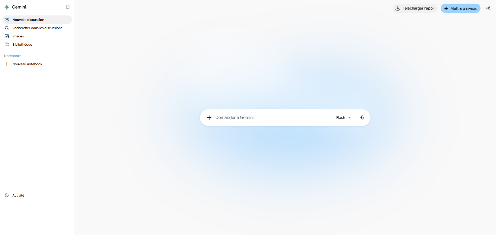

</div>

<div class="etape" markdown>

### <span class="etape-num">3</span> Formuler une demande

Cliquez dans la zone **Demander à Gemini** et décrivez ce que vous voulez obtenir en précisant le **résultat attendu**, le **public** visé et les **contraintes** (longueur, format, niveau). Par exemple : « Propose 4 mises en situation pour introduire un cours de science des matériaux à des élèves ingénieurs de 1re année. Chacune doit partir d'un objet du quotidien ou d'un incident industriel réel, tenir en 5 lignes et se terminer par une question à poser aux étudiants. »

Appuyez sur **Entrée** ou cliquez sur la **flèche**, dans le rond bleu à droite de la zone de saisie, pour envoyer. Poursuivez ensuite la conversation pour affiner le résultat.

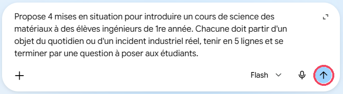

</div>

<div class="etape" markdown>

### <span class="etape-num">4</span> Découvrir le menu +

Cliquez sur le bouton **+** à gauche de la zone de saisie : il se transforme en croix, et un menu s'ouvre en dessous.

| Option | À quoi elle sert |
|---|---|
| **Importer des fichiers** | Joindre un document ou une image depuis votre ordinateur |
| **Ajouter depuis Drive** | Joindre un fichier enregistré dans votre Google Drive |
| **Plus d'importations** | D'autres sources, dont vos notebooks NotebookLM (voir l'étape 6) |
| **Créer une image** | Générer une image à partir de votre description |
| **Créer de la musique** | Générer un court morceau de musique |
| **Canvas** | « Codez, écrivez ou créez des diapositives » dans un espace à part (voir l'étape 9) |
| **Deep Research** | Obtenir un rapport détaillé, construit à partir de nombreuses sources (voir l'étape 8) |
| **Apprentissage guidé** | Comprendre une notion pas à pas : Gemini vous guide par des questions plutôt que de donner directement la réponse |

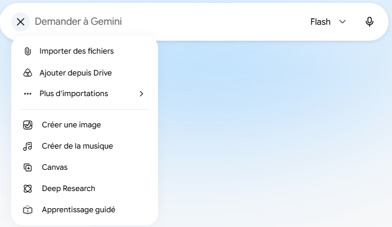

</div>

<div class="etape" markdown>

### <span class="etape-num">5</span> Joindre un document

1. Cliquez sur le bouton **+**, puis sur **Importer des fichiers** pour un fichier de votre ordinateur, ou sur **Ajouter depuis Drive** pour un fichier de votre Google Drive.
2. Choisissez le fichier. Il s'affiche au-dessus de la zone de saisie.
3. Écrivez votre demande en vous référant au document, puis envoyez-la.

Retirez toute donnée personnelle d'un document avant de le joindre.

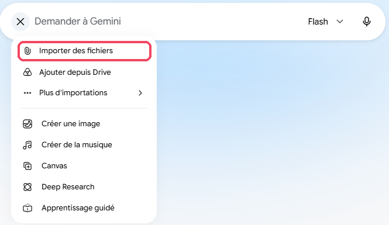

</div>

<div class="etape" markdown>

### <span class="etape-num">6</span> Utiliser un notebook NotebookLM

Vos notebooks sont partagés entre Gemini et [NotebookLM](../recherche/notebooklm.md) : un notebook créé dans l'un apparaît dans l'autre, avec ses sources. Vous pouvez donc demander à Gemini de travailler à partir des documents d'un notebook.

1. Ouvrez la fenêtre **Ajouter un notebook** depuis le bouton **+**.
2. La liste de vos notebooks s'affiche, avec pour chacun son nombre de sources et sa date de création. Cliquez sur le notebook voulu : une coche bleue apparaît et le bas de la fenêtre indique **1 sélectionné(s)**. Cliquez sur **Ajouter**.

    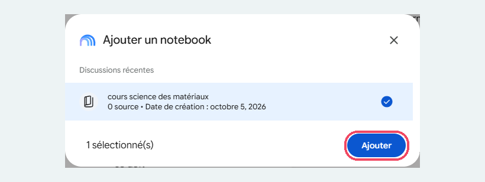

3. Le notebook s'affiche sous forme de vignette au-dessus de la zone de saisie. Écrivez votre demande, par exemple : « À partir de mon carnet NotebookLM sur le béton auto-cicatrisant, crée un quiz d'entraînement de 10 questions à choix multiples pour des élèves ingénieurs de 2e année. Mélange des questions de mémorisation, de compréhension et d'application. Pour chaque question, donne la bonne réponse, une courte explication et la partie du cours concernée. »

    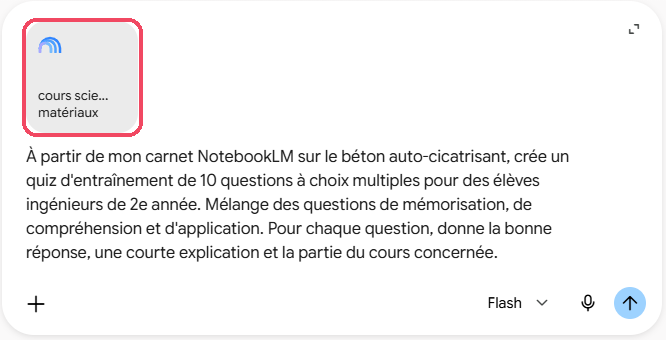

4. Gemini peut répondre par un **quiz interactif**, qui s'ouvre dans un panneau à droite : une question à la fois, quatre réponses au choix, un **Indice** à déplier, les boutons **Retour** et **Suivant**, et le compte des bonnes et des mauvaises réponses. En haut du panneau, deux icônes permettent de **partager** le quiz et de le **fermer**. Pour obtenir le quiz sous forme de texte, cliquez sur **Réessayer sans quiz interactif** dans la conversation.

Choisissez un notebook qui contient des sources : un notebook indiqué « 0 source » ne donnera à Gemini aucun document sur lequel s'appuyer.

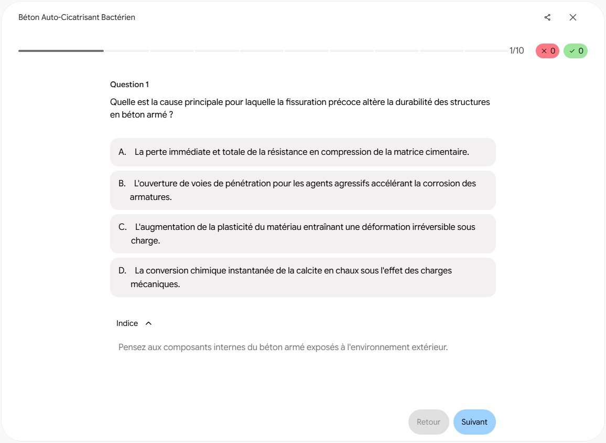

</div>

<div class="etape" markdown>

### <span class="etape-num">7</span> Activer le raisonnement étendu

Pour une question complexe (un calcul en plusieurs étapes, une démonstration, un problème ouvert), demandez à Gemini de prendre davantage de temps pour raisonner.

1. Cliquez sur le sélecteur **Flash**, à droite de la zone de saisie. La liste des modes de réponse s'affiche : **3.5 Flash-Lite** (« Réponses les plus rapides »), **3.6 Flash** (« Aide polyvalente », choisi par défaut) et **3.1 Pro** (« Raisonnement avancé », dont l'accès est limité dans la version gratuite).

    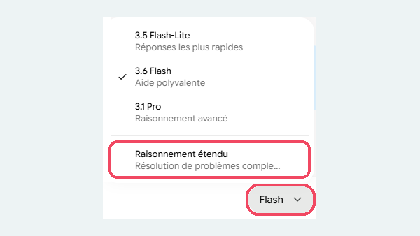

2. Sous ces modes, cliquez sur **Raisonnement étendu** (« Résolution de problèmes complexes »). Une coche apparaît devant l'option, et le sélecteur affiche désormais **Flash Extended**.

Les réponses sont plus lentes, mais plus approfondies.


</div>

<div class="etape" markdown>

### <span class="etape-num">8</span> Lancer une recherche approfondie

La recherche approfondie consulte de nombreuses sources sur le web et en tire un rapport structuré, avec les liens vers chaque source.

1. Cliquez sur le bouton **+**, puis sur **Deep Research**.
2. Écrivez votre demande en précisant le sujet, la période, les sources attendues et la forme du résultat, puis envoyez-la.

La recherche prend plusieurs minutes, et son nombre d'utilisations est limité dans la version gratuite. Ouvrez les liens fournis pour vérifier chaque source avant de réutiliser le rapport.

<!-- Capture attendue : gemini-08-deep-research.png -->

</div>

<div class="etape" markdown>

### <span class="etape-num">9</span> Créer dans le Canvas

Le **Canvas** est un espace de travail à part, ouvert à droite de la conversation, dans lequel Gemini rédige un document, du code ou des diapositives que vous pouvez ensuite modifier.

1. Cliquez sur le bouton **+**, puis sur **Canvas** (au survol, l'info-bulle indique « Codez, écrivez ou créez des diapositives »).
2. Écrivez votre demande, par exemple celle de l'onglet « Diapositives avec Canvas » des cas d'usage, puis envoyez-la.

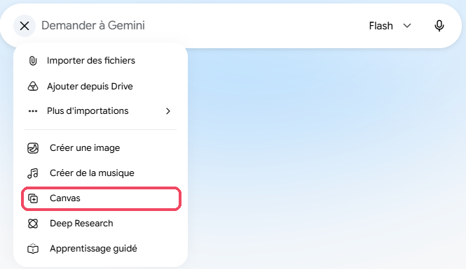

</div>

<div class="etape" markdown>

### <span class="etape-num">10</span> Créer un Gem

**Un Gem, qu'est-ce que c'est ?** C'est une version de Gemini que vous configurez une fois pour toutes pour une tâche précise. Vous lui donnez un nom, des instructions (son rôle, sa manière de répondre, ce qu'il doit éviter) et, si besoin, des documents de référence. Ensuite, chaque fois que vous l'ouvrez, il applique ces consignes sans que vous ayez à les répéter. Google les présente ainsi : « Les Gems sont des versions personnalisées de Gemini qui fournissent des réponses sur mesure. » Exemples : un tuteur qui guide vos étudiants sans donner les réponses, un relecteur de sujets d'examen, un assistant qui rédige vos courriels selon votre style.

1. Cliquez sur la **roue dentée**, en bas à gauche, puis sur **Gems**.

    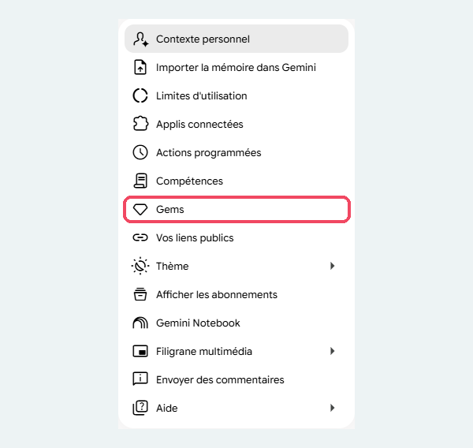

2. La page **Gestionnaire de Gems** s'ouvre. La rubrique **Prédéfinis par Google** propose des Gems prêts à l'emploi (**Storybook**, **Assistant au brainstorming**, **Guide de carrière**, **Partenaire de code**). Sous **Mes Gems**, cliquez sur **Nouveau Gem**.

    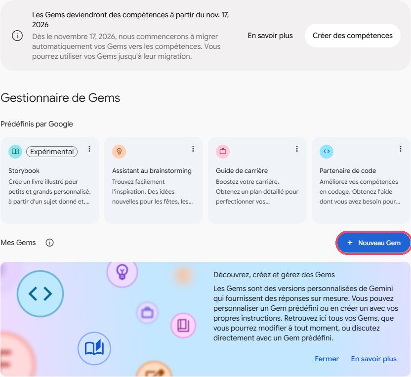

3. Remplissez le formulaire :
    - **Nom** : par exemple « Tuteur méthodes numériques » (obligatoire) ;
    - **Description** : à quoi sert le Gem ;
    - **Instructions** : son rôle et sa façon de répondre (voir l'exemple dans les cas d'usage, onglet « Créer un Gem tuteur ») ;
    - **Outil par défaut** : laissez **Aucun outil par défaut** ;
    - **Connaissances** : cliquez sur **+** pour ajouter des fichiers de référence, par exemple votre polycopié.
4. Testez le Gem dans la partie **Prévisualiser**, à droite : elle devient utilisable dès que le Gem a un nom.
5. Cliquez sur **Enregistrer**, en haut à droite.

!!! info "Les Gems deviennent des « compétences »"
    Une bannière de la page **Gestionnaire de Gems** l'annonce : à partir du 17 novembre 2026, Google migre automatiquement les Gems vers les **compétences**. Vous pouvez utiliser vos Gems jusqu'à leur migration.

<!-- Capture attendue : gemini-10-nouveau-gem.png (formulaire Nouveau Gem) -->

</div>

<div class="etape" markdown>

### <span class="etape-num">11</span> Dicter une demande

1. Cliquez sur le **micro**, à droite de la zone de saisie (au survol, l'info-bulle **Dicter** s'affiche, avec le raccourci **Ctrl + Maj + D**).
2. Autorisez votre navigateur à utiliser le micro si la question vous est posée.
3. Parlez : votre texte s'inscrit dans la zone de saisie. Relisez-le, corrigez-le si besoin, puis envoyez-le.

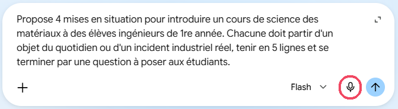

</div>

<div class="etape" markdown>

### <span class="etape-num">12</span> Donner des instructions permanentes

Vous pouvez indiquer une fois pour toutes comment vous souhaitez que Gemini vous réponde.

1. Cliquez sur la **roue dentée**, en bas à gauche, puis sur **Contexte personnel**.

    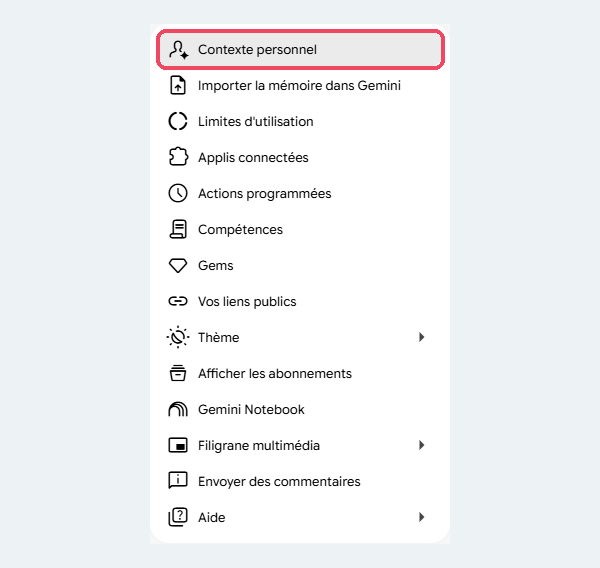

2. La page **Contexte personnel** comporte deux réglages :
    - **Mémoire** : lorsque l'interrupteur est activé, « Gemini apprend de vos anciennes discussions ». Vous pouvez le laisser désactivé ;
    - **Vos instructions pour Gemini** : vérifiez que l'interrupteur est activé (bleu, avec une coche).

    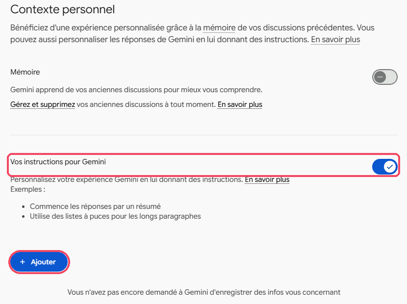

3. Cliquez sur **Ajouter**. Dans la fenêtre **Que voulez-vous que Gemini mémorise ?**, écrivez vos consignes, par exemple :

    ```
    Réponds en français, de façon structurée et concise, avec
    un vocabulaire scientifique précis. Pour mes enseignements,
    propose des contenus adaptés au niveau indiqué, avec des
    objectifs d'apprentissage formulés par des verbes d'action
    et des exemples tirés de cas industriels réels. Ne jamais
    inventer de référence bibliographique. Signale toujours les
    points à vérifier, en particulier les calculs, les chiffres
    et les normes.
    ```

4. Cliquez sur **Envoyer**.

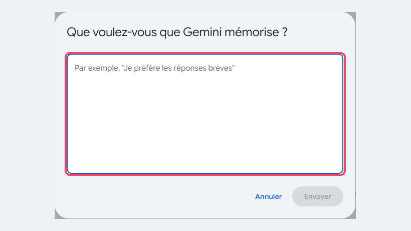

</div>

<!--
Étape restant à rédiger (capture attendue) :
13. Désactiver l'enregistrement de l'activité (lien « Activité » en bas de la barre latérale)
-->

<div class="etape" markdown>

### <span class="etape-num">14</span> Utiliser une discussion temporaire

Pour une demande que vous ne souhaitez pas conserver, utilisez une **discussion temporaire**. Elle n'apparaît pas dans votre historique et ne sert ni à entraîner les modèles de Google, ni à personnaliser vos réponses. Google la conserve toutefois 72 heures.

1. Cliquez sur **Nouvelle discussion**.
2. En haut à droite, cliquez sur l'icône de discussion temporaire : l'info-bulle **Activer les discussions temporaires** s'affiche au survol.
3. Écrivez votre demande comme d'habitude.


</div>

## Ressources officielles

- [Centre d'aide Gemini](https://support.google.com/gemini?hl=fr) : prise en main, fonctionnalités, confidentialité.
- [Limites de la version gratuite et des abonnements](https://support.google.com/gemini/answer/16275805?hl=fr) : ce qui est inclus selon la formule.
- [Gérer et supprimer votre activité](https://support.google.com/gemini/answer/13278892?hl=fr) : enregistrement des conversations, durée de conservation, chat temporaire.
- [Organiser vos projets avec les notebooks](https://support.google.com/gemini/answer/16972047?hl=fr) : notebooks partagés entre Gemini et NotebookLM.
- [Centre de confidentialité des applications Gemini](https://support.google.com/gemini/answer/13594961?hl=fr) : utilisation de vos données.

## Points de vigilance

!!! warning "Données"
    Google est une entreprise américaine : vos conversations sont traitées hors de l'Union européenne. Avec un compte Google personnel, elles peuvent être lues par des personnes chargées d'améliorer les modèles. N'y déposez ni données personnelles d'étudiants (noms, notes, copies nominatives), ni documents confidentiels, et désactivez l'enregistrement de l'activité (voir le pas à pas).

!!! tip "Fiabilité"
    Gemini peut se tromper ou inventer des références, y compris lorsqu'il résume une vidéo ou un document. Vérifiez chaque information avant de la transmettre à vos étudiants.

!!! info "Gems partagés"
    Un Gem partagé est accessible à toute personne qui dispose du lien. Ne mettez dans ses instructions ou ses fichiers aucune information personnelle ou confidentielle.

!!! note "Une interface qui évolue vite"
    Google modifie régulièrement l'interface et les limites de la version gratuite. Si un intitulé a changé, le principe reste généralement le même.
