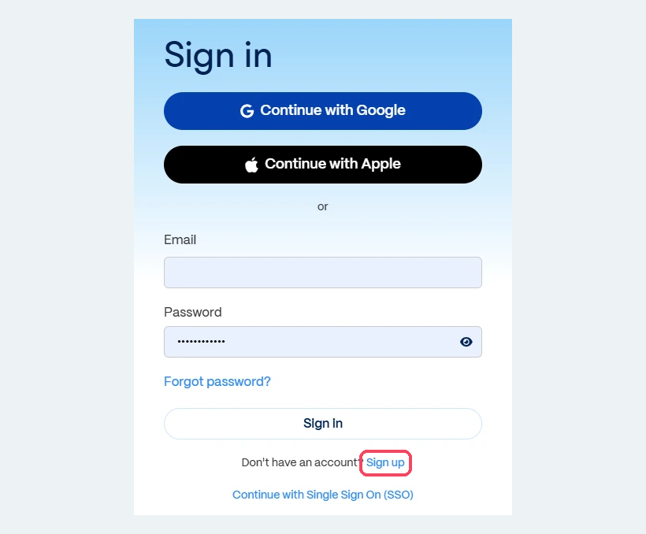
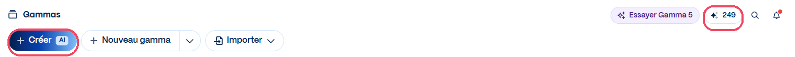
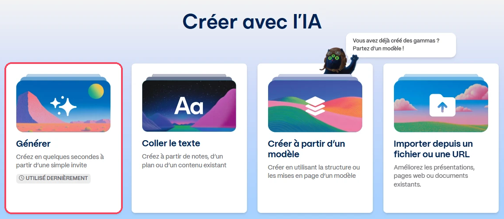
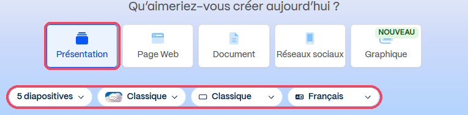

# Gamma

<span class="badge badge-hors-ue">Hors UE</span> <span class="badge badge-gratuit">Gratuit, crédits limités</span>

<p class="maj">Dernière vérification : à compléter</p>

**Gamma** crée en quelques secondes une présentation, une page web ou un document mis en page, à partir d'une simple demande, d'un plan ou d'un texte existant. Chaque diapositive, appelée **carte**, se modifie ensuite librement : texte, images, mise en page, thème graphique. Le résultat se présente directement dans le navigateur, se partage par un lien ou s'exporte.

[Ouvrir Gamma](https://gamma.app){ .md-button .md-button--primary }

!!! info "Fiche en cours de rédaction"
    Le tutoriel complet sera bientôt disponible.

## À quoi ça sert dans le supérieur

- **Produire rapidement un premier support de cours** à partir de votre plan, à retravailler ensuite.
- **Rédiger une fiche de synthèse mise en page** pour vos étudiants (format document).
- **Proposer un modèle de soutenance** à vos étudiants, avec la structure attendue.
- **Créer une page web de présentation** d'un module, d'un projet ou d'une option.

## Version gratuite

Le compte gratuit donne **400 crédits à l'inscription**. Chaque action d'IA (générer une présentation, réécrire une carte, créer une image) consomme des crédits, et **ces crédits ne se renouvellent pas** : une fois épuisés, il faut en gagner en parrainant d'autres personnes ou passer à un abonnement payant. La version gratuite génère **jusqu'à 10 cartes** par demande (vous pouvez en ajouter d'autres à la main), et les fichiers exportés portent la mention « Made with Gamma ». Les abonnements payants (Plus, Pro) donnent davantage de crédits, des présentations plus longues et retirent la mention « Made with Gamma ».

!!! warning "Économisez vos crédits"
    Préparez votre plan avant de lancer la génération, et retouchez les cartes à la main plutôt que de tout régénérer : avec 400 crédits qui ne se renouvellent pas, chaque génération compte.

## Cas d'usage

=== "Support de cours"

    **Exemple** : la séance d'introduction d'un cours de mécanique des fluides en 1re année.

    ```
    Présentation de 10 cartes pour la première séance d'un
    cours de mécanique des fluides, destinée à des élèves
    ingénieurs de 1re année. Plan : 1) pourquoi étudier les
    fluides (exemples industriels : hydraulique, aéronautique,
    génie des procédés), 2) définitions (fluide, pression,
    masse volumique, viscosité), 3) statique des fluides,
    4) objectifs et organisation du cours. Style sobre, une
    idée par carte, phrases courtes.
    ```

=== "Fiche de synthèse"

    **Exemple** : la synthèse d'une séance de TD de thermodynamique, pour les étudiants absents ou pour la révision.

    Choisissez le format **document**, puis demandez :

    ```
    Fiche de synthèse d'une séance de TD de thermodynamique
    pour des élèves ingénieurs de 1re année, sur le premier
    principe appliqué aux systèmes fermés : rappel des
    notions clés, méthode de résolution en 5 étapes, une
    erreur fréquente à éviter et deux exercices
    d'entraînement sans corrigé.
    ```

=== "Modèle de soutenance"

    **Exemple** : guider vos étudiants pour la soutenance de leur projet de 2e année.

    ```
    Crée un modèle de présentation de soutenance de projet
    pour des élèves ingénieurs de 2e année (15 minutes,
    10 cartes). Pour chaque carte, indique le titre attendu
    et, en quelques mots, ce que l'étudiant doit y mettre :
    contexte, problématique, cahier des charges, démarche,
    résultats, analyse critique, conclusion, perspectives.
    ```

    Partagez ensuite le lien avec vos étudiants : chacun pourra le dupliquer et le compléter.

=== "Page web de présentation"

    **Exemple** : la page de présentation d'une option de 3e année sur l'énergie.

    Choisissez le format **page web**, puis demandez :

    ```
    Page web de présentation de l'option « Énergie et
    environnement » d'une école d'ingénieurs : objectifs de
    formation, compétences visées, organisation des
    enseignements, projets réalisés avec des entreprises,
    débouchés. Ton informatif, destiné aux élèves de 2e année
    qui choisissent leur option.
    ```

## Pas à pas

:material-magnify-plus-outline: Cliquez sur une capture pour l'agrandir.
{ .astuce-zoom }

<div class="etape" markdown>

### <span class="etape-num">1</span> Créer un compte

1. Rendez-vous sur [gamma.app](https://gamma.app), le site officiel de Gamma. La page de connexion s'affiche en anglais.
2. Sous le bouton **Sign in**, cliquez sur **Sign up** (« Don't have an account? Sign up ») pour créer un compte.
3. Saisissez votre **adresse e-mail de l'école** (@mines-ales.fr) et choisissez un mot de passe, puis suivez les indications à l'écran. N'utilisez pas **Continue with Google** ni **Continue with Apple**, qui relient Gamma à un compte personnel.

!!! warning "Attention aux imitations"
    Plusieurs sites reprennent le nom « Gamma » sans appartenir à son éditeur (par exemple gamma.com.ai). Vérifiez toujours que l'adresse affichée est bien **gamma.app** avant de vous inscrire ou de déposer un document.



</div>

<div class="etape" markdown>

### <span class="etape-num">2</span> Découvrir l'accueil

Une fois connecté, vous arrivez sur la page **Gammas**, qui regroupe toutes vos créations.

- En haut, le bouton **Créer** (avec la mention **AI**) lance une création avec l'IA (étape suivante). **Nouveau gamma** permet de partir d'une page vierge, et **Importer** d'ajouter un document existant.
- En haut à droite, le nombre précédé d'une **étoile** indique vos **crédits restants**. Chaque génération par l'IA en consomme.
- Dans la colonne de gauche, **Gammas**, **Recherche**, **Tous**, **Partagés avec vous** et **Sites** donnent accès à vos créations, et **Créer un dossier** permet de les ranger. La mention **Free**, sous le nom de votre espace, rappelle que vous utilisez la version gratuite.

Les boutons **Passez à la version supérieure** et **Essayer Gamma 5** concernent les abonnements payants : vous n'en avez pas besoin.



</div>

<div class="etape" markdown>

### <span class="etape-num">3</span> Choisir comment créer avec l'IA

Cliquez sur **Créer**. La page **Créer avec l'IA** propose quatre façons de commencer :

| Option | À quoi elle sert |
|---|---|
| **Générer** | « Créez en quelques secondes à partir d'une simple invite » : vous décrivez ce que vous voulez en une phrase ou un paragraphe |
| **Coller le texte** | « Créez à partir de notes, d'un plan ou d'un contenu existant » : vous collez votre propre texte |
| **Créer à partir d'un modèle** | Reprendre la structure ou la mise en page d'un modèle |
| **Importer depuis un fichier ou une URL** | Partir d'une présentation, d'une page web ou d'un document existant |

Pour une première fois, cliquez sur **Générer**.



</div>

<div class="etape" markdown>

### <span class="etape-num">4</span> Choisir le format et les réglages

1. Sous « Qu'aimeriez-vous créer aujourd'hui ? », choisissez le format : **Présentation**, **Page Web**, **Document**, **Réseaux sociaux** ou **Graphique**.
2. Réglez les options juste en dessous : le **nombre de diapositives** (par exemple **5 diapositives**), le style et la **langue** (**Français**).
3. Écrivez votre demande dans la grande zone de texte. Précisez le sujet, le public, le niveau et le plan souhaité, comme dans les exemples des cas d'usage.

Commencez par un petit nombre de diapositives : vous économiserez vos crédits et pourrez en ajouter ensuite.



</div>

<!--
Étapes restant à rédiger à partir des captures (plan provisoire) :
 5. Relire et modifier le plan proposé
 6. Choisir un thème graphique
 7. Générer et découvrir le résultat
 8. Modifier une carte (texte, image, mise en page)
 9. Présenter
10. Partager et exporter
-->

## Ressources officielles

- [Centre d'aide de Gamma](https://help.gamma.app) : prise en main, création, partage (en anglais).
- [Fonctionnement des crédits](https://help.gamma.app/en/articles/7834324-how-do-credits-work-in-gamma) : ce que consomme chaque action, crédits de la version gratuite (en anglais).
- [Comparatif des formules](https://gamma.app/pricing) : version gratuite et abonnements.

## Points de vigilance

!!! warning "Données"
    Gamma est une entreprise américaine : vos contenus sont traités hors de l'Union européenne. N'y déposez ni données personnelles d'étudiants, ni documents confidentiels (sujets d'examen non publiés, données de partenaires industriels).

!!! tip "Fiabilité"
    Gamma rédige vite, mais peut inventer des chiffres, des dates ou des exemples. Relisez chaque carte, en particulier les définitions, les formules et les données techniques.

!!! info "Images et droits"
    Vérifiez l'origine des images proposées par Gamma avant de diffuser une présentation, et privilégiez vos propres schémas pour les contenus techniques : une image générée par l'IA n'est pas un schéma fiable.

!!! note "Un premier jet, pas un cours"
    Gamma produit une structure et une mise en page. Le contenu scientifique, la progression pédagogique et les exemples restent à vérifier et à adapter à vos étudiants.
