# HeyGen

<span class="badge badge-hors-ue">Hors UE</span> <span class="badge badge-gratuit">Gratuit, très limité</span>

<p class="maj">Dernière vérification : octobre 2026</p>

**HeyGen** produit des vidéos dans lesquelles un **avatar**, un personnage de synthèse, lit votre texte avec une voix de synthèse. Vous choisissez un avatar parmi des centaines de modèles, vous écrivez ou collez votre script, et HeyGen génère la vidéo, dans plus de 30 langues.

[Ouvrir HeyGen](https://www.heygen.com){ .md-button .md-button--primary }

!!! warning "N'utilisez pas votre propre voix"
    HeyGen propose de cloner votre voix, et ce clone est réalisé par un autre fournisseur, ElevenLabs. Votre voix est une donnée biométrique : **ne l'enregistrez pas**. Lors de la création de votre avatar, **ignorez l'étape de la voix**, puis choisissez une **voix de synthèse** prête à l'emploi dans la **Bibliothèque HeyGen**.

## À quoi ça sert dans le supérieur

- **Présenter un module ou une consigne** en vidéo courte, à déposer sur Moodle.
- **Produire une capsule de rappel** d'une notion clé, à revoir avant un TP.
- **Proposer une version dans une autre langue** d'une vidéo d'accueil, pour les étudiants internationaux.
- **Tester une mise en situation** : un « client » ou un « recruteur » qui présente un cahier des charges ou une offre de stage.

## Version gratuite

Le compte gratuit permet de créer **jusqu'à 3 vidéos par mois**, d'**une minute au maximum** chacune, en qualité **720p**, avec un **filigrane HeyGen**. Il donne accès à plus de 500 avatars prêts à l'emploi, à plus de 30 langues, et à un essai des fonctions avancées (avatars les plus réalistes, traduction avec synchronisation des lèvres). Les vidéos plus longues, sans filigrane et en haute définition sont réservées aux abonnements payants.

!!! warning "Une minute, c'est court"
    Avec une minute par vidéo et trois vidéos par mois, la version gratuite convient pour une courte capsule ou un test, pas pour un cours complet. Un script d'une minute compte environ 130 à 150 mots.

## Cas d'usage

=== "Présenter un module"

    **Exemple** : la vidéo d'accueil d'un module de génie électrique, à déposer sur Moodle.

    Choisissez un avatar, puis collez ce script :

    ```
    Bonjour et bienvenue dans le module d'électrotechnique.
    Pendant huit semaines, vous allez apprendre à analyser les
    circuits en régime alternatif, à dimensionner un
    transformateur et à choisir un moteur adapté à une
    application industrielle. Chaque semaine comporte un cours,
    un TD et un quiz en ligne. Le module se termine par un
    projet en binôme. Commencez dès maintenant par le quiz de
    positionnement, disponible sur Moodle.
    ```

=== "Capsule de rappel"

    **Exemple** : un rappel sur les unités et les ordres de grandeur, à revoir avant un TP de physique.

    ```
    Avant le TP, rappelons trois règles. Un : notez toujours
    l'unité avec la valeur mesurée. Deux : vérifiez l'ordre de
    grandeur de votre résultat ; une résistance de plusieurs
    mégaohms dans un circuit de lampe doit vous alerter. Trois :
    estimez l'incertitude de chaque mesure avant de conclure.
    ```

=== "Version dans une autre langue"

    **Exemple** : la même vidéo d'accueil, en anglais, pour les étudiants en échange.

    Créez la vidéo en français, puis demandez sa traduction en anglais. Faites relire le script traduit par un collègue anglophone avant de la diffuser.

=== "Mise en situation"

    **Exemple** : un « client » qui présente le cahier des charges d'un projet de 2e année.

    ```
    Bonjour, je dirige une petite entreprise de transformation
    de fruits. Nos chambres froides consomment trop d'énergie.
    J'attends de votre équipe un diagnostic de l'installation
    actuelle, deux solutions d'amélioration chiffrées et une
    estimation du temps de retour sur investissement. Vous me
    présenterez vos propositions dans six semaines.
    ```

## Pas à pas

:material-magnify-plus-outline: Cliquez sur une capture pour l'agrandir.
{ .astuce-zoom }

<div class="etape" markdown>

### <span class="etape-num">1</span> Créer un compte

1. Rendez-vous sur [heygen.com](https://www.heygen.com). Si le bandeau **Gérer les cookies** s'affiche, cliquez sur **Refuser les Cookies**. Cliquez ensuite sur **Commencez gratuitement** (ou sur **Se connecter** si vous avez déjà un compte).

    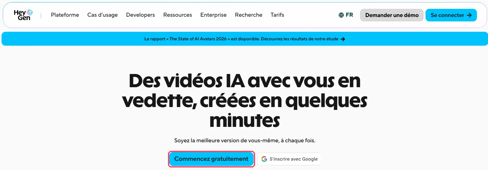

2. Sur la page de connexion, cliquez sur **Utiliser l'e-mail** et saisissez votre **adresse e-mail de l'école** (@mines-ales.fr). N'utilisez pas **Se connecter avec Google** ni **Se connecter avec Apple**, qui relient HeyGen à un compte personnel.

HeyGen indique en anglais qu'une inscription avec une adresse professionnelle donne droit à deux fois plus de vidéos gratuites (« Sign up with a business email and get 2x free videos »).

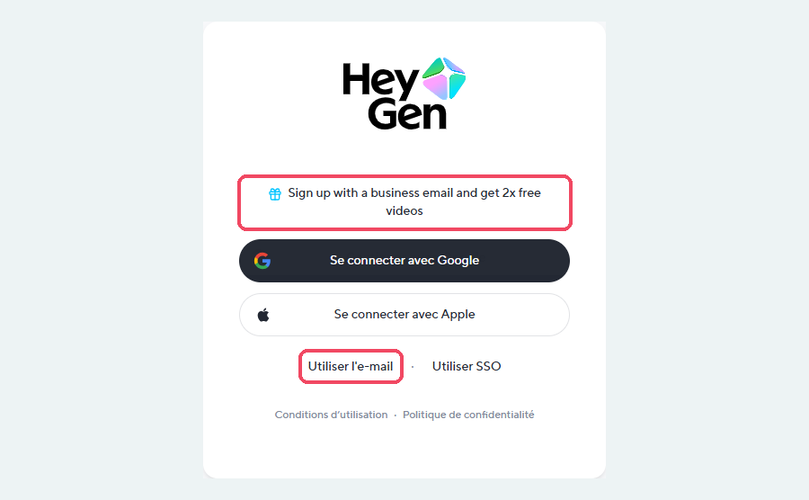

</div>

<div class="etape" markdown>

### <span class="etape-num">2</span> Choisir l'offre gratuite

À la première connexion, HeyGen vous fait passer par trois écrans : **Choisir une offre**, **Personnaliser** et **Créer un avatar**.

Sur la page **Choisissez l'offre idéale pour vous**, laissez l'onglet **Individuel** et cliquez sur **Choisir Free**, dans la colonne de gauche. L'offre **Free** comprend : « 3 vidéos par mois », « Des vidéos jusqu'à 1 minute chacune », l'accès à Avatar IV et Video Agent, plus de 500 présentateurs prêts à l'emploi et plus de 30 langues.

Les offres **Creator** et **Pro** sont payantes : ne les choisissez pas.

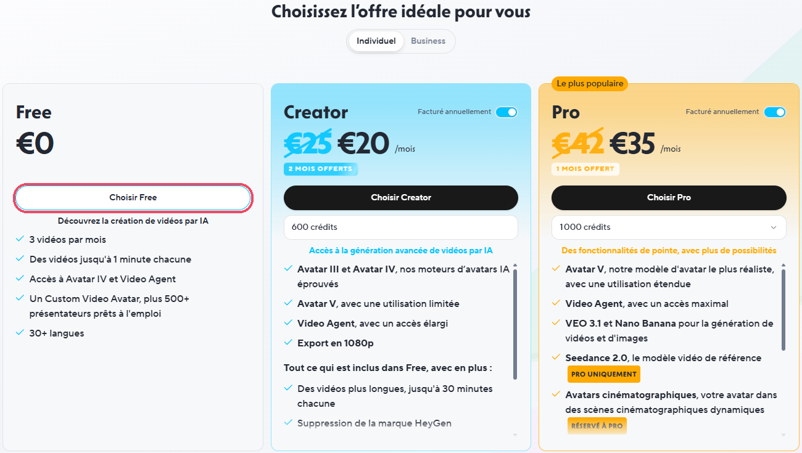

</div>

<div class="etape" markdown>

### <span class="etape-num">3</span> Répondre à la question de personnalisation

La page **Que souhaitez-vous promouvoir ou soutenir avec HeyGen ?** sert uniquement à adapter les suggestions de HeyGen. Choisissez l'option la plus proche de votre usage, par exemple **Autre chose**, puis cliquez sur **Continuer**.

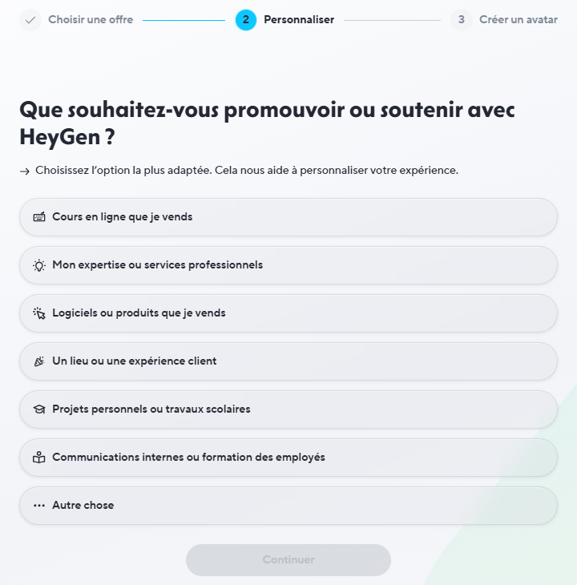

</div>

<div class="etape" markdown>

### <span class="etape-num">4</span> Créer votre avatar

À la première connexion, HeyGen **oblige à créer un avatar à votre image** avant d'ouvrir la page d'accueil. La page **Créons votre avatar** annonce trois étapes : **Apparence**, **Mouvement** et **Voix**. Seule la photo est obligatoire : le mouvement et la voix peuvent être ignorés. Votre visage et votre voix sont des **données biométriques** : lisez chaque écran attentivement.

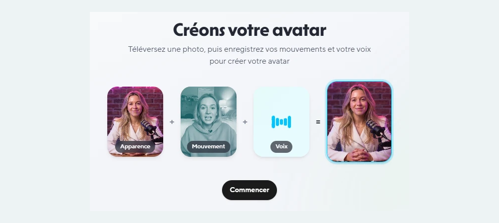

1. Cliquez sur **Commencer**. Sur la page **Choisissez le premier look de votre avatar**, cliquez sur **Téléverser votre photo préférée** pour choisir une photo sur votre ordinateur (ou sur **Importer depuis le téléphone** ou **Prendre une maintenant**). Choisissez une photo prise dans un cadre neutre, sans autre personne ni élément personnel à l'image. N'utilisez jamais la photo d'une autre personne.

    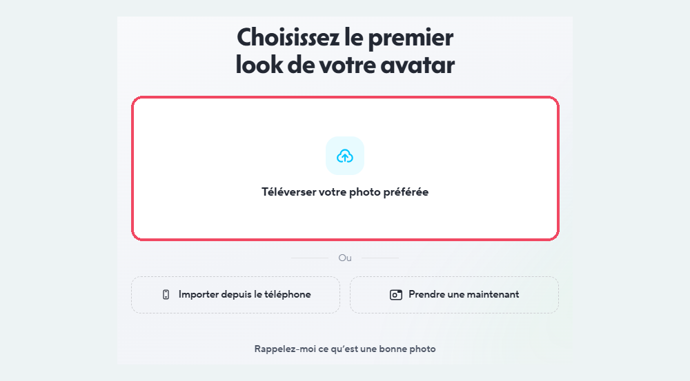

2. La page **Apprenez-lui vos mouvements** propose d'enregistrer une courte vidéo de vous. Cette étape est facultative : cliquez sur **Ignorer**, en bas de la page.

    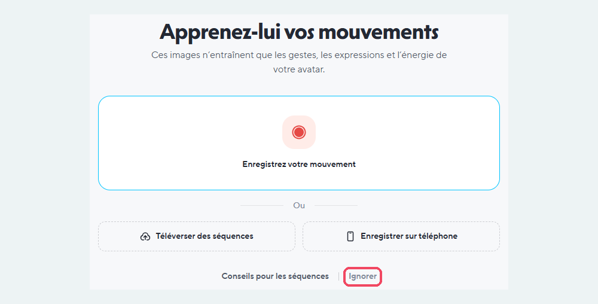

    La fenêtre **Le mouvement paraîtra moins réaliste** vous incite alors à enregistrer 30 secondes de vidéo : « Sans enregistrement, votre avatar utilise des expressions et des gestes génériques au lieu des vôtres ». Ne cliquez pas sur **Enregistrer 30s** : cliquez sur **Continuer quand même**.

    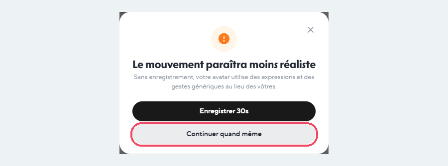

3. HeyGen vous propose ensuite d'enregistrer votre voix pour la **cloner**, c'est-à-dire créer une voix de synthèse qui imite la vôtre. **Ignorez cette étape** : n'enregistrez pas votre voix. Vous choisirez une voix de synthèse prête à l'emploi au moment de créer votre vidéo (voir l'étape 9).

    !!! warning "Ne clonez pas votre voix"
        Votre voix est une donnée biométrique, et le clone est réalisé par un deuxième fournisseur, ElevenLabs. Si vous avez déjà enregistré votre voix par erreur, l'écran **Cloner votre voix à partir de cet enregistrement ?** s'affiche : ne cliquez pas sur **Créer un clone de voix**.

    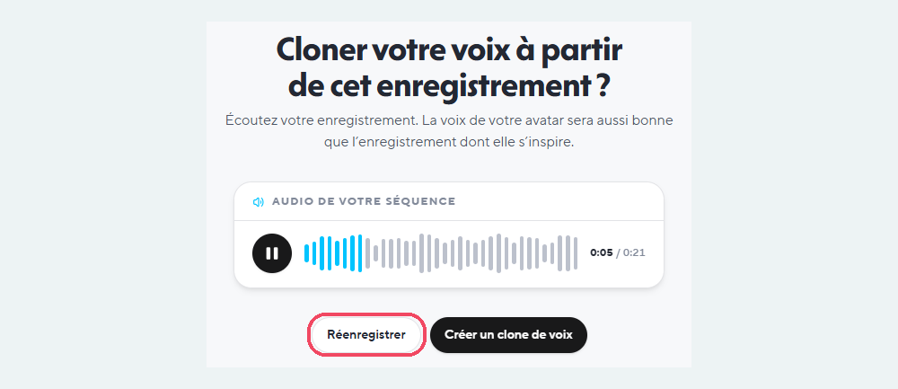

Si un clone de voix a été créé malgré tout, il apparaît dans **Avatar**, puis **Voix**, onglet **Mes voix**, avec la mention **Clone de voix** et la description « ElevenLabs ». Supprimez-le : cliquez sur le bouton **…**, à droite de la voix, puis sur **Supprimer**.

Pour vos vidéos, rien ne vous oblige à utiliser cet avatar ni cette voix : préférez les **avatars** et les **voix prêts à l'emploi** de HeyGen (onglet **Bibliothèque HeyGen**).

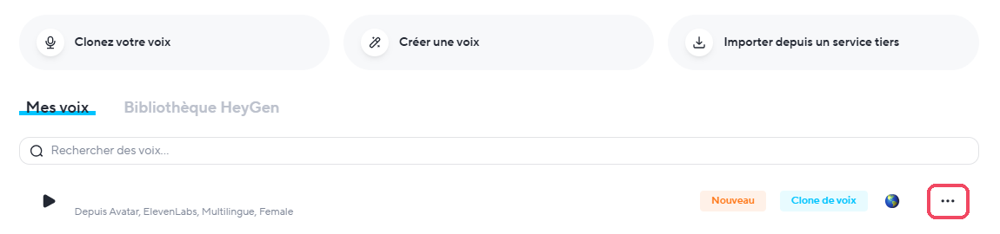

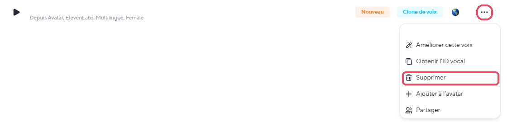

</div>

<div class="etape" markdown>

### <span class="etape-num">5</span> Découvrir les applications

La colonne de gauche donne accès aux grandes rubriques : **Accueil**, **Avatar** (vos avatars et vos voix), **Marque**, **Applications** et **Projets** (vos vidéos).

Cliquez sur **Applications** : la **Bibliothèque d'applications** présente tous les outils de HeyGen, par exemple :

| Application | À quoi elle sert |
|---|---|
| **AI Studio** | « Créez et produisez des vidéos d'avatar professionnelles » à partir de votre script |
| **Agent vidéo** | « Décrivez votre vidéo et laissez un agent IA la scénariser et la créer » |
| **PPT/PDF vers vidéo** | « Transformez des documents en vidéos attrayantes avec avatar » (étape suivante) |
| **Traduire des vidéos** | « Convertir n'importe quelle vidéo en plus de 175 langues » |
| **Podcast vidéo** | Générer une vidéo de podcast avec plusieurs avatars |

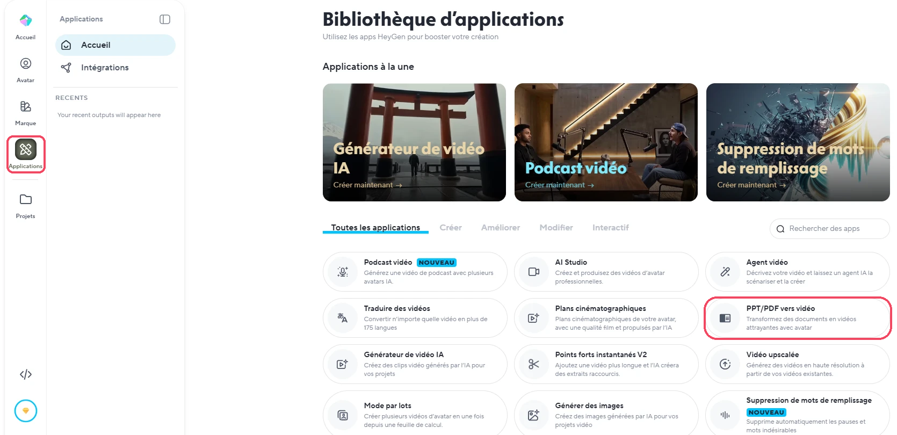

</div>

<div class="etape" markdown>

### <span class="etape-num">6</span> Transformer une présentation en vidéo

L'application **PPT/PDF vers vidéo** part d'un support de cours existant : chaque diapositive devient un plan de la vidéo, commenté par un avatar.

1. Dans la **Bibliothèque d'applications**, cliquez sur **PPT/PDF vers vidéo**.
2. Cliquez sur **Upload a Presentation** (téléverser une présentation) : un fichier PowerPoint donne des diapositives modifiables, un PDF des diapositives fixes, jusqu'à 50 Mo. L'option **Generate a Presentation** crée au contraire une présentation à partir d'une simple demande.
3. Choisissez le fichier sur votre ordinateur.

Retirez de votre présentation toute donnée personnelle et toute information confidentielle avant de la téléverser.

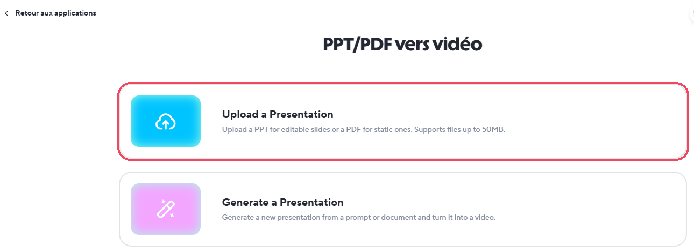

</div>

<div class="etape" markdown>

### <span class="etape-num">7</span> Choisir l'avatar et le script, puis créer la vidéo

Votre fichier apparaît à droite (le bouton **Remplacer le fichier** permet d'en changer). Réglez la vidéo dans la colonne de gauche :

1. **Avatar** : cliquez sur **+** pour choisir un avatar. Préférez un avatar prêt à l'emploi plutôt que votre propre avatar.
2. **Options du script** : choisissez **Utiliser les notes du présentateur comme script** si vous avez rédigé le commentaire dans les notes de vos diapositives. C'est la meilleure solution : l'avatar dira exactement votre texte. Sinon, **Générer un script automatiquement** rédige le commentaire à partir des diapositives ; précisez alors :
    - l'**Objectif du script**, par exemple « présenter le déroulement du module aux étudiants » ;
    - la **Longueur du script** : **Court**, **Standard**, **Détaillé** ou **Long format**. Avec la version gratuite, limitée à une minute, choisissez **Court** ;
    - l'**Audience** (par exemple « élèves ingénieurs de 1re année »), le **Ton** (par exemple « pédagogique ») et la **Langue** (**Français**).
3. Cliquez sur **Create Video** (créer la vidéo).

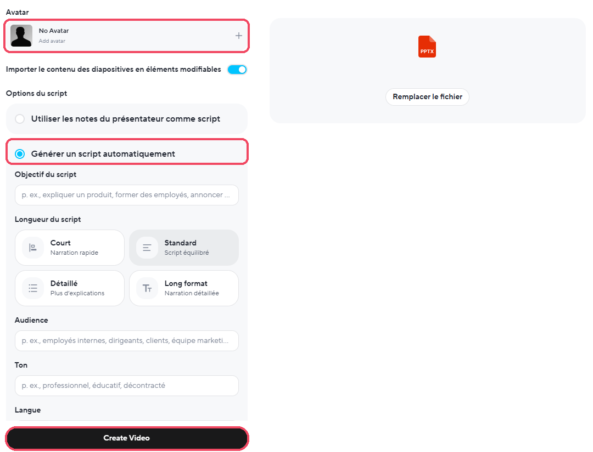

</div>

<div class="etape" markdown>

### <span class="etape-num">8</span> Relire et modifier le script

Après **Create Video**, la vidéo s'ouvre dans l'éditeur, sous forme de **scènes** : une scène par diapositive. Le **Script** est à gauche, l'aperçu au centre, les scènes en bas, et les outils (**Avatar**, **Marque**, **Outils IA**, **Médias**, **Sous-titres**…) dans la colonne de droite.

1. Relisez le script scène par scène : chaque paragraphe numéroté correspond à une scène, et c'est le texte que l'avatar dira.
2. Pour corriger un paragraphe, **cliquez deux fois** dessus, puis modifiez le texte.
3. Une scène marquée **Aucun script** n'a pas de commentaire : cliquez dans la ligne **Saisissez votre script**, puis écrivez votre texte. Le bouton **Rédacteur de script** propose un texte, et **Téléverser de l'audio** permet d'utiliser votre propre enregistrement.

    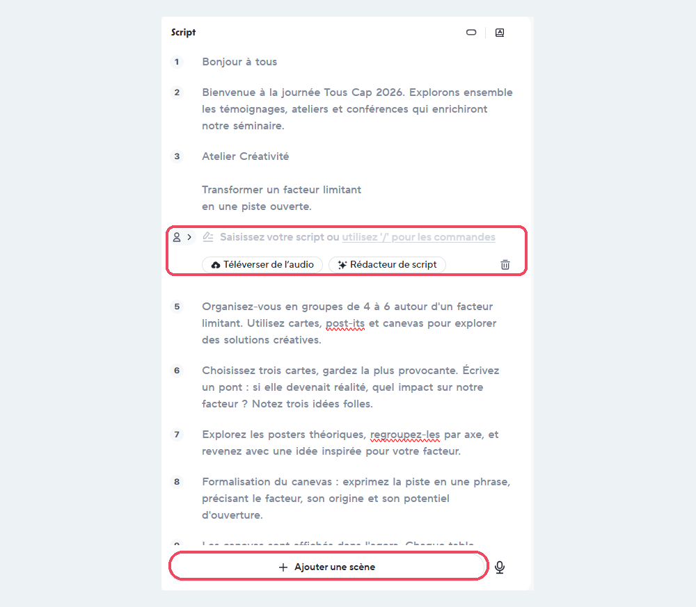

    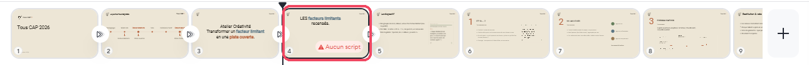

4. Le menu en forme de **trois traits**, en haut à gauche, propose aussi **Téléverser le script**, **Télécharger le script** et **Traduire le script** (fonction en test, marquée **Bêta**).

Surveillez la durée estimée, sous l'aperçu : avec la version gratuite, la vidéo ne doit pas dépasser une minute. Raccourcissez le script ou supprimez des scènes si besoin.

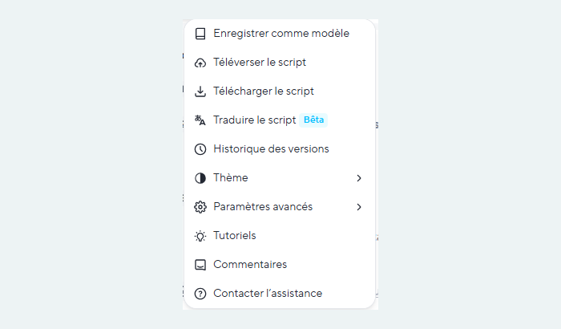

</div>

<div class="etape" markdown>

### <span class="etape-num">9</span> Choisir la voix

1. Dans la colonne de droite, cliquez sur **Avatar**, puis sur la voix. Le panneau **Modifier La Voix** s'ouvre.
2. Cliquez sur le bouton **lecture** pour écouter la voix actuelle (ici **Lisa**, une voix de synthèse), puis sur **Basculer** pour en choisir une autre parmi les voix prêtes à l'emploi. N'utilisez pas de clone de votre propre voix.
3. Sous **Paramètres**, réglez la **Vitesse** et le **Volume**, puis choisissez la **Langue** et l'**Accent**.

Écoutez le résultat sur une scène qui contient des termes techniques, des sigles ou des unités : leur prononciation est parfois fautive.

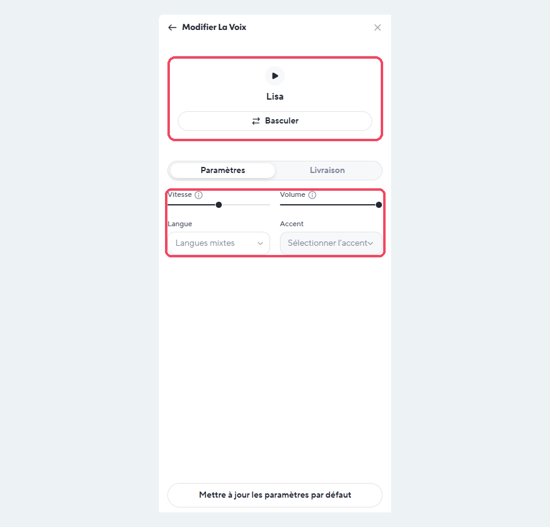

</div>

<div class="etape" markdown>

### <span class="etape-num">10</span> Générer la vidéo

Lorsque le script et la voix vous conviennent, cliquez sur **Générer**, en haut à droite de l'éditeur. La génération prend quelques minutes, et chaque vidéo générée compte dans les 3 vidéos gratuites du mois.


</div>

<div class="etape" markdown>

### <span class="etape-num">11</span> Télécharger ou partager la vidéo

Une fois générée, la vidéo s'ouvre sur sa propre page. Vous la retrouverez ensuite dans **Projets**, dans la colonne de gauche.

1. En haut à droite, cliquez sur la **flèche vers le bas** pour **télécharger** la vidéo, puis déposez-la sur Moodle comme n'importe quelle vidéo. C'est la solution la plus sûre : la vidéo reste sous votre contrôle.
2. Le bouton **Partager** ouvre la fenêtre **Partager cette vidéo** :
    - par défaut, l'accès est réglé sur **Toute personne avec le lien** : « Toute personne sur internet avec le lien peut voir. Pas de connexion requise ». Le menu à côté permet de restreindre cet accès ;
    - **Exiger le mot de passe** protège la vidéo par un mot de passe ;
    - **Copier le lien** copie l'adresse de la vidéo, et **Intégrer** donne un code pour l'insérer dans une page web.

    

    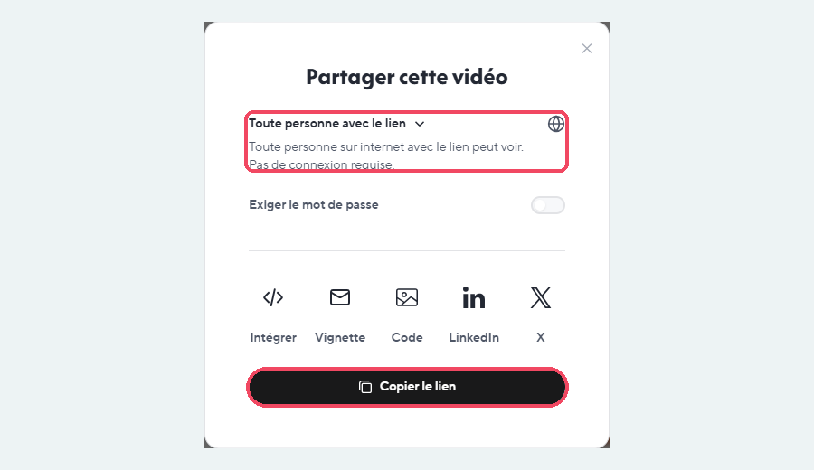

3. Le panneau de droite, onglet **Éditer**, propose d'autres actions : **Nouvelle révision dans AI Studio** pour modifier la vidéo, **Traduire** (fonction en test, marquée **BÊTA**), **Changer la vignette**. **Supprimer le filigrane** est « Disponible avec le plan Créateur », c'est-à-dire payant : avec la version gratuite, la vidéo garde le logo HeyGen.

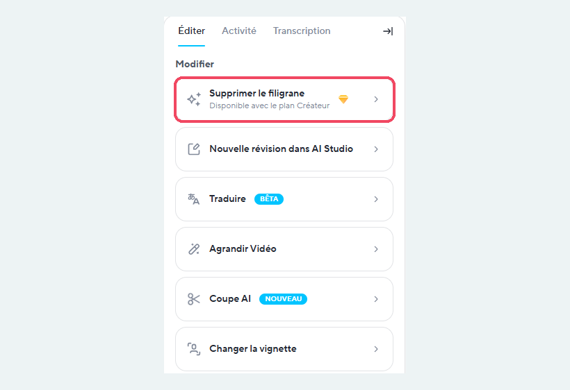

</div>

## Ressources officielles

- [Questions fréquentes de HeyGen](https://www.heygen.com/faq) : fonctionnement, formules, limites (en anglais).
- [Comparatif des formules](https://www.heygen.com/pricing) : version gratuite et abonnements.
- [Éthique et traitement des données](https://www.heygen.com/ethics) : consentement, avatars, voix (en anglais).
- [Politique de confidentialité](https://www.heygen.com/privacy) (en anglais).

## Points de vigilance

!!! warning "Données et droit à l'image"
    HeyGen est une entreprise américaine : vos contenus sont traités hors de l'Union européenne. Sauf pour les clients entreprise, HeyGen peut utiliser les vidéos et les traits du visage pour entraîner ses modèles si vous y avez consenti. HeyGen oblige à fournir une photo de vous à la première connexion : votre visage est une **donnée biométrique**, tout comme votre voix. **N'enregistrez pas votre voix** (le clone serait réalisé par un autre fournisseur, ElevenLabs) et utilisez une voix de synthèse. Refusez toute utilisation de vos données pour l'entraînement si elle vous est proposée, ne créez jamais d'avatar ni de clone de voix à partir d'une autre personne, et utilisez de préférence les avatars prêts à l'emploi pour vos vidéos.

!!! tip "Fiabilité"
    HeyGen lit exactement le texte que vous lui donnez, y compris ses erreurs. Relisez votre script et écoutez la vidéo en entier : la prononciation des sigles, des unités et des termes techniques est parfois fautive.

!!! info "Transparence"
    Indiquez à vos étudiants que la vidéo a été réalisée avec un avatar de synthèse. Une vidéo d'avatar ne remplace pas votre présence : réservez-la aux consignes, rappels et présentations courtes.

!!! note "Accessibilité"
    Ajoutez des sous-titres à vos vidéos et déposez le script en texte à côté : les étudiants pourront le relire, et ceux qui ne peuvent pas écouter le son ne seront pas pénalisés.
