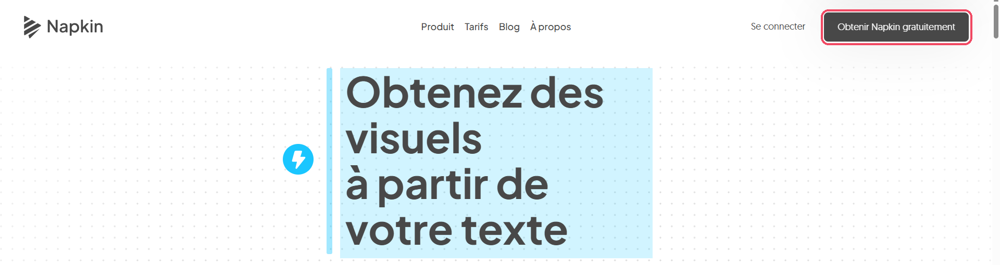
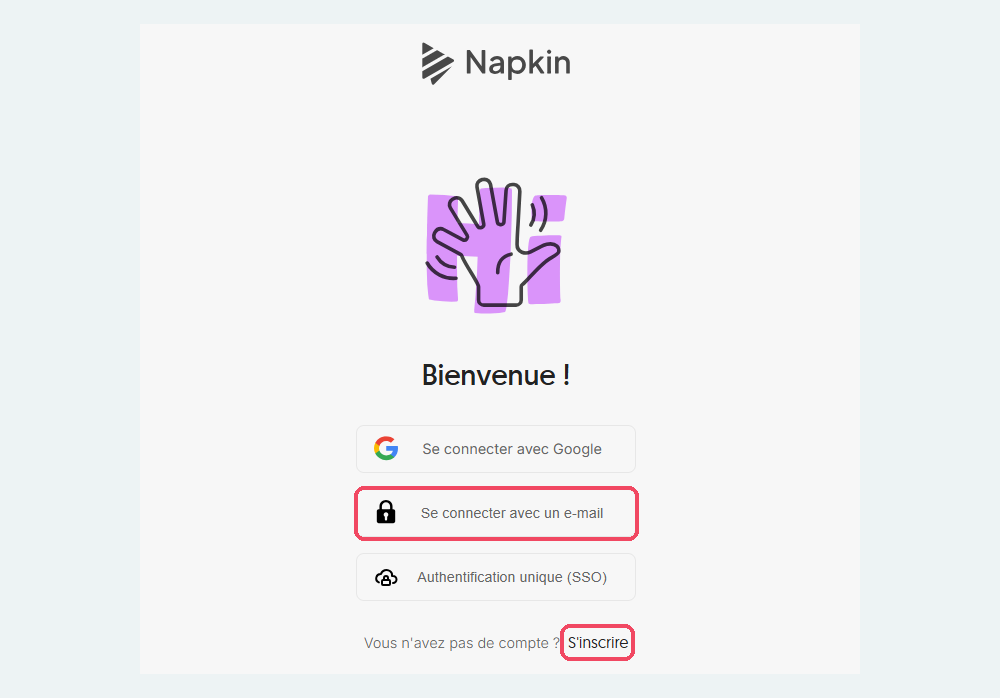
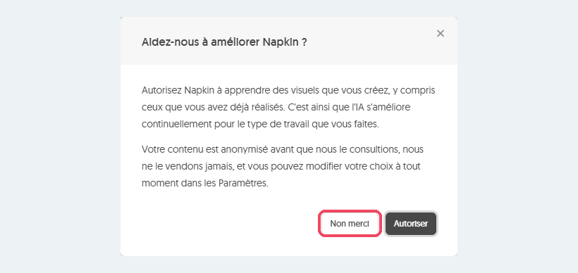
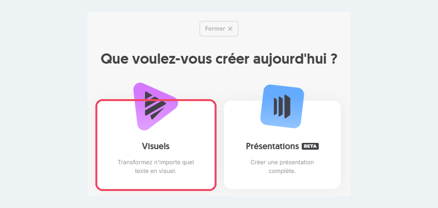
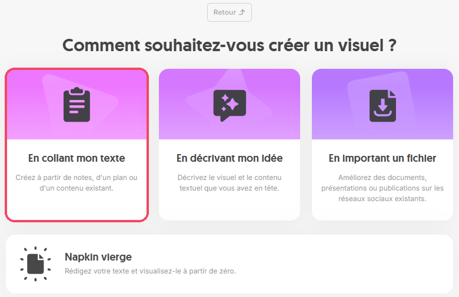
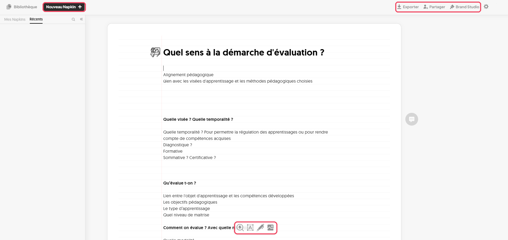
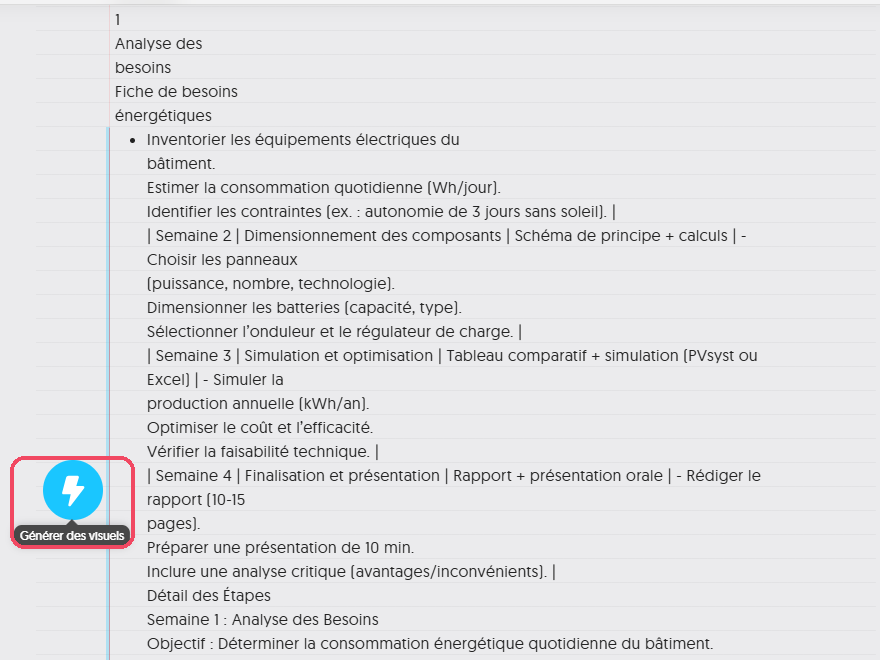
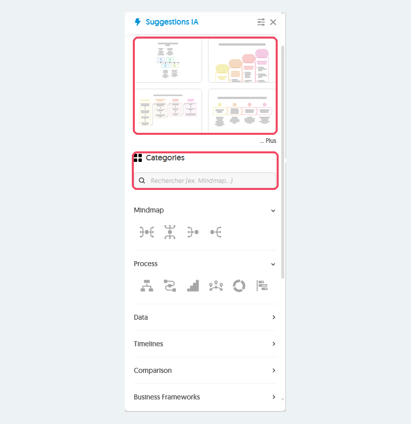
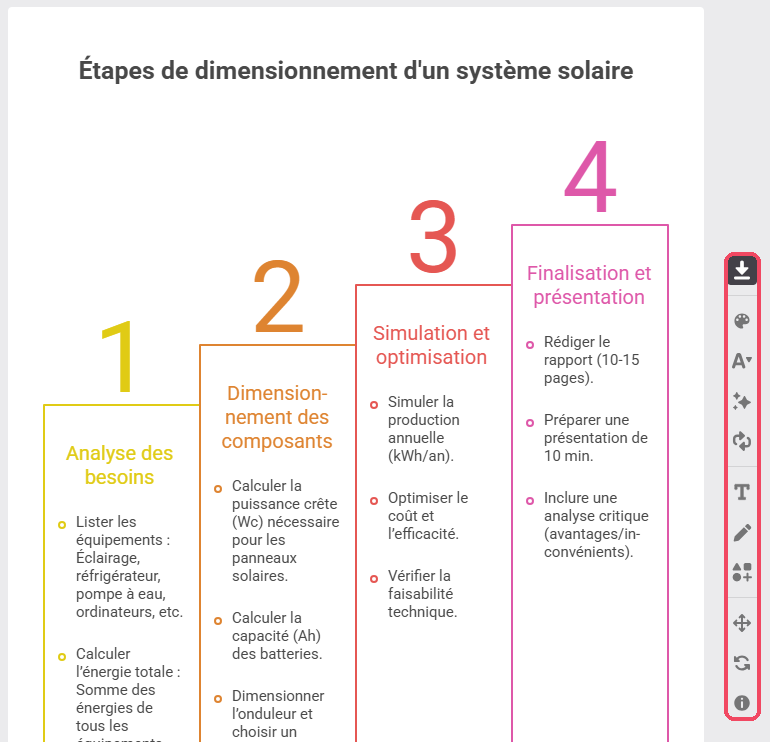
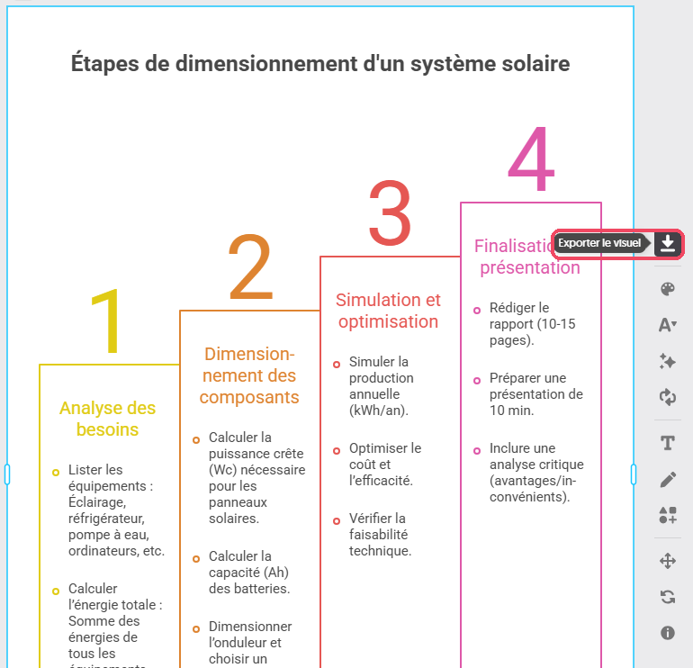

# Napkin

<span class="badge badge-hors-ue">Hors UE</span> <span class="badge badge-gratuit">Gratuit, compte obligatoire</span>

<p class="maj">Dernière vérification : à compléter</p>

**Napkin** transforme un texte en **schéma** : étapes d'un procédé, comparaison, cycle, frise chronologique, carte d'idées. Vous écrivez ou collez votre texte, vous sélectionnez un passage, et Napkin propose plusieurs visuels au choix. Le schéma reste ensuite modifiable : textes, couleurs, icônes, disposition.

[Ouvrir Napkin](https://www.napkin.ai){ .md-button .md-button--primary }

!!! info "Fiche en cours de rédaction"
    Le tutoriel complet sera bientôt disponible.

## À quoi ça sert dans le supérieur

- **Illustrer un support de cours** avec des schémas de synthèse clairs et homogènes.
- **Représenter un processus** ou une démarche en étapes (protocole, méthode, cycle de vie).
- **Comparer** deux méthodes, deux matériaux ou deux technologies.
- **Rendre visuel le plan** d'un module, d'un projet ou d'une séance.
- **Aider les étudiants** à structurer leurs propres synthèses et leurs supports de soutenance.

## Version gratuite

Le compte gratuit donne **500 crédits d'IA par semaine**, renouvelés chaque semaine. La génération coûte environ **un crédit par mot sélectionné** : un paragraphe de 100 mots consomme donc une centaine de crédits. La modification des visuels est illimitée, ainsi que l'import de fichiers (PowerPoint, Word, PDF, HTML, Markdown) et l'export aux formats **PNG** et **PDF**. L'export aux formats **PowerPoint** et **SVG** (image modifiable), ainsi que les crédits supplémentaires, sont réservés aux abonnements payants (Plus, Pro).

!!! tip "Sélectionnez court"
    Ne sélectionnez que le passage à illustrer, pas tout le document : vous obtiendrez un schéma plus lisible et vous économiserez vos crédits.

## Cas d'usage

=== "Schéma d'un procédé"

    **Exemple** : les étapes du traitement des eaux usées, pour un cours de génie de l'environnement.

    Collez ce texte, sélectionnez-le, puis cliquez sur l'éclair pour générer un visuel :

    ```
    Le traitement des eaux usées se fait en quatre étapes.
    Le prétraitement retire les déchets solides et les sables.
    Le traitement primaire sépare par décantation les matières
    en suspension. Le traitement secondaire dégrade la matière
    organique grâce à des bactéries. Le traitement tertiaire
    élimine l'azote et le phosphore avant le rejet en milieu
    naturel.
    ```

=== "Comparer deux méthodes"

    **Exemple** : comparer le soudage à l'arc et le soudage laser en génie mécanique.

    ```
    Soudage à l'arc : équipement peu coûteux, adapté aux pièces
    épaisses et aux chantiers, mais zone affectée thermiquement
    large et vitesse limitée.
    Soudage laser : grande précision, vitesse élevée et faible
    déformation des pièces, mais investissement important et
    préparation des joints exigeante.
    ```

=== "Démarche de projet"

    **Exemple** : les jalons d'un projet de 2e année, à présenter lors de la séance de lancement.

    ```
    Semaine 1 : constitution des équipes et choix du sujet.
    Semaines 2 à 3 : état de l'art et cahier des charges.
    Semaines 4 à 7 : conception et prototypage.
    Semaine 8 : essais et analyse des résultats.
    Semaine 9 : rédaction du rapport.
    Semaine 10 : soutenance devant un jury.
    ```

=== "Cycle de vie"

    **Exemple** : l'analyse du cycle de vie d'un produit, en écoconception.

    ```
    L'analyse du cycle de vie suit le produit de l'extraction
    des matières premières à sa fin de vie : extraction,
    fabrication, transport, utilisation, puis fin de vie
    (réemploi, recyclage ou élimination). À chaque étape, on
    mesure les consommations de ressources et les émissions.
    ```

## Pas à pas

:material-magnify-plus-outline: Cliquez sur une capture pour l'agrandir.
{ .astuce-zoom }

<div class="etape" markdown>

### <span class="etape-num">1</span> Créer un compte

1. Rendez-vous sur [napkin.ai](https://www.napkin.ai). Si un bandeau **Nous utilisons des cookies** s'affiche, cliquez sur **Tout refuser**. En haut à droite, cliquez sur **Obtenir Napkin gratuitement** (ou sur **Se connecter** si vous avez déjà un compte).

    

2. Sur la page **Bienvenue !**, cliquez sur **S'inscrire**, puis sur **Se connecter avec un e-mail** et saisissez votre **adresse e-mail de l'école** (@mines-ales.fr). N'utilisez pas **Se connecter avec Google**, qui relie Napkin à un compte personnel.



</div>

<div class="etape" markdown>

### <span class="etape-num">2</span> Refuser l'utilisation de vos visuels pour entraîner l'IA

À la première utilisation, Napkin affiche la fenêtre **Aidez-nous à améliorer Napkin ?**. Elle demande l'autorisation d'« apprendre des visuels que vous créez, y compris ceux que vous avez déjà réalisés ».

Cliquez sur **Non merci**. Vous pourrez modifier ce choix à tout moment dans les **Paramètres** (la **roue dentée**, en haut à droite de l'éditeur).



</div>

<div class="etape" markdown>

### <span class="etape-num">3</span> Créer un nouveau Napkin

1. En haut à gauche, cliquez sur **Nouveau Napkin**.
2. La page **Que voulez-vous créer aujourd'hui ?** propose deux choix :
    - **Visuels** : « Transformez n'importe quel texte en visuel » ;
    - **Présentations** (fonction en test, marquée **BETA**) : « Créer une présentation complète ».
3. Cliquez sur **Visuels**.

    

4. La page **Comment souhaitez-vous créer un visuel ?** propose quatre départs :
    - **En collant mon texte** : « Créez à partir de notes, d'un plan ou d'un contenu existant » ;
    - **En décrivant mon idée** : « Décrivez le visuel et le contenu textuel que vous avez en tête » ;
    - **En important un fichier** : partir d'un document, d'une présentation ou d'une publication existante ;
    - **Napkin vierge** : « Rédigez votre texte et visualisez-le à partir de zéro ».
5. Pour commencer, cliquez sur **En collant mon texte** et collez votre texte, par exemple celui d'un des cas d'usage ci-dessus.



</div>

<div class="etape" markdown>

### <span class="etape-num">4</span> Découvrir l'éditeur

Un Napkin se présente comme une page de texte, dans laquelle vous insérez des visuels.

- **En haut à gauche** : **Bibliothèque** pour retrouver tous vos documents, et **Nouveau Napkin** pour en créer un autre.
- **Dans la colonne de gauche** : les onglets **Mes Napkins** et **Récents** listent vos documents. La **loupe** permet d'y chercher, et les **doubles chevrons** masquent la colonne.
- **En haut à droite** : **Exporter**, **Partager**, **Brand Studio** (pour enregistrer vos couleurs et vos polices) et la **roue dentée** des paramètres.
- **Au centre** : votre texte. Lorsque vous cliquez dans un paragraphe, une petite **barre d'outils** apparaît à côté. Son premier bouton, en forme d'**éclair**, génère un visuel à partir du texte (étape suivante).



</div>

<div class="etape" markdown>

### <span class="etape-num">5</span> Générer des visuels à partir d'un passage

1. Cliquez dans le paragraphe à illustrer, ou sélectionnez le passage avec la souris. Un trait bleu, à gauche du texte, montre la partie prise en compte.
2. Cliquez sur le rond bleu en forme d'**éclair**, à gauche du texte (au survol : **Générer des visuels**).

Seul le passage sélectionné est utilisé, et il consomme des crédits : sélectionnez un passage court et structuré plutôt que tout le document.



</div>

<div class="etape" markdown>

### <span class="etape-num">6</span> Choisir un visuel

Le panneau **Suggestions IA** s'ouvre à gauche.

1. En haut, Napkin propose quatre visuels construits à partir de votre texte. Cliquez sur **Plus** pour en voir d'autres.
2. Si aucune proposition ne convient, cherchez une forme dans **Categories** : **Mindmap** (carte mentale), **Process** (étapes), **Data** (données), **Timelines** (frises chronologiques), **Comparison** (comparaisons) ou **Business Frameworks**. Le champ de recherche accepte un mot-clé, par exemple « Mindmap ».
3. Cliquez sur un visuel : il s'insère dans votre document, sous le texte.



</div>

<div class="etape" markdown>

### <span class="etape-num">7</span> Modifier le visuel

Cliquez sur le visuel pour le sélectionner : un cadre bleu l'entoure, et une **colonne d'icônes** apparaît à sa droite. Elle permet notamment de changer les **couleurs** (palette), la **police**, le **texte** (T), de **dessiner** (crayon), d'ajouter des **éléments**, de **déplacer** le visuel ou d'en essayer une autre forme.

Vous pouvez aussi cliquer directement sur un texte du visuel pour le corriger. Le message **Enregistré**, en bas à droite, confirme que vos modifications sont conservées, et **Annuler**, en haut, revient en arrière.

Vérifiez le visuel avant de l'utiliser : Napkin peut regrouper, résumer ou réordonner votre texte.



</div>

<div class="etape" markdown>

### <span class="etape-num">8</span> Exporter le visuel

1. Sélectionnez le visuel, puis cliquez sur la première icône de la colonne de droite (au survol : **Exporter le visuel**).
2. Choisissez le format. Avec le compte gratuit, les formats **PNG** (image) et **PDF** sont disponibles sans limite. Les formats **PowerPoint** et **SVG** sont réservés aux abonnements payants.
3. Insérez ensuite l'image dans votre support de cours (PowerPoint, Word, Moodle).

Pour exporter tout le document, utilisez le bouton **Exporter**, en haut à droite de l'éditeur.



</div>

<!--
Étapes restant à rédiger à partir des captures (plan provisoire) :
 9. Partager le document
10. Suivre ses crédits
-->

## Ressources officielles

- [Centre d'aide de Napkin](https://help.napkin.ai) : prise en main et fonctionnalités (en anglais).
- [Napkin est-il gratuit ?](https://help.napkin.ai/en/articles/10010139-is-napkin-ai-free-to-use) : ce que comprend la version gratuite (en anglais).
- [Les crédits d'IA](https://help.napkin.ai/en/articles/12108746-what-are-ai-credits-and-how-can-i-check-how-many-i-have-left) : fonctionnement et suivi des crédits (en anglais).
- [Comparatif des formules](https://www.napkin.ai/pricing/) : version gratuite et abonnements.

## Points de vigilance

!!! warning "Données"
    Napkin est une entreprise américaine : vos textes sont traités hors de l'Union européenne. N'y collez ni données personnelles d'étudiants, ni documents confidentiels.

!!! tip "Fiabilité"
    Napkin peut reformuler, regrouper ou réordonner vos idées. Vérifiez que le schéma respecte l'ordre et le sens de votre texte, en particulier pour un procédé ou une chronologie.

!!! info "Un schéma de synthèse, pas un schéma technique"
    Napkin produit des schémas de synthèse : étapes, comparaisons, cycles. Il ne remplace pas un schéma technique à l'échelle, un plan ou un circuit, que vous devez réaliser avec vos outils habituels.

!!! note "Citez l'outil"
    Si vous diffusez un schéma réalisé avec Napkin, indiquez qu'il a été créé avec l'aide d'un outil d'IA, comme vous le demandez à vos étudiants.
