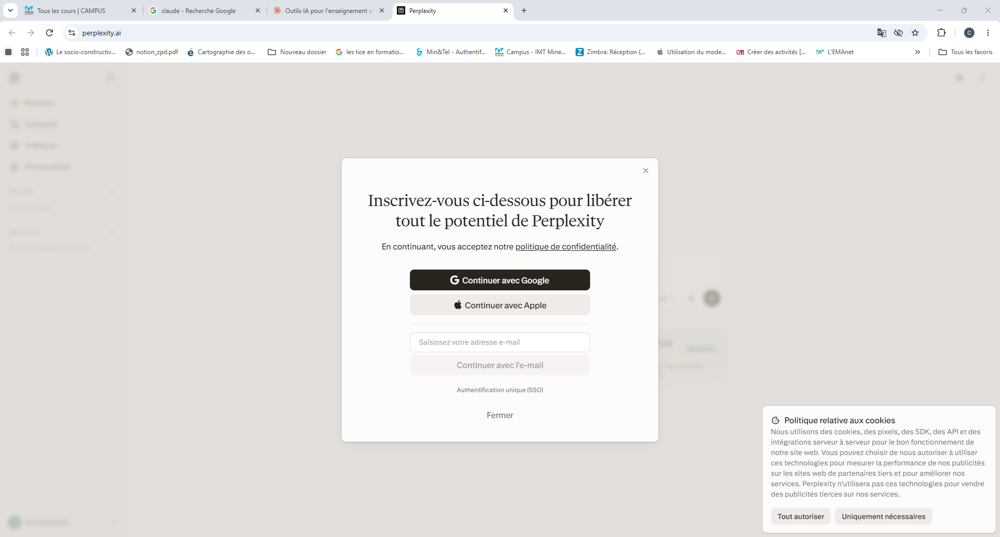
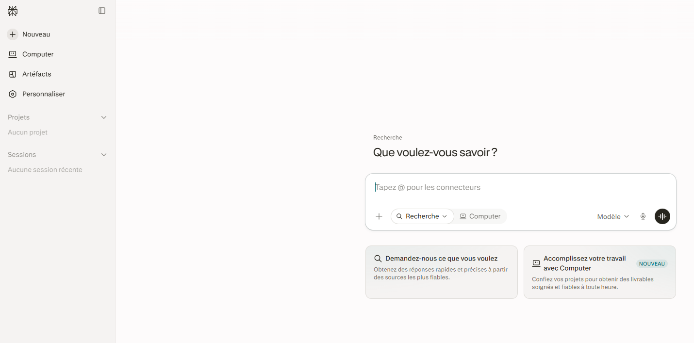
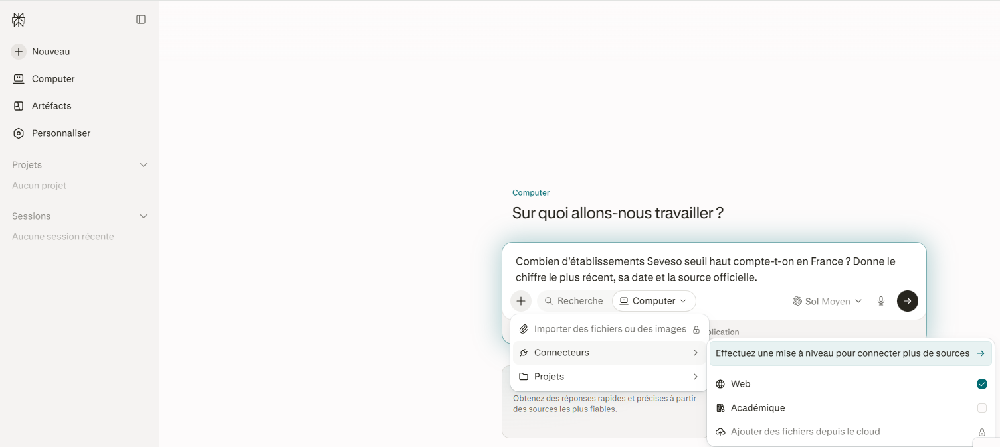
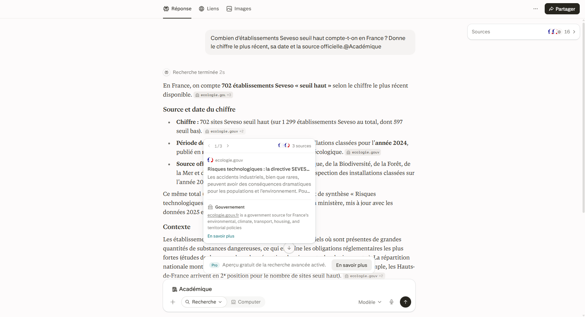
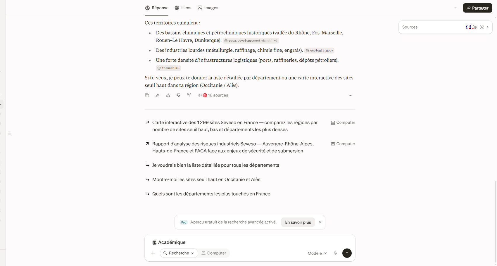
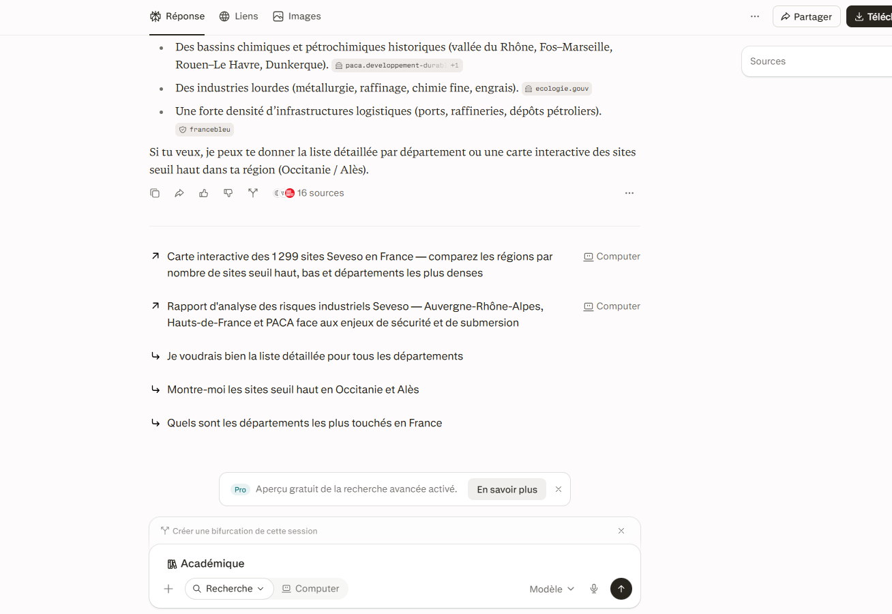
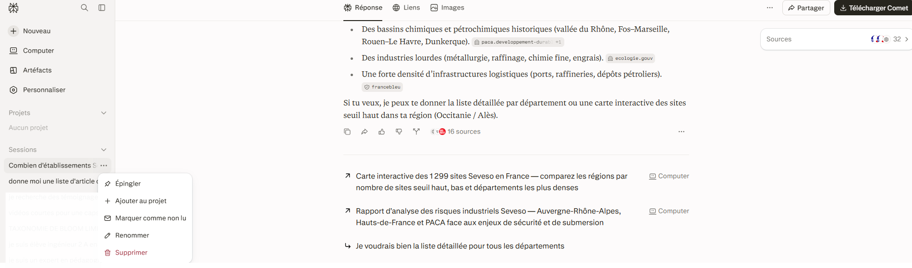
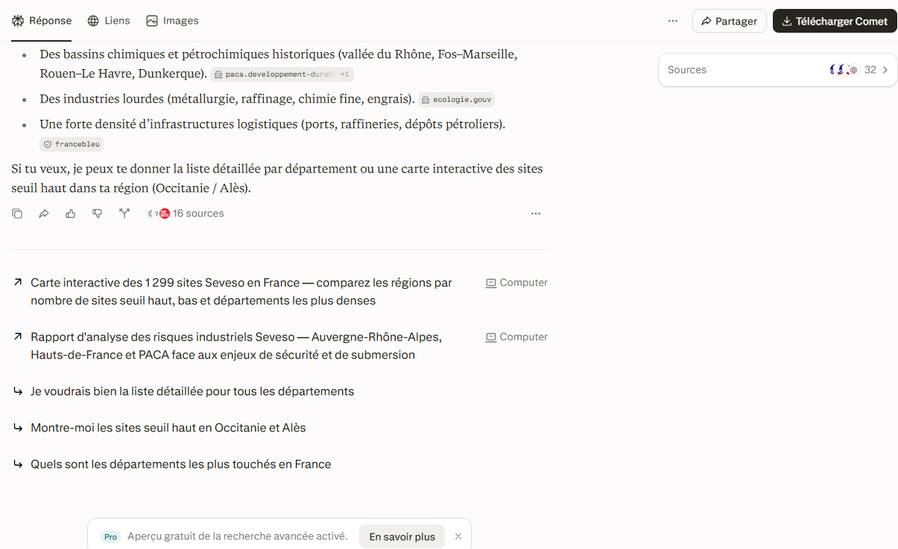

# Perplexity

<span class="badge badge-hors-ue">Hors UE</span> <span class="badge badge-gratuit">Gratuit, compte conseillé</span>

<p class="maj">Dernière vérification : septembre 2026</p>

Perplexity est un **moteur de recherche conversationnel** : vous posez une question en langage courant, il interroge le web et rédige une réponse synthétique en **citant ses sources**. Contrairement à NotebookLM, qui travaille sur vos propres documents, Perplexity va chercher l'information à l'extérieur.

[Ouvrir Perplexity](https://www.perplexity.ai){ .md-button .md-button--primary }

## À quoi ça sert dans le supérieur

- **Défricher un sujet** : obtenir en quelques minutes une vue d'ensemble sourcée avant d'approfondir.
- **Vérifier une information** : une date, un chiffre, une réglementation, avec accès direct à la source.
- **Décliner une recherche** pour plusieurs publics ou plusieurs angles grâce aux bifurcations.
- **Actualiser un cours** : repérer les évolutions récentes d'une technologie, d'une norme ou d'un marché.
- **Préparer une étude de cas** à partir de faits réels et récents.
- **Trouver des ressources pédagogiques ouvertes** : cours, vidéos, jeux de données, rapports publics.

## Version gratuite

Perplexity fonctionne même sans compte, mais un compte gratuit permet de conserver l'historique de vos recherches. La version gratuite offre des recherches simples quasi illimitées, mais seulement **quelques recherches avancées par jour** (« Pro ») et un accès très restreint à la recherche approfondie. Le choix du modèle d'IA et l'analyse de fichiers sont réservés aux abonnements payants ou fortement limités. Pour un usage d'enseignant, la version gratuite suffit largement.

## Cas d'usage

=== "Défricher un sujet"

    **Exemple** : vous préparez une intervention sur l'hydrogène vert et souhaitez faire le point rapidement.

    ```
    Fais un état des lieux de la production d'hydrogène vert en
    Europe : procédés utilisés, rendements, coûts actuels,
    principaux verrous technologiques. Privilégie les sources
    institutionnelles et scientifiques publiées depuis 2024.
    ```

    Poursuivez ensuite avec une question plus ciblée, par exemple sur un procédé précis : Perplexity garde le fil de la conversation.

=== "Vérifier une information"

    **Exemple** : vous voulez vérifier une donnée citée dans un de vos supports de cours sur les risques industriels.

    ```
    Combien d'établissements Seveso seuil haut compte-t-on en
    France ? Donne le chiffre le plus récent, sa date et la source
    officielle.
    ```

    Cliquez ensuite sur la source citée pour contrôler le chiffre directement sur le site officiel.

=== "Actualiser un cours"

    **Exemple** : votre cours sur les réseaux informatiques date de trois ans.

    ```
    Quelles sont les évolutions majeures des réseaux mobiles et
    de la cybersécurité des réseaux depuis 2023 ? Pour chaque
    évolution, indique en une phrase son intérêt pour un cours
    d'école d'ingénieurs et cite une source.
    ```

=== "Étude de cas"

    **Exemple** : une étude de cas pour un cours de génie de l'environnement.

    ```
    Trouve un cas réel et documenté de réhabilitation d'un ancien
    site minier en France. Résume le contexte, les pollutions
    en jeu, les techniques de dépollution employées et le coût,
    avec les sources.
    ```

    Pour orienter la recherche vers des publications scientifiques, cliquez sur **+**, puis **Connecteurs**, et activez **Académique**.

=== "Ressources ouvertes"

    **Exemple** : des ressources pour compléter un cours de science des matériaux.

    ```
    Liste des ressources pédagogiques en accès libre sur la
    résistance des matériaux, de niveau licence ou master :
    cours en ligne, vidéos, exercices corrigés. Indique pour
    chacune l'établissement ou l'auteur et la licence d'utilisation.
    ```

## Pas à pas

:material-magnify-plus-outline: Cliquez sur une capture pour l'agrandir.
{ .astuce-zoom }

<div class="etape" markdown>

### <span class="etape-num">1</span> Se connecter

Rendez-vous sur [perplexity.ai](https://www.perplexity.ai). Cliquez sur **S'inscrire** (ou **Se connecter**) en bas à gauche de l'écran, puis choisissez **Continuer avec Google**, **Continuer avec Apple** ou saisissez votre adresse e-mail. Le compte est gratuit et permet de conserver l'historique de vos recherches.



</div>

<div class="etape" markdown>

### <span class="etape-num">2</span> Poser une question

Cliquez dans la zone de saisie et tapez votre question. Précisez le niveau attendu, la période et le type de sources souhaité. Appuyez ensuite sur **Entrée** ou cliquez sur la **flèche** noire à droite de la zone pour lancer la recherche.



</div>

<div class="etape" markdown>

### <span class="etape-num">3</span> Choisir les sources

Avant de lancer la recherche, cliquez sur le bouton **+** à gauche de la zone de saisie, puis sur **Connecteurs**. Activez les sources souhaitées : **Web** pour une recherche générale, **Académique** pour cibler les publications scientifiques. La source choisie s'affiche ensuite au-dessus de la zone de saisie.



</div>

<div class="etape" markdown>

### <span class="etape-num">4</span> Lire la réponse et vérifier les sources

La réponse s'affiche avec de petites étiquettes à la fin des phrases, qui indiquent le site d'origine (par exemple *ecologie.gouv*). **Cliquez sur une étiquette** pour ouvrir la source. Pour voir la liste complète, cliquez sur l'onglet **Liens** en haut de la page, ou sur le cadre **Sources** à droite.



</div>

<div class="etape" markdown>

### <span class="etape-num">5</span> Approfondir

Tapez une nouvelle question dans la zone de saisie en bas de la page : Perplexity garde le contexte de la conversation. Vous pouvez aussi cliquer sur l'une des **questions proposées** sous la réponse, précédées d'une petite flèche.



</div>

<div class="etape" markdown>

### <span class="etape-num">6</span> Explorer une autre piste avec une bifurcation

Sous une réponse, cliquez sur l'icône **Bifurcation** :material-source-fork: (en forme de branche, à droite des pouces :material-thumb-up-outline: :material-thumb-down-outline:). Le bandeau **Créer une bifurcation de cette session** apparaît au-dessus de la zone de saisie : posez votre nouvelle question. Perplexity crée une nouvelle session qui reprend tout le contexte jusqu'à cette réponse, sans modifier la session d'origine. Pratique pour décliner une même recherche pour deux publics différents.



</div>

<div class="etape" markdown>

### <span class="etape-num">7</span> Choisir le mode de recherche

Dans la zone de saisie, cliquez sur le menu **Recherche** pour choisir le type de recherche : simple pour une question factuelle, avancée pour une question complexe. En version gratuite, les recherches avancées sont limitées : réservez-les aux questions qui le justifient. Le bouton **Computer**, juste à côté, correspond à une fonction payante (voir plus bas).



</div>

<div class="etape" markdown>

### <span class="etape-num">8</span> Retrouver ses recherches

Dans le menu de gauche, la rubrique **Sessions** liste toutes vos recherches, de la plus récente à la plus ancienne. Cliquez sur une session pour la rouvrir et la poursuivre, ou sur les **trois points** à droite de son titre pour la renommer ou la supprimer. La rubrique **Projets**, juste au-dessus, permet de regrouper les sessions d'un même cours.



</div>

<div class="etape" markdown>

### <span class="etape-num">9</span> Partager une recherche

En haut à droite de la page, cliquez sur **Partager**, puis sur **Copier le lien**. Collez ce lien dans un courriel ou sur Moodle pour transmettre la recherche à un collègue ou à des étudiants.

</div>

## Aller plus loin : le mode Computer

!!! warning "Fonction payante"
    Le mode Computer n'est **pas inclus dans la version gratuite** : il nécessite un abonnement Perplexity actif et consomme des crédits à chaque tâche. Il est présenté ici pour information.

**Perplexity Computer** n'est pas un simple moteur de recherche : c'est un **agent autonome**. Au lieu de répondre à une question, il prend en charge une tâche complète en plusieurs étapes. Il découpe le travail en sous-tâches, confie chacune à des agents spécialisés, puis livre un résultat concret : un rapport, un tableau, un document, voire un petit site web.

**Ce qu'il sait faire**

- Mener une recherche longue et produire un livrable structuré.
- Utiliser des outils et services connectés (documents, messagerie, outils de gestion) avec votre autorisation.
- Exécuter des **tâches planifiées** : une veille hebdomadaire ou un rapport mensuel produit automatiquement.
- Ajuster son niveau d'effort, d'une tâche légère à une tâche très approfondie, ce qui influe sur les crédits consommés.

**Comment formuler une tâche**

Perplexity recommande de décrire trois éléments : le **résultat attendu**, les **fichiers ou outils** à utiliser, et la **forme du livrable**. Par exemple :

```
Réalise une veille sur les nouvelles réglementations européennes
concernant le recyclage des batteries, publiées depuis janvier 2026.
Produis un rapport de 2 pages avec un tableau récapitulatif
(texte, date, principales obligations, source) et une liste
de 3 questions de discussion pour un cours de génie
de l'environnement.
```

!!! tip "Avant d'utiliser Computer"
    Surveillez votre consommation de crédits, et soyez attentif aux accès que vous accordez : la version installée sur ordinateur peut lire vos fichiers et piloter vos applications. N'autorisez que les dossiers et services strictement nécessaires.

## Ressources officielles

Perplexity propose une documentation complète, disponible en français, pour approfondir chaque fonction :

- [Centre d'aide Perplexity](https://www.perplexity.ai/help-center/en) : guides de prise en main, fonctions et abonnements (choisissez le français en haut de la page).
- [Guide de démarrage officiel](https://www.perplexity.ai/hub/getting-started) : les bases de la recherche avec Perplexity.
- [Documentation du mode Computer](https://www.perplexity.ai/help-center/en/collections/18534886-computer) : présentation, tâches planifiées, niveaux d'effort.

## Points de vigilance

!!! warning "Données"
    Vos questions sont traitées hors de l'Union européenne. N'y saisissez ni données personnelles d'étudiants ni informations confidentielles (projets de recherche non publiés, données de partenaires industriels).

!!! tip "Fiabilité des sources"
    Perplexity cite ses sources, mais toutes ne se valent pas : blogs, sites commerciaux et pages institutionnelles se mélangent. Ouvrez systématiquement les sources des informations que vous réutilisez, et vérifiez qu'elles disent bien ce que la réponse leur attribue.

!!! info "Pour la littérature scientifique"
    Perplexity est efficace pour défricher un sujet, mais il ne remplace pas une recherche bibliographique rigoureuse. Pour identifier et suivre des articles scientifiques, complétez avec [Semantic Scholar](semantic-scholar.md) et [ResearchRabbit](researchrabbit.md).

!!! note "Actualité des informations"
    Pour un sujet qui évolue vite, précisez la période dans votre question (« depuis 2024 », « ces douze derniers mois ») et vérifiez la date de publication des sources citées.
