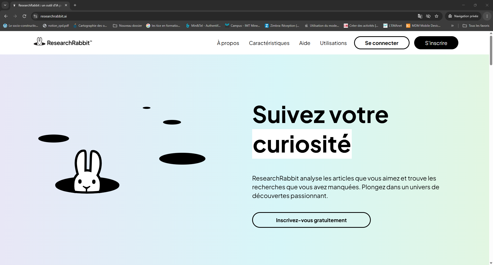
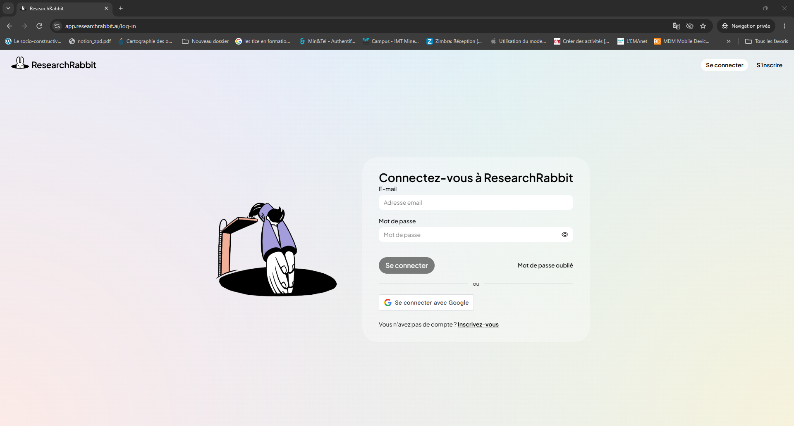
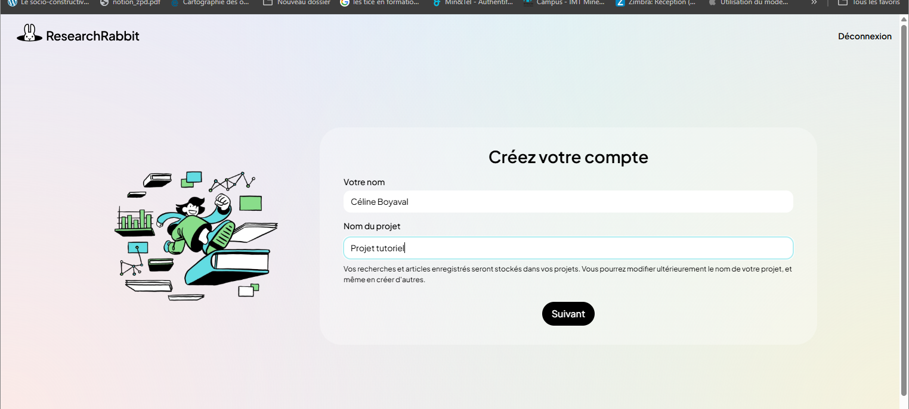
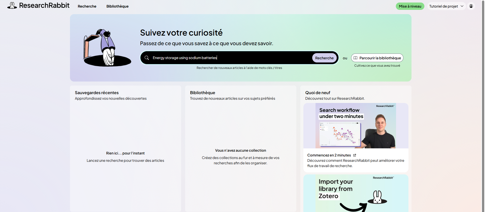
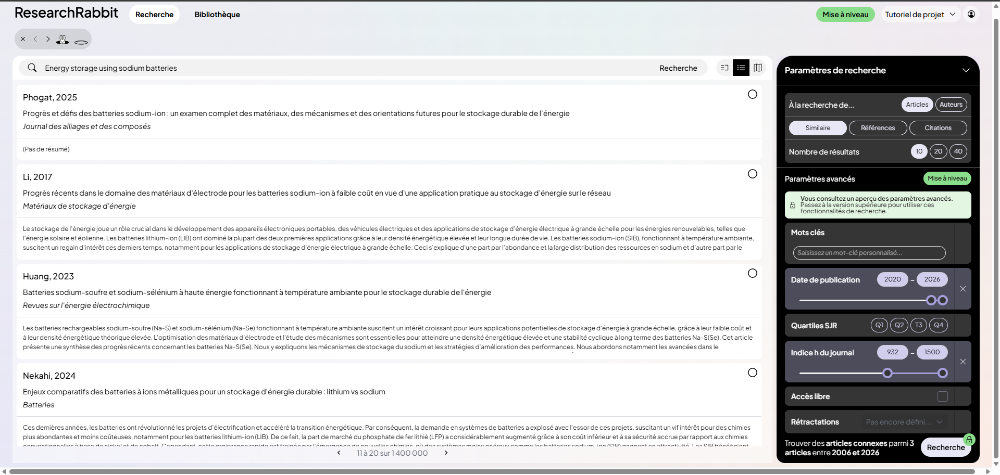
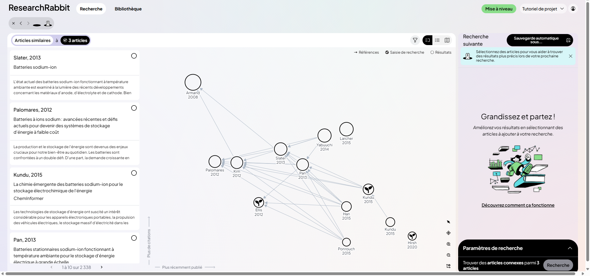
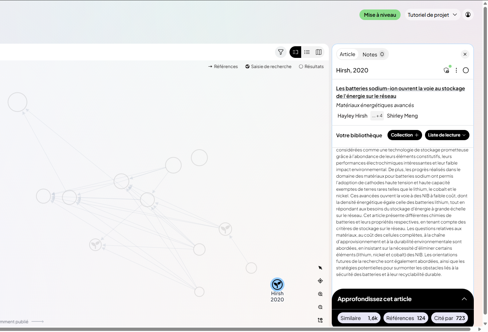
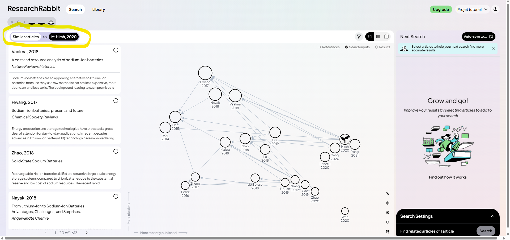

# ResearchRabbit

Hors UE Gratuit, compte obligatoire

Dernière vérification : septembre 2026

ResearchRabbit est un outil de **cartographie de la littérature scientifique**. Au lieu d'une simple liste de résultats, il affiche une **carte** des articles reliés entre eux par leurs citations. À partir de quelques articles que vous connaissez déjà, il vous fait découvrir les travaux fondateurs, les recherches récentes et les grandes thématiques d'un domaine.

[Ouvrir ResearchRabbit](https://www.researchrabbit.ai){ .md-button .md-button--primary }

!!! info "Afficher le site en français"
    ResearchRabbit est conçu en anglais. Dans **Chrome**, cliquez sur l'**icône de traduction** à droite de la barre d'adresse, puis sur **Français**. Pour que chaque nouvelle page soit traduite, cliquez sur les **trois points** de la fenêtre de traduction, puis sur **Toujours traduire l'anglais**. Ce tutoriel utilise les intitulés de la version traduite, qui peuvent légèrement varier.

    En revanche, **tapez vos mots-clés en anglais** pour de meilleurs résultats.

## À quoi ça sert dans le supérieur

- **Démarrer une revue de littérature** à partir de quelques articles de référence.
- **Comprendre la structure d'un domaine** : ses grands courants, ses articles fondateurs, ses travaux récents.
- **Repérer des pistes peu explorées**, utiles pour définir des sujets de projets ou de stages.
- **Organiser ses lectures** en collections, avec des notes personnelles.
- **Partager une bibliographie** avec des collègues ou des étudiants.

## Version gratuite

La version gratuite est **complète et sans limite de durée** : recherches illimitées parmi plus de 300 millions d'articles, collections illimitées, carte des citations, notes, partage de collections, import depuis Zotero et export au format BibTeX. Sa principale limite : **50 articles de départ au maximum** par recherche, et un seul projet. L'abonnement payant (RR+) augmente ces limites pour les revues de littérature de grande ampleur, ce qui est rarement nécessaire pour un enseignant.

## Cas d'usage

=== "Démarrer une revue de littérature"

    **Exemple** : vous encadrez un projet de fin d'études sur le stockage de l'énergie par batteries au sodium.

    Recherchez 3 ou 4 articles que vous connaissez déjà sur le sujet et sélectionnez-les comme **articles de départ**. ResearchRabbit construit une carte des travaux liés : en quelques minutes, vous obtenez une vingtaine d'articles pertinents à proposer à vos étudiants comme bibliographie de départ.

    Choisissez de préférence un article très cité (une référence du domaine) et un article récent : la carte sera plus équilibrée.

=== "Comprendre un domaine"

    **Exemple** : vous devez intervenir dans un module sur la géothermie, un domaine voisin du vôtre.

    Sur la carte, les articles se regroupent en **îlots** : chacun correspond généralement à une sous-thématique. Les articles placés **en haut** sont les plus cités, ceux placés **à droite** les plus récents. Vous identifiez ainsi rapidement les travaux fondateurs à lire en priorité et les directions de recherche actuelles.

=== "Trouver des sujets de projets"

    **Exemple** : vous cherchez des sujets de projets pour des élèves ingénieurs en génie de l'environnement.

    Explorez la carte autour de votre thématique : les zones où peu d'articles sont reliés entre eux signalent souvent des questions encore peu étudiées. Ce sont de bonnes pistes pour des sujets de projets ou de stages, à confirmer par une lecture des articles concernés.

=== "Remonter et descendre le fil"

    **Exemple** : un article de référence sur la sûreté des procédés industriels vous sert de point de départ.

    Ouvrez-le, puis utilisez les trois boutons d'exploration :

    - **Références** : les travaux plus anciens sur lesquels il s'appuie ;
    - **Cité par** : les travaux plus récents qui le prolongent ;
    - **Similaire** : les articles proches par leur sujet.

    Chaque bouton ouvre une nouvelle carte, sans perdre la précédente.

=== "Partager une bibliographie"

    **Exemple** : vous voulez fournir aux étudiants d'un cours une bibliographie commentée et évolutive.

    Rassemblez les articles dans une **collection** dédiée au cours, ajoutez une note sur chacun (pourquoi le lire, quel chapitre), puis partagez la collection par un **lien public**. Les étudiants consultent la liste à jour, sans avoir besoin de créer un compte pour la lire.

## Pas à pas

:material-magnify-plus-outline: Cliquez sur une capture pour l'agrandir.
{ .astuce-zoom }

### 1 Accéder au site

Rendez-vous sur [researchrabbit.ai](https://www.researchrabbit.ai) et traduisez la page en français (voir l'encadré en haut de cette fiche). La page d'accueil présente l'outil ; les boutons **Se connecter** et **S'inscrire** se trouvent en haut à droite.

### 2 Créer un compte

Cliquez sur **S'inscrire** en haut à droite (ou sur **Inscrivez-vous gratuitement** au centre de la page). Le plus simple est de cliquer sur **Se connecter avec Google** ; vous pouvez aussi créer un compte avec une adresse e-mail et un mot de passe. Les fois suivantes, cliquez sur **Se connecter** et saisissez les mêmes identifiants.

### 3 Créer votre projet

À la première connexion, ResearchRabbit vous demande de créer un **projet** : c'est votre espace de travail pour un thème de recherche. Donnez-lui un nom simple, par exemple l'intitulé de votre cours, puis validez. Le nom pourra être modifié plus tard.

### 4 Lancer une recherche

Cliquez sur l'onglet **Recherche** en haut à gauche, puis dans la **barre de recherche**. Tapez des mots-clés en anglais, le titre d'un article que vous connaissez ou son DOI, puis cliquez sur le bouton **Recherche** à droite de la barre (ou appuyez sur **Entrée**).

### 5 Choisir vos articles de départ

Parcourez la liste des résultats : chacun affiche l'auteur, l'année, le titre, la revue et un extrait du résumé. Pour retenir un article, cliquez sur le **petit cercle** à droite de son titre : il s'ajoute dans le panneau **Recherche suivante**, à droite de l'écran, qui indique le nombre d'articles sélectionnés. Pour voir d'autres résultats, utilisez les **flèches** ‹ › en bas de la liste. Pour retirer un article, cliquez sur la **croix** à côté de lui dans le panneau (ou sur **Clair** pour tout retirer). Sélectionnez de préférence 2 à 5 articles : ils deviendront vos **articles de départ**.

### 6 Régler les paramètres de recherche

En bas à droite, cliquez sur **Paramètres de recherche** pour déplier le panneau. La partie **Paramètres de recherche de base**, gratuite, permet de choisir :

- **À la recherche de…** : des **Articles** ou des **Auteurs** liés à votre sélection ;
- le type de lien : **Similaire** (articles proches par le sujet), **Références** (travaux plus anciens cités par votre sélection) ou **Citations** (travaux plus récents qui la citent) ;
- le **Nombre de résultats** affichés : **10**, **20** ou **40**.

Cliquez ensuite sur **Recherche**, en bas du panneau, à droite de **Trouver des articles connexes** : la carte des citations se construit à partir de vos articles de départ.

!!! info "Paramètres avancés : version payante"
    La partie **Paramètres avancés** (mots-clés, date de publication, classement des revues, accès libre…) s'affiche en aperçu, mais elle est réservée à l'abonnement payant, signalé par le bouton vert **Mise à niveau**.

### 7 Lire la carte des citations

La carte s'affiche au centre de l'écran. Le cadre en haut à gauche rappelle son origine, par exemple **Articles similaires à 3 articles**. Vos articles de départ sont signalés par une **pousse** 🌱, et chaque **cercle** représente un article lié ; les flèches indiquent qui cite qui. Deux repères aident à la lire : l'axe vertical **Plus de citations** (plus un article est haut, plus il est cité) et l'axe horizontal **Plus récemment publié** (plus il est à droite, plus il est récent). La liste à gauche reprend les mêmes articles. Utilisez les **loupes** + et − en bas à droite de la carte pour zoomer, et les trois boutons en haut à droite pour afficher la carte, la liste seule ou une vue en colonnes.

### 8 Explorer à partir d'un article

Cliquez sur un cercle de la carte ou sur un titre de la liste : un panneau s'ouvre à droite. Il affiche le titre, la revue, les auteurs et le résumé de l'article, avec deux onglets en haut : **Article** et **Notes**. Tout en bas, le cadre **Approfondissez cet article** propose trois boutons, chacun suivi du nombre d'articles concernés : **Similaire** (articles proches par le sujet), **Références** (travaux plus anciens qu'il cite) et **Cité par** (travaux plus récents qui le citent). Cliquez sur l'un d'eux pour ouvrir une nouvelle carte.

### 9 Prendre des notes

Dans le panneau de l'article, cliquez sur l'onglet **Notes** et écrivez ce que vous en retenez : idée principale, résultats clés, intérêt pour votre cours. Le chiffre à côté de l'onglet indique le nombre de notes déjà rédigées.

### 10 Enregistrer dans une collection

Dans le panneau de l'article, repérez la ligne **Votre bibliothèque**. Cliquez sur **Collection +**, puis choisissez une collection existante ou créez-en une : donnez-lui un nom, choisissez une couleur et cliquez sur **Créer**. Le bouton **Liste de lecture**, juste à côté, permet de marquer un article à lire plus tard. Vos collections se retrouvent ensuite dans l'onglet **Bibliothèque**, en haut à gauche de l'écran.

### 11 Affiner la recherche

Quand vous découvrez un article particulièrement pertinent, ajoutez-le à vos articles de départ et relancez la recherche. À chaque passage, la carte devient plus précise et plus complète.

### 12 Partager et exporter

Depuis l'onglet **Bibliothèque**, ouvrez une collection pour la partager : invitez des collègues ou générez un **lien public** à transmettre à vos étudiants. Vous pouvez aussi **exporter** la collection au format BibTeX pour votre logiciel de références, ou **importer** une bibliothèque Zotero existante.

### 13 Naviguer entre vos explorations

Chaque exploration ouvre une nouvelle carte. Le cadre en haut à gauche de la carte indique toujours son point de départ : par exemple **Articles similaires à Hirsh, 2020** après avoir cliqué sur **Similaire** depuis l'article de Hirsh. La petite barre située juste au-dessus garde la trace de toutes vos cartes : cliquez sur les **flèches** ‹ › pour revenir à une carte précédente ou avancer à la suivante, et sur la **croix** pour fermer la carte en cours.

## Ressources officielles

- [Guide pas à pas de ResearchRabbit](https://www.researchrabbit.ai/articles/guide-to-using-researchrabbit) : de la première recherche à la carte des citations (en anglais).
- [Tutoriels vidéo](https://www.researchrabbit.ai/help/tutorials) : exploration des articles, suivi des auteurs, collections.
- [Contenu de la version gratuite](https://learn.researchrabbit.ai/en/articles/12865509-researchrabbit-free-tier) : le détail de ce qui est inclus sans abonnement.

## Points de vigilance

!!! warning "Données"
    ResearchRabbit est édité par une entreprise britannique. Vos collections et vos notes y sont conservées : évitez d'y stocker des informations sur des projets de recherche confidentiels.

!!! tip "La carte ne juge pas la qualité"
    Un article très cité ou bien placé sur la carte n'est pas forcément fiable ni adapté à vos étudiants. La carte montre les liens entre articles, pas leur valeur scientifique : lisez les articles avant de les recommander.

!!! info "Couverture incomplète"
    Certains articles, notamment en français ou dans des revues spécialisées, peuvent manquer. Complétez avec [Semantic Scholar](semantic-scholar.md), HAL et les bases de données de votre discipline.

!!! note "Accès aux articles"
    ResearchRabbit aide à trouver des articles, mais ne donne pas accès aux articles payants. Pour les télécharger, suivez la méthode décrite dans la fiche [Semantic Scholar](semantic-scholar.md) (LibKey ou accès via l'établissement).
