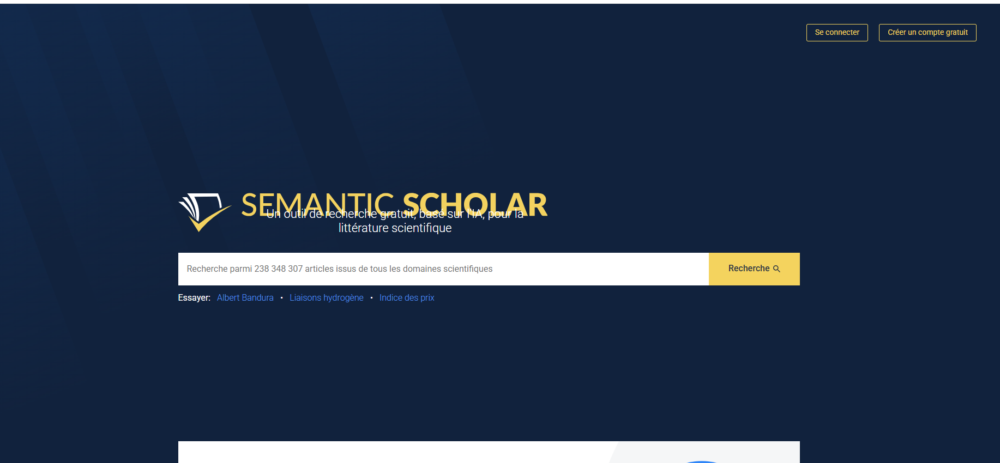
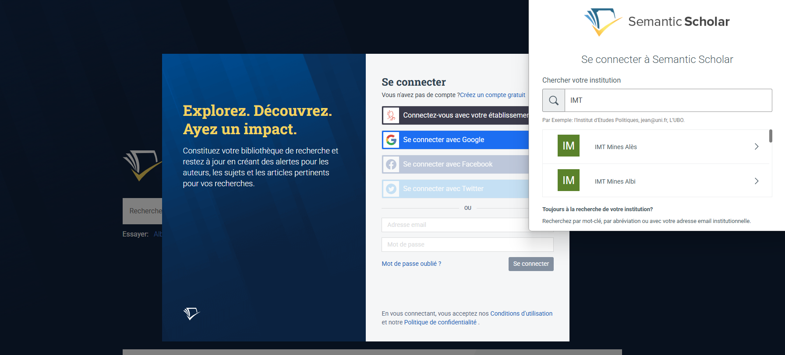
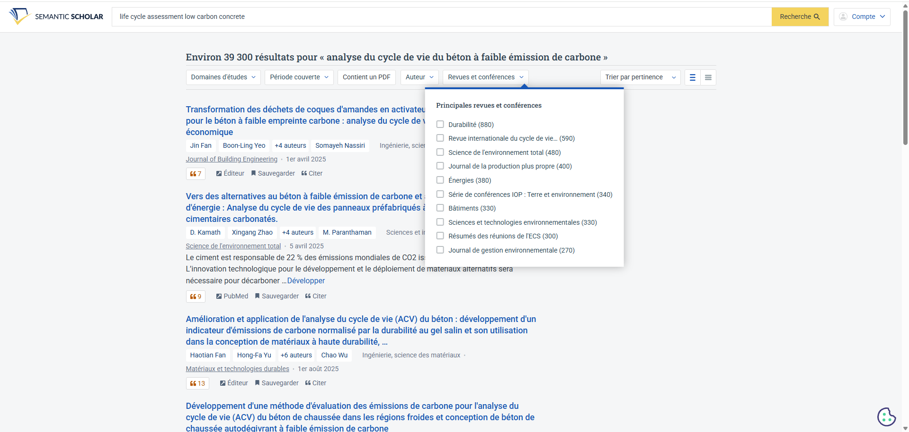
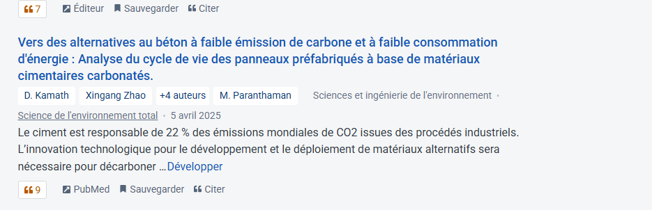
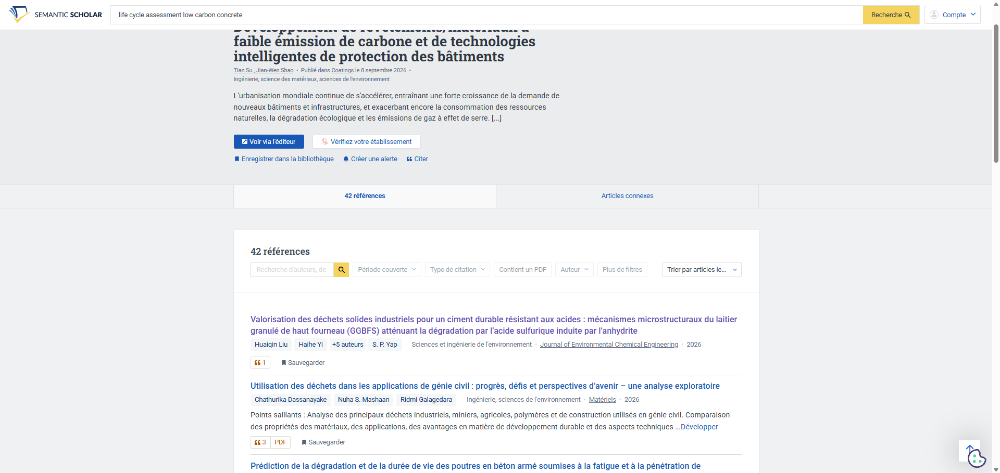
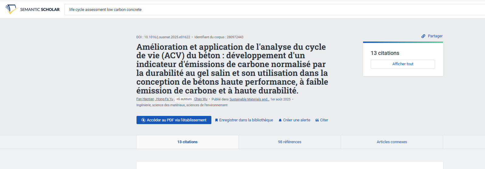
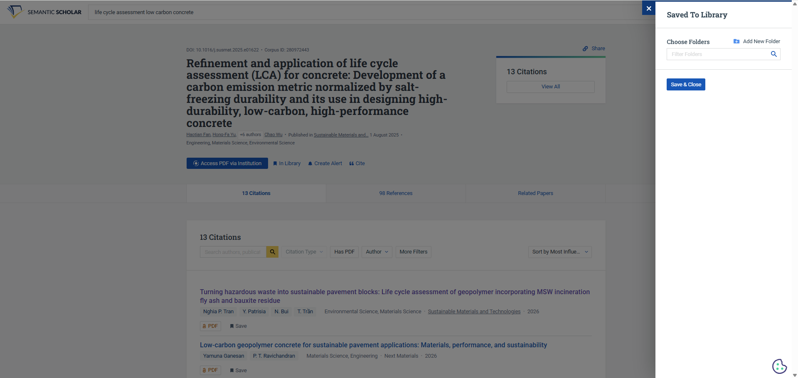
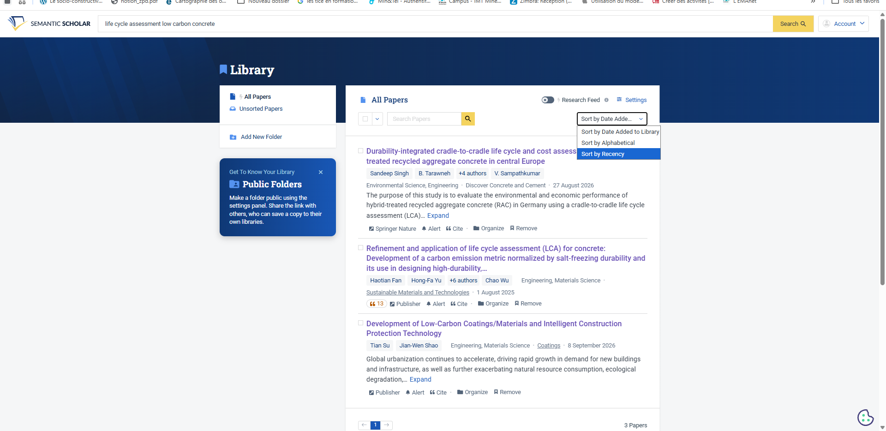
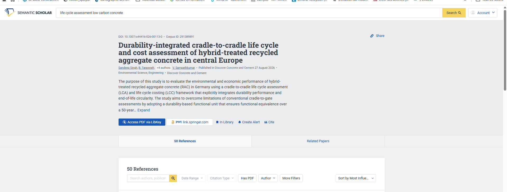

# Semantic Scholar

Hors UE Entièrement gratuit

Dernière vérification : septembre 2026

Semantic Scholar est un **moteur de recherche d'articles scientifiques** développé par l'Allen Institute for AI, un institut de recherche à but non lucratif. Il indexe plus de 200 millions de publications et utilise l'IA pour vous aider à trier rapidement : résumé d'une phrase pour chaque article, repérage des citations les plus influentes, recommandations personnalisées de nouveaux articles.

[Ouvrir Semantic Scholar](https://www.semanticscholar.org){ .md-button .md-button--primary }

!!! info "Afficher le site en français"
    Semantic Scholar est conçu en anglais, mais votre navigateur peut le traduire automatiquement. Dans **Chrome**, cliquez sur l'**icône de traduction** à droite de la barre d'adresse, puis sur **Français**. Dans **Edge**, cliquez sur l'icône **Traduire** au même endroit. Pour ne pas avoir à traduire chaque nouvelle page, cliquez sur les **trois points** de la fenêtre de traduction de Chrome, puis sur **Toujours traduire l'anglais**. Ce tutoriel utilise les intitulés de la version traduite, qui peuvent légèrement varier d'un navigateur à l'autre.

    En revanche, **tapez vos mots-clés en anglais** : les articles scientifiques étant majoritairement rédigés en anglais, les résultats sont bien meilleurs.

## À quoi ça sert dans le supérieur

- **Identifier les articles de référence** d'un domaine, triés par nombre de citations.
- **Évaluer rapidement la pertinence** d'un article grâce à son résumé en une phrase.
- **Remonter le fil d'une recherche** : ce qu'un article cite, et qui le cite.
- **Faire une veille automatique** sur un sujet ou un auteur, avec des alertes par courriel.
- **Récupérer les articles en PDF**, en accès libre ou grâce aux abonnements de l'école.
- **Constituer une bibliographie** pour un cours ou un projet étudiant, prête à citer.

## Version gratuite

Semantic Scholar est **entièrement gratuit**, sans version payante. La recherche et la lecture des fiches d'articles fonctionnent sans compte. Un compte gratuit ajoute la bibliothèque personnelle, les recommandations automatiques et les alertes.

## Cas d'usage

=== "Trouver les articles clés"

    **Exemple** : vous construisez un cours sur l'analyse du cycle de vie des bétons bas carbone.

    Tapez des mots-clés en anglais, par exemple `life cycle assessment low carbon concrete`, puis triez les résultats par nombre de citations (menu **Trier par pertinence**, à droite, puis tri par nombre de citations). Les articles les plus cités apparaissent en tête : ce sont généralement les références incontournables du domaine.

    Restreignez ensuite aux publications récentes avec le filtre **Période couverte** pour compléter avec l'état de l'art actuel.

=== "Trier sans tout lire"

    **Exemple** : votre recherche renvoie 40 articles potentiellement utiles pour un module d'intelligence artificielle.

    Lorsque le début du résumé s'affiche sous un titre, cliquez sur **Développer** pour le lire en entier ; sinon, ouvrez la fiche de l'article en cliquant sur son titre. Pour certains articles, une étiquette **TLDR** propose même un résumé en une seule phrase. En quelques minutes, vous écartez les articles hors sujet et ne gardez que ceux qui méritent une lecture complète.

    Le TLDR est surtout disponible en informatique, en biologie et en médecine : en sciences de l'ingénieur, il est souvent absent, et le résumé suffit pour trier.

=== "Remonter le fil"

    **Exemple** : un article de synthèse sur les risques liés à l'hydrogène vous sert de point de départ.

    Ouvrez sa fiche et consultez :

    - la section **Références** : les travaux sur lesquels il s'appuie, pour remonter aux sources ;
    - la section **Citations** : les travaux plus récents qui l'ont cité, pour voir comment le sujet a évolué.

    Repérez les articles marqués **Très influent** : ce sont ceux qui ont réellement compté, et non de simples mentions. Le menu **Trier par les plus influents** les place en tête de liste.

=== "Veille automatique"

    **Exemple** : vous voulez suivre les nouvelles publications sur la valorisation des déchets miniers.

    Sauvegardez 5 articles pertinents dans un dossier de votre bibliothèque, puis activez le **Flux de recherche** de ce dossier. Semantic Scholar vous propose chaque jour de nouveaux articles proches, et vous les envoie par courriel. Plus vous indiquez d'articles non pertinents, plus les recommandations s'affinent.

=== "Bibliographie étudiante"

    **Exemple** : vous préparez une bibliographie de départ pour un projet d'élèves ingénieurs en génie de l'environnement.

    Sauvegardez les articles retenus dans un dossier dédié au projet. Pour chacun, le bouton **Citer** fournit la référence prête à copier (formats APA, MLA ou BibTeX). Utilisez le filtre **Contient un PDF** pour privilégier les articles en accès libre, que les étudiants pourront lire sans abonnement.

## Pas à pas

:material-magnify-plus-outline: Cliquez sur une capture pour l'agrandir.
{ .astuce-zoom }

### 1 Accéder au site

Rendez-vous sur [semanticscholar.org](https://www.semanticscholar.org). Si un bandeau sur les cookies s'affiche, cliquez sur **Tout rejeter** (ou **Accepter tout**, selon votre choix). Traduisez ensuite la page en français : dans Chrome, cliquez sur l'**icône de traduction** à droite de la barre d'adresse, puis sur **Français**.

### 2 Créer un compte

La recherche fonctionne sans compte, mais un compte gratuit est indispensable pour enregistrer des articles et recevoir des recommandations. En haut à droite, cliquez sur **Se connecter** (une fois connecté, ce bouton devient **Compte**), puis sur **S'inscrire**. Choisissez **S'inscrire avec Google** ou saisissez votre adresse e-mail. Une fenêtre **Confirmer les détails du compte** s'ouvre : seule l'adresse e-mail est obligatoire. Cliquez sur **Soumettre**. 

### 3 Lancer une recherche

Cliquez dans la **barre de recherche** au centre de la page, tapez vos mots-clés **en anglais**, puis cliquez sur **Recherche** ou appuyez sur **Entrée**.

### 4 Filtrer et trier les résultats

Juste sous la barre de recherche, utilisez les filtres de la barre grise : **Domaines d'études** (discipline), **Période couverte** (années de publication), **Contient un PDF** (articles en accès libre), **Auteur** et **Revues et conférences**. Un filtre actif s'affiche en bleu ; cliquez sur **Clair** pour tous les retirer. À droite, le menu **Trier par pertinence** permet de classer les résultats autrement, par exemple par nombre de citations ou du plus récent au plus ancien.

### 5 Évaluer un article en un coup d'œil

Chaque résultat affiche les auteurs, la discipline, la revue et la date de publication. Le petit cadre orange avec des guillemets indique le **nombre de citations** de l'article. Lorsque le début du résumé s'affiche sous le titre, cliquez sur **Développer** pour le lire en entier. Sinon, cliquez sur le **titre** : le résumé complet se trouve sur la fiche de l'article (étape suivante). Pour certains articles, surtout en informatique et en biologie, une étiquette **TLDR** propose aussi un résumé en une phrase. Le lien **Éditeur** (ou **PubMed**) ouvre l'article sur le site de la revue, où il peut être payant.

### 6 Explorer la fiche d'un article

Cliquez sur le **titre** d'un article pour ouvrir sa fiche : vous y trouvez le résumé complet (cliquez sur **Développer**) et les boutons d'action. Plus bas, des onglets donnent accès aux **Références** (ce que cet article cite), aux **Citations** (les articles qui l'ont cité, lorsqu'il y en a) et aux **Articles connexes**. Dans ces listes, l'étiquette **Très influent** signale les travaux les plus significatifs, et le menu **Trier par les plus influents** les place en tête.

### 7 Télécharger l'article en PDF

**Le plus simple : le bouton LibKey.** Si un bouton bleu **Accéder au PDF via LibKey** apparaît sur la fiche, cliquez dessus : il ouvre directement le PDF grâce aux abonnements de l'école, en passant par le SSO si nécessaire.

**Si l'article est en accès libre**, un bouton indiquant la source du PDF (par exemple **[PDF] link.springer.com**) apparaît sur sa fiche : cliquez dessus pour l'ouvrir, puis téléchargez-le depuis votre navigateur. Pour ne voir que ces articles, activez le filtre **Contient un PDF** dans les résultats.

**Si aucun de ces boutons n'apparaît**, passez par le site de la revue :

1. Cliquez sur **Éditeur** (sous le résultat ou sur la fiche) pour ouvrir l'article sur le site de la revue.
2. Sur ce site, cliquez sur **Accès via votre établissement** (souvent en anglais : *Access through your institution*).
3. Recherchez **IMT Mines Alès** dans la liste et sélectionnez-la.
4. Vous êtes redirigé vers la **page de connexion SSO de l'école** : saisissez vos identifiants habituels de l'école.
5. Vous revenez automatiquement sur le site de la revue. Si l'école est abonnée, une mention l'indique en haut de la page (sur ScienceDirect : *You have institutional access via IMT Mines Alès*) et le bouton **View PDF** (ou **Afficher le PDF** en version traduite) permet d'ouvrir et de télécharger l'article.

Depuis le réseau de l'école, l'accès est souvent reconnu automatiquement, sans connexion.

### 8 Lire avec Semantic Reader

Semantic Reader est un **lecteur de PDF enrichi** intégré à Semantic Scholar : cliquez sur une référence citée dans le texte pour afficher une carte avec le résumé de l'article cité, sans quitter votre lecture. Lorsqu'il est disponible, le bouton **Semantic Reader** apparaît en haut de la fiche de l'article.

!!! info "Disponibilité limitée"
    Semantic Reader ne fonctionne que sur ordinateur et pour une partie des articles en accès libre, principalement en informatique. Pour la plupart des articles en sciences de l'ingénieur, le bouton n'apparaît pas : lisez alors le PDF comme d'habitude.

### 9 Sauvegarder des articles dans sa bibliothèque

Sous un résultat, cliquez sur **Sauvegarder** (l'icône en forme de marque-page), ou sur le bouton équivalent depuis la fiche d'un article. Choisissez un dossier existant ou cliquez sur **Créer un nouveau dossier**, par exemple un dossier par cours. L'article affiche alors la mention **Dans la bibliothèque**. Retrouvez vos dossiers en cliquant sur **Compte** en haut à droite, puis sur **Bibliothèque**.

### 10 Activer les recommandations automatiques

Cliquez sur **Compte** en haut à droite, puis sur **Bibliothèque**, et sélectionnez un dossier dans le panneau de gauche. Au-dessus des options de tri, activez l'interrupteur **Flux de recherche**. Revenez le lendemain : de nouveaux articles vous sont proposés chaque jour et envoyés par courriel. Pour de meilleures recommandations, enregistrez au moins 5 articles pertinents dans le dossier et marquez 3 articles proposés comme **Non pertinent**. Retrouvez ensuite toutes vos recommandations dans **Compte**, puis **Flux de recherche**.

### 11 Créer une alerte

Sur la fiche d'un article, cliquez sur **Créer une alerte** pour être prévenu par courriel dès qu'un nouvel article le cite. Sur la page d'un auteur (cliquez sur son nom), cliquez sur **Suivre** pour être averti de ses nouvelles publications.

### 12 Citer un article

Sous un résultat, cliquez sur **Citer** (à droite de **Sauvegarder**), ou sur le bouton équivalent depuis la fiche d'un article. Choisissez le format (**BibTeX**, **APA**, **MLA**…), puis cliquez sur **Copier** pour copier la référence. Si vous utilisez Zotero, son extension de navigateur enregistre directement l'article, son PDF et son résumé dans votre bibliothèque Zotero.

## Ressources officielles

- [Foire aux questions de Semantic Scholar](https://www.semanticscholar.org/faq) : compte, bibliothèque, alertes, TLDR (en anglais).
- [Créer un flux de recherche](https://www.semanticscholar.org/faq/create-research-feeds) : le guide officiel des recommandations automatiques.
- [Présentation de Semantic Reader](https://www.semanticscholar.org/product/semantic-reader) : les fonctions du lecteur enrichi.

## Points de vigilance

!!! warning "Données"
    Semantic Scholar est hébergé aux États-Unis. Votre bibliothèque et vos recherches y sont conservées : évitez d'y constituer des dossiers révélant des projets de recherche confidentiels.

!!! tip "Couverture inégale selon les disciplines"
    Semantic Scholar est très complet en informatique, en biologie et en médecine, mais moins exhaustif dans certaines sciences de l'ingénieur et en sciences humaines. Pour une bibliographie rigoureuse, complétez avec les bases de données de votre discipline et avec HAL pour les publications françaises.

!!! info "Le TLDR ne remplace pas la lecture"
    Le résumé en une phrase aide à trier, pas à citer. Avant de mentionner un article dans un cours, lisez au moins son résumé complet et vérifiez qu'il dit bien ce que vous lui attribuez.

!!! tip "Article introuvable en accès libre ou via l'école ?"
    Cherchez une version gratuite et légale sur [HAL](https://hal.science), le site de l'auteur ou sa page ResearchGate. Vous pouvez aussi écrire directement à l'auteur, qui envoie généralement volontiers son article, ou solliciter le service de documentation de l'école.

!!! note "Nombre de citations"
    Un article très cité n'est pas forcément le plus pertinent pour vos étudiants : les articles récents ont mécaniquement moins de citations. Combinez le tri par citations et le tri par date.
