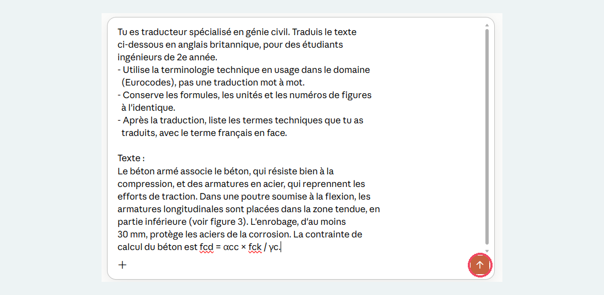
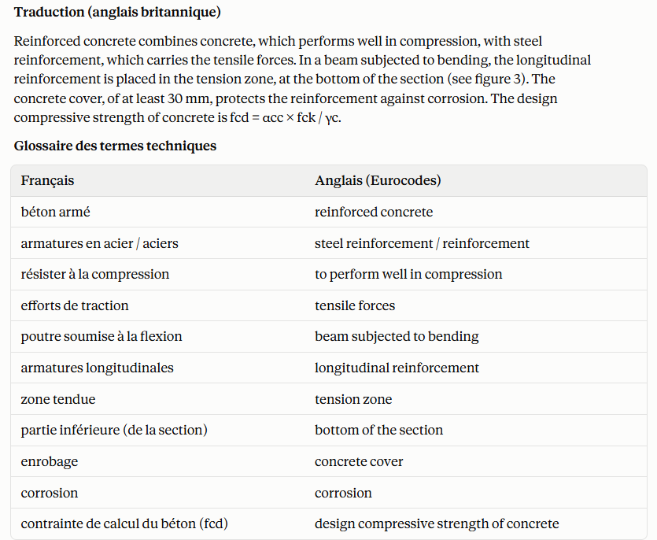
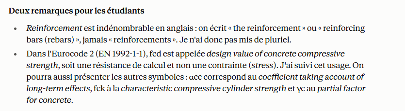
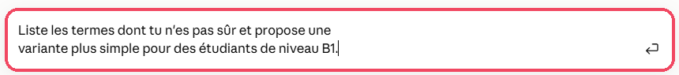
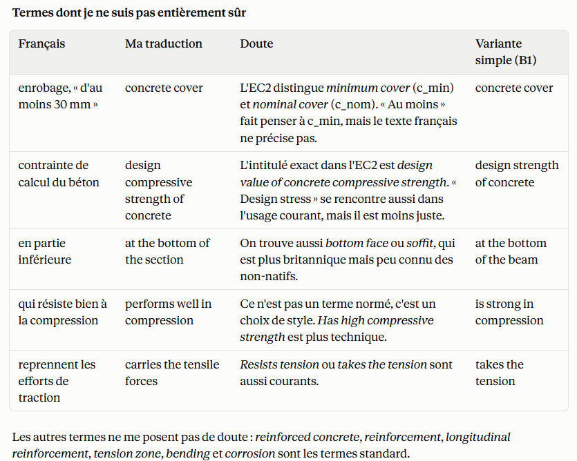

# Traduire avec un assistant IA

<span class="badge badge-gratuit">Version gratuite</span>

<p class="maj">Dernière vérification : octobre 2026</p>

Les assistants conversationnels présentés sur ce site (ILaaS, Mistral Vibe, Claude, ChatGPT, Gemini) savent aussi traduire. Contrairement à un outil de traduction comme [Lara Translate](lara.md), vous pouvez **dialoguer** avec eux : leur imposer le vocabulaire de votre discipline, leur demander d'adapter le niveau de langue, de créer un glossaire ou de relire une traduction existante.

**La bonne méthode combine les deux outils :** Lara traduit vite un fichier entier en gardant sa mise en page ; l'assistant IA vous aide ensuite à retravailler le texte et le vocabulaire technique.

[Voir les assistants IA](../assistants/index.md){ .md-button .md-button--primary }

## À quoi ça sert dans le supérieur

- **Traduire en gardant le bon vocabulaire technique** : les termes exacts de votre discipline, et non une traduction mot à mot.
- **Créer un glossaire bilingue** pour un cours, à distribuer aux étudiants internationaux.
- **Adapter le niveau de langue** : un anglais simple pour des étudiants de 1re année, ou plus soutenu pour un public de master.
- **Relire une traduction** faite par Lara ou par un collègue, et repérer les erreurs de terminologie.
- **Traduire et reformuler** des consignes d'examen, un syllabus ou un e-mail à un partenaire étranger.

## Version gratuite

Tous les assistants présentés sur ce site traduisent dans leur version gratuite. Les limites sont celles de chaque assistant (nombre de messages par jour, taille des fichiers) : consultez leur fiche.

## Choisir son assistant

Le choix dépend surtout de la **confidentialité** du texte à traduire.

| Assistant | Hébergement | Pour quels textes ? |
|---|---|---|
| [ILaaS](../assistants/ilaas.md) | <span class="badge badge-souverain">Souverain ESR</span> | Documents de travail internes, textes non publiés |
| [Mistral Vibe](../assistants/le-chat.md) | <span class="badge badge-ue">Entreprise UE</span> | Supports de cours, documents pédagogiques |
| [Claude](../assistants/claude.md), [ChatGPT](../assistants/chatgpt.md), [Gemini](../assistants/gemini.md) | <span class="badge badge-hors-ue">Hors UE</span> | Textes publics ou déjà diffusés |

## Cas d'usage

=== "Garder le vocabulaire technique"

    **Exemple** : un extrait de cours de génie civil sur le béton armé.

    ```
    Tu es traducteur spécialisé en génie civil. Traduis le texte
    ci-dessous en anglais britannique, pour des étudiants
    ingénieurs de 2e année.
    - Utilise la terminologie technique en usage dans le domaine
      (Eurocodes), pas une traduction mot à mot.
    - Conserve les formules, les unités et les numéros de figures
      à l'identique.
    - Après la traduction, liste les termes techniques que tu as
      traduits, avec le terme français en face.

    Texte :
    [collez votre texte ici]
    ```

=== "Créer un glossaire bilingue"

    **Exemple** : un glossaire pour un module de thermodynamique.

    ```
    À partir du texte de cours ci-dessous, crée un glossaire
    bilingue français-anglais des 20 termes techniques les plus
    importants. Présente-le sous forme de tableau à 3 colonnes :
    terme français, terme anglais, définition courte en anglais
    (une phrase simple). Classe les termes par ordre alphabétique.

    Texte :
    [collez votre texte ici]
    ```

    Distribuez ce glossaire aux étudiants internationaux en début de module. Vous pourrez aussi le réutiliser dans vos demandes de traduction suivantes.

=== "Adapter le niveau de langue"

    **Exemple** : des consignes de TP de chimie pour des étudiants en échange qui débutent en anglais.

    ```
    Traduis ces consignes de travaux pratiques en anglais simple,
    niveau B1 : phrases courtes, une action par phrase, pas
    d'expressions idiomatiques. Garde le vocabulaire de laboratoire
    exact (verrerie, réactifs, consignes de sécurité).

    Consignes :
    [collez vos consignes ici]
    ```

=== "Relire une traduction"

    **Exemple** : un diaporama de mécanique des fluides traduit avec Lara.

    ```
    Voici un texte en français et sa traduction automatique en
    anglais. Tu es relecteur spécialisé en mécanique des fluides.
    Relève les erreurs de terminologie, les contresens et les
    tournures maladroites. Pour chaque problème, présente dans un
    tableau : la phrase concernée, le problème, ta correction.
    Ne réécris pas tout le texte.

    Texte original :
    [collez le texte français]

    Traduction :
    [collez la traduction]
    ```

=== "Traduire un e-mail"

    **Exemple** : un e-mail à un partenaire industriel allemand pour organiser un projet étudiant.

    ```
    Traduis cet e-mail en allemand, avec un ton professionnel et
    cordial, adapté à un premier contact avec une entreprise.
    Signale-moi les formules de politesse que tu as adaptées aux
    usages allemands.

    E-mail :
    [collez votre e-mail ici]
    ```

## Pas à pas

La méthode est la même quel que soit l'assistant choisi. Les captures ci-dessous ont été réalisées avec [Claude](../assistants/claude.md), à partir du cas d'usage « Garder le vocabulaire technique ».

<div class="etape" markdown>

### <span class="etape-num">1</span> Choisir l'assistant

Choisissez votre assistant selon la confidentialité du texte (voir le tableau [Choisir son assistant](#choisir-son-assistant)) :

- document interne ou non publié : **ILaaS** ;
- support de cours : **Mistral Vibe** ;
- texte public : l'assistant de votre choix.

Ouvrez une **nouvelle conversation**, pour que l'assistant ne mélange pas votre traduction avec un échange précédent.

</div>

<div class="etape" markdown>

### <span class="etape-num">2</span> Décrire le contexte

En début de message, précisez à l'assistant :

1. **son rôle** : « Tu es traducteur spécialisé en… » ;
2. **la langue cible**, et si besoin sa variante (anglais britannique ou américain) ;
3. **le public** : étudiants de 1re année, de master, partenaires industriels… ;
4. **le niveau de langue** souhaité : simple, courant, soutenu.

</div>

<div class="etape" markdown>

### <span class="etape-num">3</span> Donner vos consignes de vocabulaire

Indiquez les termes à traduire d'une façon précise, ou à ne pas traduire. Par exemple :

```
Traduis « béton armé » par « reinforced concrete » et
« contrainte » par « stress ». Ne traduis pas les noms de
logiciels ni les sigles des normes.
```

Si vous avez déjà un glossaire bilingue, collez-le dans votre message.

</div>

<div class="etape" markdown>

### <span class="etape-num">4</span> Coller le texte à traduire

Collez votre texte à la fin du message, après la mention « Texte : », puis envoyez.

Pour un long document, procédez **par parties** (une section ou quelques diapositives à la fois) : la traduction sera plus soignée et plus facile à vérifier. Vous pouvez aussi joindre le fichier, mais la mise en page ne sera pas conservée : pour traduire un fichier entier, préférez [Lara Translate](lara.md).



L'assistant affiche la traduction, puis le tableau des termes techniques demandé dans la consigne :



Il peut aussi ajouter des remarques utiles, ici sur l'usage des termes dans l'Eurocode 2 :



</div>

<div class="etape" markdown>

### <span class="etape-num">5</span> Faire améliorer la traduction

Poursuivez la conversation pour ajuster le résultat, par exemple :

- « Simplifie les phrases de la deuxième partie. »
- « Liste les termes dont tu n'es pas sûr. »
- « Propose deux traductions possibles pour ce paragraphe. »

Par exemple, écrivez dans la zone de réponse :



L'assistant détaille alors ses doutes et propose des variantes plus simples. Ces explications vous aident à trancher, mais la décision finale vous revient :



</div>

<div class="etape" markdown>

### <span class="etape-num">6</span> Vérifier avant de diffuser

Relisez toujours la traduction finale :

1. les **termes techniques** de votre discipline ;
2. les **nombres, unités et formules** ;
3. le **sens général** des passages importants (consignes d'examen, règles de sécurité).

En cas de doute, faites relire le passage par un collègue qui maîtrise la langue.

</div>

## Ressources officielles

- [Fiches des assistants IA](../assistants/index.md) : prise en main de chaque assistant présenté sur ce site.
- [Lara Translate](lara.md) : pour traduire un document entier en gardant sa mise en page.
- [Bonnes pratiques](../bonnes-pratiques.md) : règles d'usage de l'IA dans l'enseignement.

## Points de vigilance

!!! warning "Données"
    Ne collez jamais de données personnelles d'étudiants (copies, notes, listes) dans un assistant. Pour les documents internes ou confidentiels (sujets d'examen non publiés, données de partenaires industriels), utilisez **ILaaS**, hébergé dans l'enseignement supérieur.

!!! tip "Fiabilité"
    Un assistant peut « inventer » un terme technique qui sonne juste mais n'est pas employé dans la discipline. Demandez-lui de lister les termes incertains, et vérifiez-les dans un dictionnaire spécialisé ou une norme.

!!! info "Textes longs"
    Sur un long texte, un assistant peut résumer ou oublier des passages sans le signaler. Traduisez par parties et vérifiez que rien ne manque.

!!! note "Une traduction n'est pas un cours en anglais"
    La traduction est un point de départ. Relisez-la, adaptez-la à votre façon de parler et au niveau de vos étudiants.
