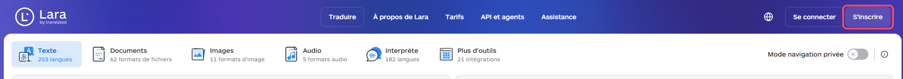
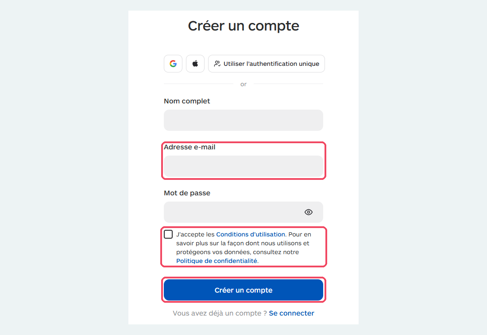
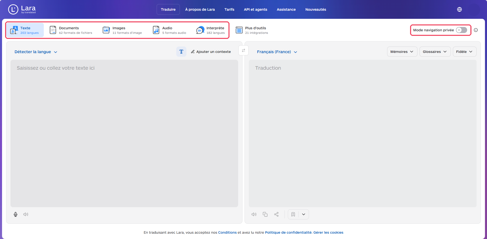
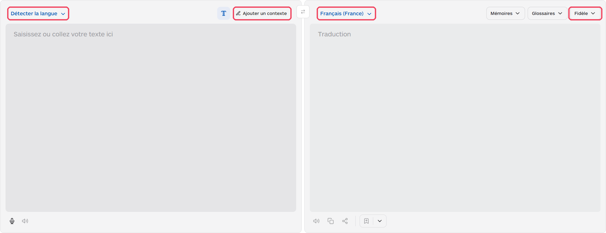
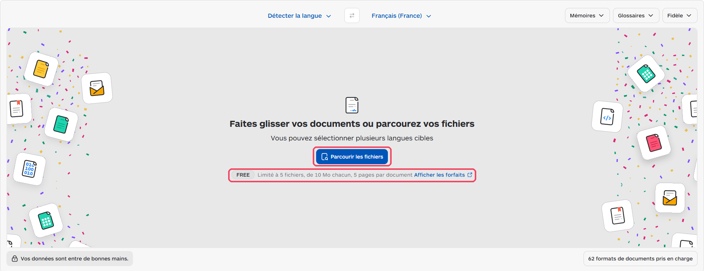
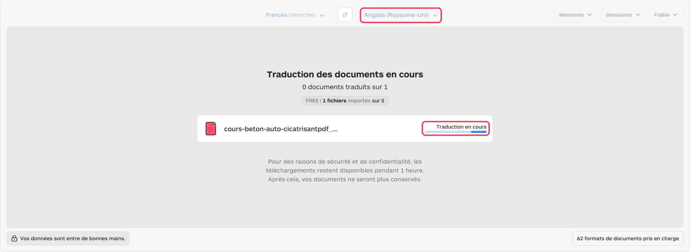
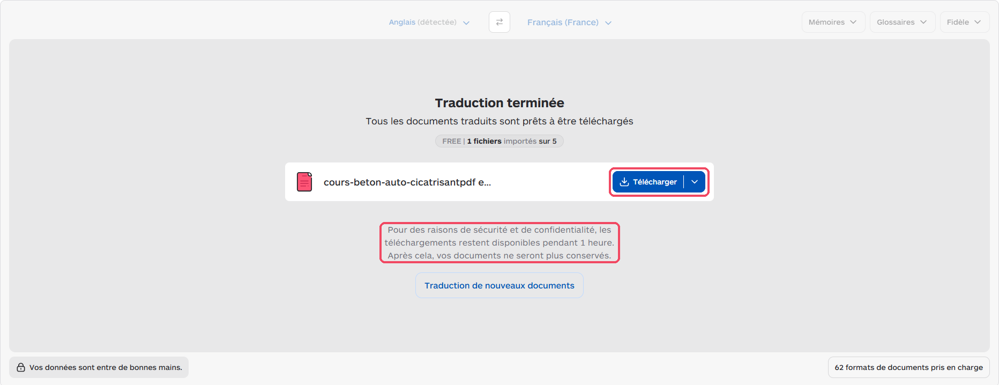
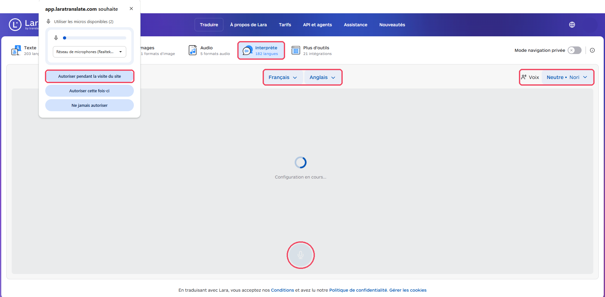

# Lara Translate

<span class="badge badge-ue">Entreprise UE</span> <span class="badge badge-gratuit">Version gratuite</span>

<p class="maj">Dernière vérification : à compléter</p>

**Lara Translate** est un outil de traduction par IA créé par **Translated**, une entreprise italienne spécialisée dans la traduction professionnelle. Il traduit un **texte**, un **document entier** (Word, **PowerPoint**, PDF…) en conservant sa mise en page, et propose une **session interprète** pour traduire à l'oral, en direct. Il suffit d'un compte gratuit créé avec une adresse e-mail.

[Ouvrir Lara Translate](https://laratranslate.com){ .md-button .md-button--primary }

!!! info "Fiche en cours de rédaction"
    Le tutoriel complet sera bientôt disponible.

## À quoi ça sert dans le supérieur

- **Traduire un diaporama PowerPoint** pour des étudiants internationaux, en gardant la mise en page des diapositives.
- **Traduire un support de cours complet** : polycopié, énoncé de TP, sujet de projet.
- **Traduire un texte court** : consigne, e-mail à un partenaire, résumé d'article.
- **Choisir le style de la traduction** (formel, technique…) selon le public.
- **Échanger à l'oral avec un interlocuteur étranger** grâce à la session interprète : rendez-vous avec un étudiant en échange, visite d'un partenaire.
- **Comprendre un document reçu dans une autre langue** : article, norme, cahier des charges.

!!! tip "Les petits plus de Lara"
    Cette fiche se concentre sur la traduction de textes et de documents. Lara sait aussi :

    - traduire le texte d'une **image** (onglet **Images**) ou un fichier **audio** (onglet **Audio**) ;
    - traduire une page web ou un passage sélectionné sans quitter votre navigateur, grâce à l'**extension Edge** ou à l'**extension Chrome** (menu **Plus d'outils**) ;
    - fonctionner sur **téléphone** (application iOS ou Android), pratique pour utiliser l'**Interprète** lors d'un échange en face à face.

## Version gratuite

La version gratuite donne droit à **60 000 caractères par mois**, partagés entre toutes les fonctions (texte, documents, session interprète). Cela représente environ **25 à 30 pages** de cours.

- **Traduction de texte** : incluse.
- **Traduction de documents** (Word, PowerPoint, PDF…) : incluse, mais limitée à **5 fichiers de 10 Mo maximum, et 5 pages par document**. Pour un long polycopié, découpez-le en plusieurs fichiers.
- **Session interprète** : incluse, mais elle consomme très vite le quota (environ 400 caractères par seconde de parole, soit **2 à 3 minutes par mois**). Réservez-la à de courts échanges.
- **Mode navigation privée** : inclus. Les textes ne sont alors ni conservés ni utilisés pour entraîner l'IA.
- Un volume plus important et davantage de minutes d'interprète sont **payants** (offre Pro).

## Cas d'usage

=== "Traduire un diaporama"

    **Exemple** : le diaporama d'un cours de mécanique des fluides, pour des étudiants en échange.

    Déposez le fichier PowerPoint, choisissez l'anglais comme langue cible, puis téléchargez la version traduite. Relisez chaque diapositive : termes techniques, unités, légendes des schémas.

=== "Préparer un cours en anglais"

    **Exemple** : le polycopié d'un module de génie électrique.

    Traduisez le document Word avec un style **technique**, puis relisez-le à voix haute : un cours oral demande des phrases plus courtes et plus directes que le texte écrit.

=== "Traduire un texte court"

    **Exemple** : la consigne d'un TP de chimie analytique, à afficher en français et en anglais.

    Collez le texte dans la zone de traduction. Pour guider l'outil, ajoutez un contexte, par exemple :

    ```
    Consigne de travaux pratiques de chimie pour des étudiants ingénieurs de 1re année. Garder un ton direct et le vocabulaire de laboratoire.
    ```

=== "Échanger à l'oral"

    **Exemple** : un rendez-vous de suivi avec un étudiant en échange qui parle peu le français.

    Lancez une session interprète, choisissez les deux langues, puis parlez chacun à votre tour : Lara traduit chaque phrase à voix haute et l'affiche à l'écran. Attention, la version gratuite ne permet que quelques minutes par mois.

=== "Comprendre un document étranger"

    **Exemple** : une norme ou un rapport technique en allemand.

    Traduisez-le vers le français pour en saisir le contenu. Pour une citation ou une décision importante, revenez toujours au texte original.

## Pas à pas

:material-magnify-plus-outline: Cliquez sur une capture pour l'agrandir.
{ .astuce-zoom }

<div class="etape" markdown>

### <span class="etape-num">1</span> Créer un compte gratuit

1. Ouvrez [laratranslate.com](https://laratranslate.com), puis cliquez sur **S'inscrire**, en haut à droite.

    

2. Remplissez **Nom complet**, **Adresse e-mail** (votre adresse de l'école) et **Mot de passe**.
3. Cochez la case **J'accepte les Conditions d'utilisation**.
4. Cliquez sur **Créer un compte**.



</div>

<div class="etape" markdown>

### <span class="etape-num">2</span> Découvrir l'interface

En haut de la page, des onglets permettent de choisir ce que vous voulez traduire :

- **Texte** : un texte saisi ou collé ;
- **Documents** : un fichier Word, PowerPoint, PDF… ;
- **Interprète** : un échange à l'oral, en direct.

À droite, l'interrupteur **Mode navigation privée** protège vos textes (étape suivante).



</div>

<div class="etape" markdown>

### <span class="etape-num">3</span> Activer le mode navigation privée

Cliquez sur l'interrupteur **Mode navigation privée**, en haut à droite. Vos textes et documents ne sont alors ni conservés ni utilisés pour entraîner l'IA.

Prenez l'habitude de vérifier qu'il est activé avant chaque traduction.


</div>

<div class="etape" markdown>

### <span class="etape-num">4</span> Traduire un texte

Dans l'onglet **Texte** :

1. Collez votre texte dans la zone **Saisissez ou collez votre texte ici**. La langue est reconnue automatiquement (**Détecter la langue**).
2. Choisissez la langue de traduction en cliquant sur **Français (France)**, à droite.
3. Pour une traduction plus juste, cliquez sur **Ajouter un contexte** et décrivez votre public (voir l'exemple dans les cas d'usage).
4. Choisissez le style de traduction dans le menu **Fidèle**.



</div>

<div class="etape" markdown>

### <span class="etape-num">5</span> Traduire un document PowerPoint

1. Cliquez sur l'onglet **Documents**.
2. Choisissez la langue de traduction, à droite de **Détecter la langue**.
3. Cliquez sur **Parcourir les fichiers** et sélectionnez votre fichier, ou faites-le glisser dans la zone grise.

La traduction démarre aussitôt : le message **Traduction en cours** s'affiche à côté du nom du fichier.

En version gratuite, chaque document est limité à **5 pages** et **10 Mo**.





</div>

<div class="etape" markdown>

### <span class="etape-num">6</span> Télécharger le document traduit

Quand le message **Traduction terminée** s'affiche, cliquez sur **Télécharger**. Le document traduit s'enregistre sur votre ordinateur, avec la même mise en page que l'original.

Le téléchargement n'est disponible que **pendant 1 heure** : ensuite, le document est effacé. Pour traduire un autre fichier, cliquez sur **Traduction de nouveaux documents**.



</div>

<div class="etape" markdown>

### <span class="etape-num">7</span> Lancer une session Interprète

1. Cliquez sur l'onglet **Interprète**.
2. Votre navigateur demande l'accès au micro : cliquez sur **Autoriser pendant la visite du site**.
3. Choisissez les deux langues de l'échange, par exemple **Français** et **Anglais**.
4. Si vous le souhaitez, changez la voix de lecture dans le menu **Voix**.
5. Maintenez le bouton du micro, en bas, pendant que vous parlez, puis relâchez-le : Lara lit la traduction à voix haute et l'affiche à l'écran. Votre interlocuteur fait de même pour vous répondre.

En version gratuite, l'Interprète ne permet que **2 à 3 minutes par mois** : réservez-le à de courts échanges.



</div>
## Ressources officielles

- [Lara Translate](https://laratranslate.com) : site officiel.
- [Centre d'aide de Lara](https://support.laratranslate.com/en/lara-translate-free-plan) : la version gratuite (en anglais).
- [Quota de la version gratuite](https://support.laratranslate.com/en/how-the-free-plan-quota-works) : comment les caractères sont décomptés (en anglais).
- [Fonctionnement de la session interprète](https://support.laratranslate.com/en/how-does-lara-interpreter-work) (en anglais).

## Points de vigilance

!!! warning "Données"
    Activez le **Mode navigation privée** avant de traduire un document de cours : vos textes ne sont alors ni conservés ni utilisés pour entraîner l'IA. Même ainsi, ne déposez jamais de données personnelles d'étudiants (copies, notes, listes) ni de documents confidentiels (sujets d'examen non publiés, données de partenaires industriels).

!!! tip "Fiabilité"
    Faites relire les termes de votre discipline, et vérifiez les nombres, les unités et les formules après traduction.

!!! info "Mise en forme"
    La traduction d'un document conserve sa mise en page, mais les textes traduits sont souvent plus longs ou plus courts : vérifiez que rien ne déborde des zones de texte de vos diapositives.

!!! note "Une traduction n'est pas un cours en anglais"
    La traduction est un point de départ. Relisez-la, adaptez-la à votre façon de parler et au niveau de vos étudiants.
