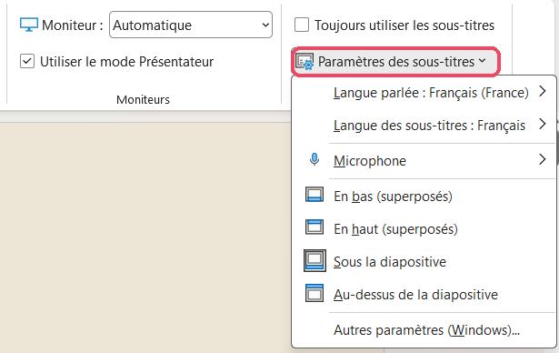
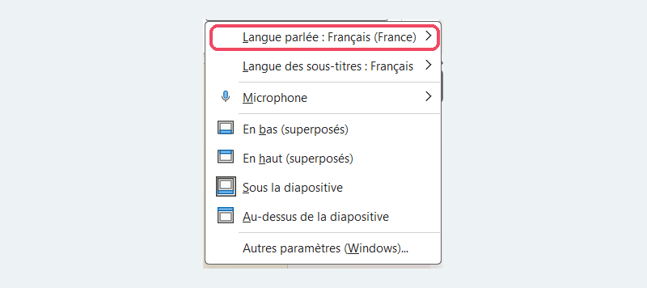
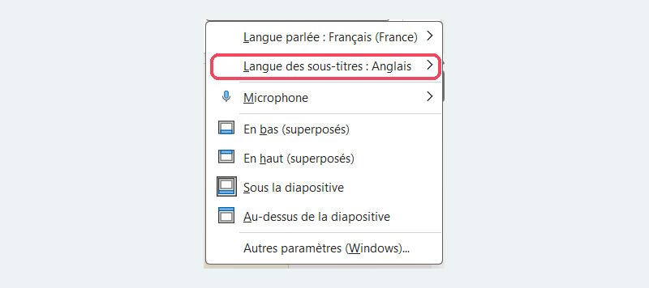
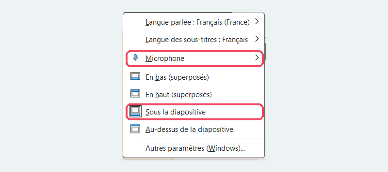
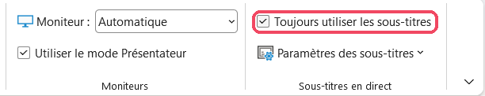
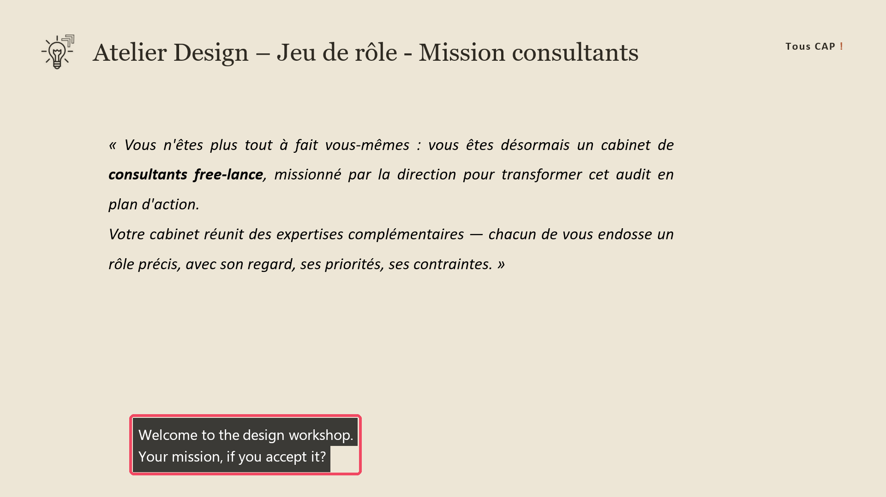
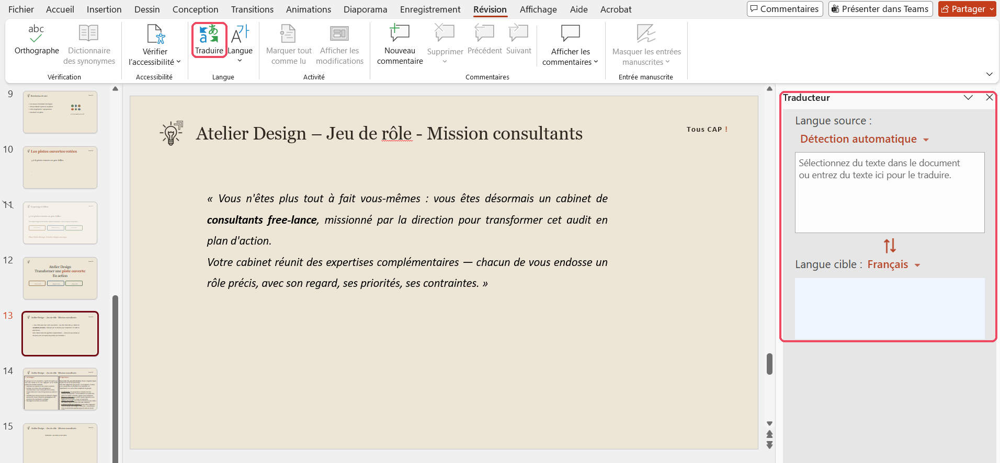
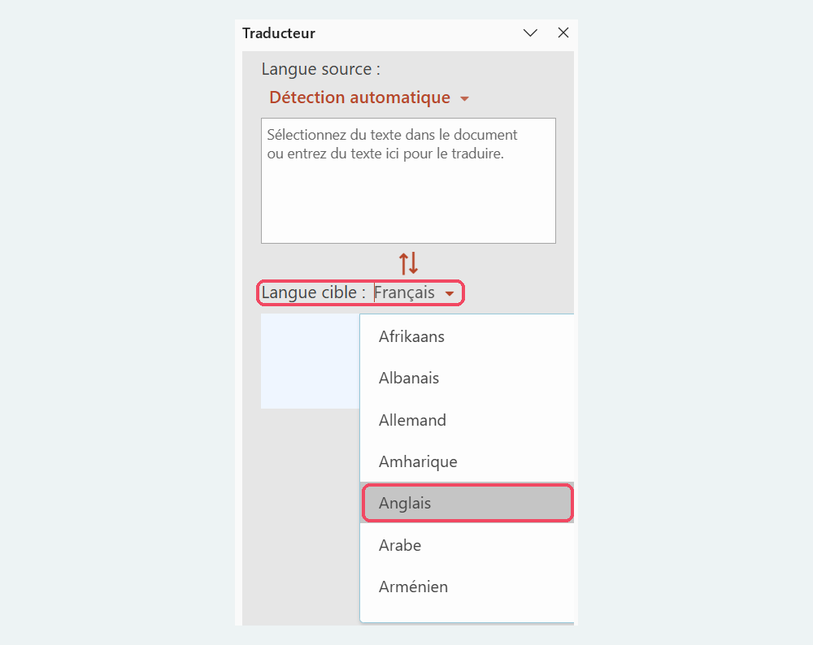
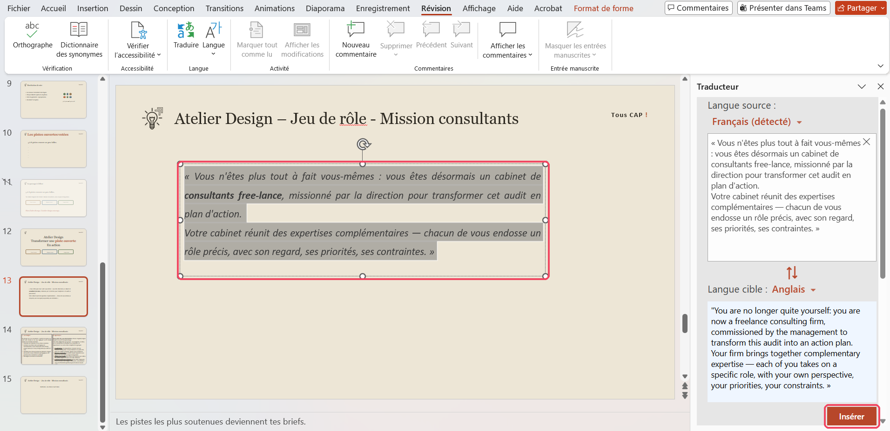

# Sous-titres en direct PowerPoint

Hors UE Inclus avec le compte école

Dernière vérification : octobre 2026

**PowerPoint** peut afficher des **sous-titres en direct** pendant que vous présentez : il écoute votre voix avec le micro de l'ordinateur et affiche, sous vos diapositives, le texte de ce que vous dites. Il peut aussi le **traduire en temps réel** dans une autre langue, par exemple en anglais pour des étudiants internationaux. PowerPoint sait aussi **traduire une partie du texte** d'une diapositive (un titre, une légende, une consigne) grâce à l'outil **Traduire**. Ces deux fonctions sont incluses dans PowerPoint (Microsoft 365), avec votre compte de l'école : rien à installer.

## À quoi ça sert dans le supérieur

- **Rendre un cours magistral accessible** aux étudiants internationaux : vous parlez en français, les sous-titres s'affichent en anglais.
- **Enseigner en anglais** en affichant des sous-titres en français, pour aider les étudiants qui débutent.
- **Améliorer l'accessibilité** pour les étudiants sourds ou malentendants (sous-titres dans la même langue que l'oral).
- **Aider tous les étudiants** à suivre le vocabulaire technique, qu'ils voient écrit en même temps qu'ils l'entendent.
- **Traduire un passage précis** d'une diapositive (titre, légende de schéma, consigne d'exercice) sans traduire toute la présentation.

!!! tip "Interprète de Lara ou sous-titres PowerPoint ?"
    - Pour **tout un cours** devant un amphithéâtre : les **sous-titres PowerPoint**, sans limite de durée.
    - Pour un **échange en face à face** avec un étudiant : l'**Interprète** de [Lara Translate](lara.md), limité à quelques minutes par mois en version gratuite.

## Version gratuite

Les sous-titres en direct sont **inclus** dans PowerPoint avec votre compte Microsoft 365 de l'école : il n'y a rien à payer ni à activer.

- Il faut une **connexion internet** pendant la présentation : la reconnaissance de la voix se fait sur les serveurs de Microsoft.
- Il faut un **micro** : celui de l'ordinateur portable suffit en petite salle ; en amphithéâtre, utilisez un micro-cravate ou un casque.
- La fonction existe dans PowerPoint installé sur l'ordinateur (Windows et Mac) et dans PowerPoint pour le web.

## Cas d'usage

=== "Cours en français, sous-titres en anglais"

    **Exemple** : un cours magistral de résistance des matériaux, avec des étudiants en échange dans l'amphithéâtre.

    Réglez **Langue parlée** sur le français et **Langue des sous-titres** sur l'anglais. Avant le cours, prévenez les étudiants que les sous-titres sont produits automatiquement et peuvent contenir des erreurs.

=== "Cours en anglais, sous-titres en français"

    **Exemple** : un module d'énergétique enseigné en anglais à des étudiants de 1re année.

    Réglez **Langue parlée** sur l'anglais et **Langue des sous-titres** sur le français : les étudiants qui maîtrisent mal l'anglais suivent plus facilement.

=== "Accessibilité"

    **Exemple** : un étudiant malentendant suit votre cours d'automatique.

    Choisissez la **même langue** pour la langue parlée et la langue des sous-titres : PowerPoint transcrit simplement ce que vous dites. Pensez à en parler avec le référent handicap de l'école.

=== "Soutenance ou conférence"

    **Exemple** : la présentation d'un projet de fin d'études devant un jury comprenant un membre étranger.

    Activez les sous-titres traduits pour que tout le jury suive la présentation. Testez-les avant la soutenance, dans la salle, avec le micro qui sera utilisé.

## Pas à pas

:material-magnify-plus-outline: Cliquez sur une capture pour l'agrandir.
{ .astuce-zoom }

### 1 Ouvrir les paramètres des sous-titres

1. Ouvrez votre présentation dans PowerPoint.
2. Cliquez sur l'onglet **Diaporama**.
3. À droite du ruban, dans le groupe **Sous-titres en direct**, cliquez sur **Paramètres des sous-titres**. Un menu s'ouvre.

### 2 Choisir la langue parlée

Dans le menu **Paramètres des sous-titres**, pointez **Langue parlée**, puis choisissez dans la liste la langue dans laquelle **vous allez parler** (par exemple **Français (France)**). La langue choisie s'affiche ensuite dans le menu.

### 3 Choisir la langue des sous-titres

Pointez **Langue des sous-titres**, puis choisissez la langue dans laquelle les sous-titres **s'afficheront** (par exemple **Anglais**).

Si vous choisissez la même langue que la langue parlée, PowerPoint transcrit simplement vos paroles, sans les traduire.

### 4 Choisir le micro et la position des sous-titres

1. Pointez **Microphone**, puis choisissez le micro que vous utiliserez pendant le cours.
2. Choisissez où s'affichent les sous-titres :
    - **Sous la diapositive** ou **Au-dessus de la diapositive** : les sous-titres ne cachent pas le contenu de vos diapositives ;
    - **En bas (superposés)** ou **En haut (superposés)** : les sous-titres s'affichent par-dessus la diapositive.

### 5 Activer les sous-titres

Cochez la case **Toujours utiliser les sous-titres**, dans le groupe **Sous-titres en direct** de l'onglet **Diaporama**. Les sous-titres s'afficheront automatiquement à chaque lancement du diaporama.

### 6 Présenter avec les sous-titres

1. Lancez le diaporama, par exemple avec la touche **F5**.
2. Parlez normalement : les sous-titres s'affichent quelques instants après vos paroles.
3. Pour masquer ou réafficher les sous-titres pendant la présentation, cliquez sur le bouton des sous-titres dans la barre d'outils, en bas à gauche de l'écran.

Dans l'exemple ci-dessous, la présentation se fait en français et les sous-titres s'affichent en anglais, en bas de la diapositive :

## Traduire une partie du texte d'une diapositive

En dehors du diaporama, l'outil **Traduire** de PowerPoint traduit le texte que vous sélectionnez : un titre, une légende de schéma, une consigne. Pratique pour créer une version bilingue d'une diapositive, ou pour vérifier un terme.

### 7 Sélectionner le texte et ouvrir l'outil Traduire

1. Sélectionnez le texte à traduire dans votre diapositive (un mot, une phrase ou toute une zone de texte).
2. Cliquez sur l'onglet **Révision**.
3. Cliquez sur **Traduire**, dans le groupe **Langue**. Le volet **Traducteur** s'ouvre à droite de l'écran.

### 8 Choisir la langue et insérer la traduction

1. Dans le volet **Traducteur**, cliquez sur la langue affichée à côté de **Langue cible**, puis choisissez la langue de traduction, par exemple **Anglais**. Laissez **Langue source** sur **Détection automatique** : PowerPoint reconnaît seul la langue du texte.

    

2. Le texte sélectionné s'affiche en haut du volet, et sa traduction en bas. S'il n'apparaît pas, sélectionnez-le de nouveau dans la diapositive.
3. Relisez la traduction, puis cliquez sur **Insérer**.

    

La traduction remplace le texte d'origine dans la diapositive, en gardant sa mise en forme :

Pour une diapositive bilingue, copiez plutôt la traduction depuis le volet et collez-la dans une nouvelle zone de texte, sous le texte d'origine. Pensez à vérifier la ponctuation : les guillemets français « » ne sont pas toujours convertis correctement.

!!! tip "Pour traduire toute la présentation"
    L'outil **Traduire** convient à quelques passages. Pour traduire un diaporama entier en gardant sa mise en page, utilisez [Lara Translate](lara.md).

## Ressources officielles

- [Présenter avec des sous-titres automatiques en temps réel dans PowerPoint](https://support.microsoft.com/fr-FR/PowerPoint/present-with-real-time-automatic-captions-or-subtitles-in-powerpoint) : aide officielle de Microsoft, avec la liste des langues disponibles.
- [Traduire du texte dans une autre langue](https://support.microsoft.com/fr-fr/office/traduire-du-texte-dans-une-autre-langue-287380e4-a56c-48a1-9977-f2dca89ce93f) : aide officielle de Microsoft sur l'outil Traduire.

## Points de vigilance

!!! warning "Données"
    Votre voix, comme le texte que vous traduisez avec l'outil **Traduire**, est envoyée aux serveurs de Microsoft (hors Union européenne). Évitez de citer des informations personnelles ou confidentielles pendant une présentation sous-titrée (noms d'étudiants, notes, données de partenaires industriels).

!!! tip "Testez avant le cours"
    Faites un essai dans la salle, avec le micro que vous utiliserez : la qualité des sous-titres dépend beaucoup du micro, du bruit ambiant et de votre débit de parole. Parlez distinctement et pas trop vite.

!!! info "Vocabulaire technique"
    La reconnaissance vocale peut mal transcrire les termes très spécialisés, les sigles et les formules. Écrivez-les sur vos diapositives : les étudiants pourront s'y référer si le sous-titre se trompe.

!!! note "Les sous-titres ne remplacent pas un support traduit"
    Pour des étudiants internationaux, fournissez aussi vos diapositives traduites, par exemple avec [Lara Translate](lara.md).
